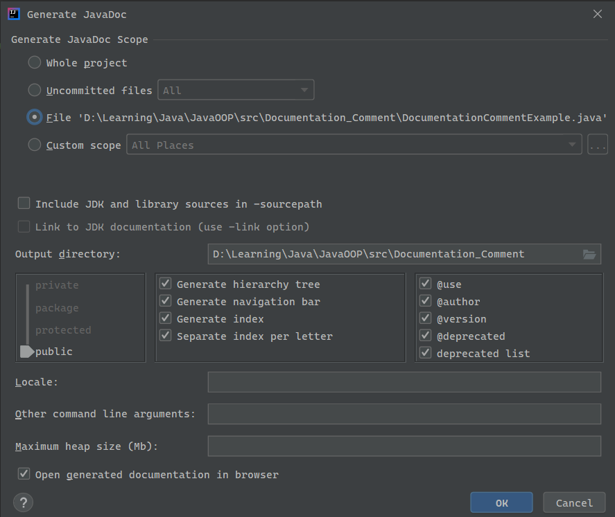
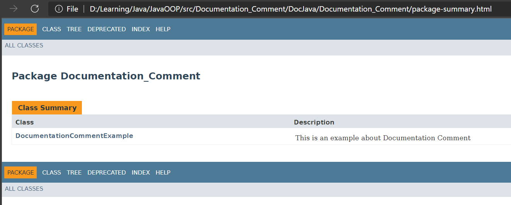
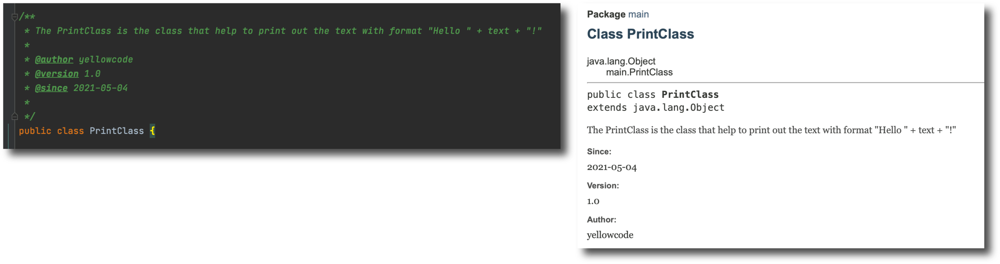
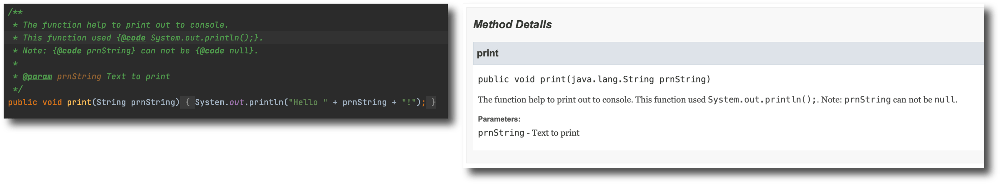
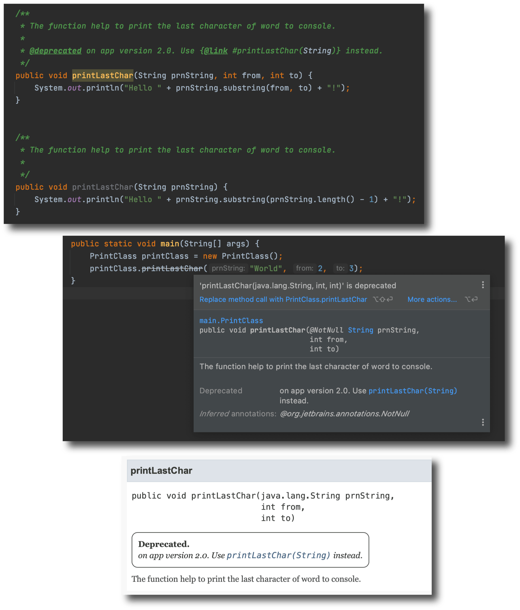
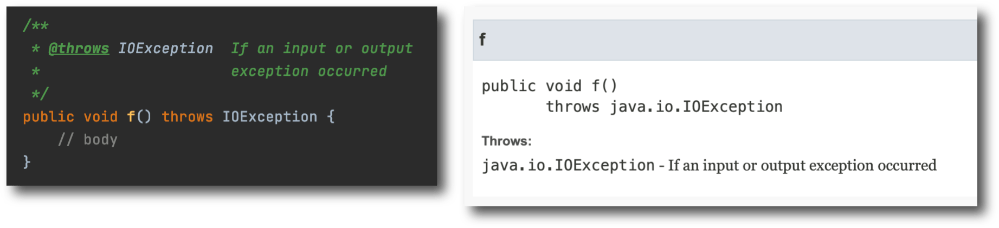
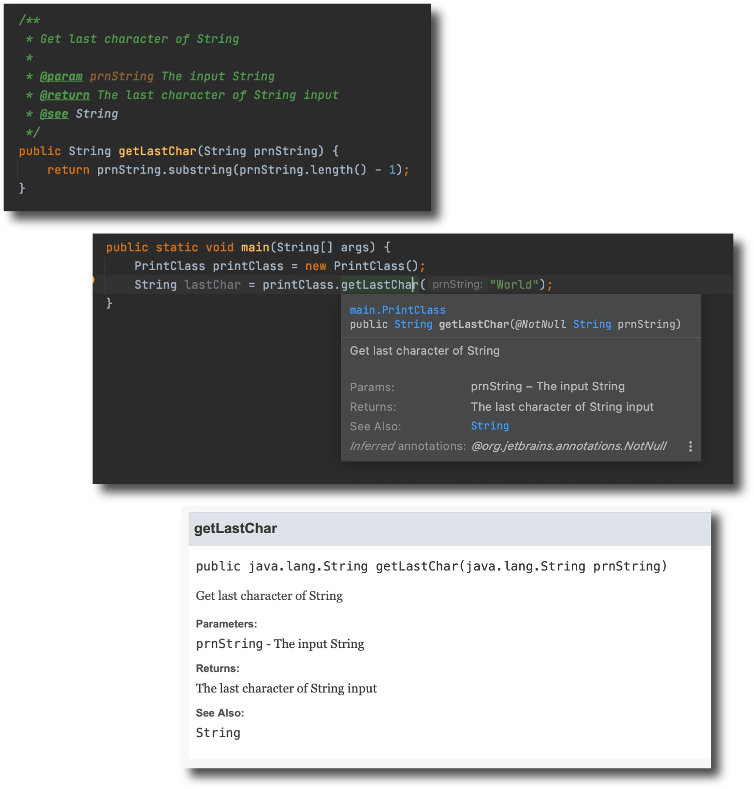
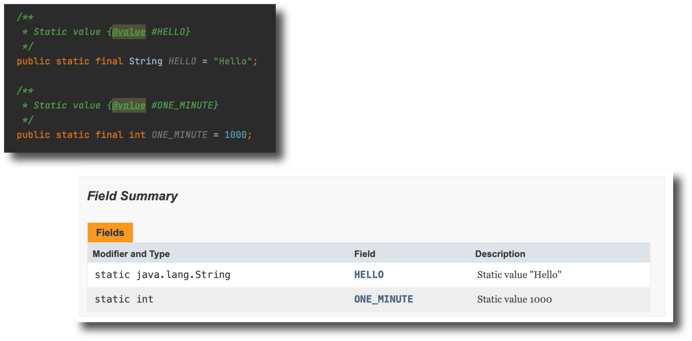

# Documentation Comment

## Nội Dung

1. [Các loại Comment trong Java](#1)
2. [Công dụng của Documentation Comment](#2)
3. [Tạo HTML Document trên IntellJ](#3)
4. [Định dạng Java Doc thông qua sử dụng Tag](#4)

    4.1. [@author, @version, @since](#4.1)
   
    4.2. [{@code}, @param](#4.2)
   
    4.3. [@deprecated, {@link}](#4.3)
   
    4.4. [@exception, @throws](#4.4)
   
    4.5. [@return, @see](#4.5)
   
    4.6. [{@value}](#4.6)
   
    4.7. [Tham khảo 1 số định dạng khác](#4.7)

## 1. Các loại Comment trong Java <a id="1"></a>
* Comment 1 dòng:
```java
// đây là comment 1 dòng 
```
* Comment nhiều dòng:
```java
/*
        có thể xuống dòng tùy ý nội dung comment giữa /* và */
 */
```
* Documentation Comment - Comment dạng Tài liệu
```java
/** đây là Documentation Comment
 *  nội dung giữa /** và */ là Doc Comment
 */
```
## 2. Công dụng của Documentation Comment <a id="2"></a>
* **Doc Comment** có định dạng rõ ràng khi cần chú thích về các **parameter**
* hiển thị nội dung của **Doc Comment** về **class** hay **method** đã được <br/>
thêm **Doc Comment** trước đó, khi trỏ chuột vào **class** hay **method**
  
* **Doc Comment** được công cụ **Javadoc** build ra 1 trang mô tả theo kiểu<br/>
**HTML**, là 1 trang Web được xây dựng hoàn chỉnh có thể publish hay <br/>
  nhúng vào các trang Web khác. Rất thích hợp để tạo ra các **Library Java**<br/>
  và gửi đến người dùng **Library** của bạn với đầy đủ hướng dẫn sử dụng<br/>
  code **Java** mà bạn đã xây dựng.
  
>**Javadoc** là 1 tool đi kèm với **JDK**<br/>
> **Javadoc** dùng để xuất xưởng ra 1 **document** theo định dạng **HTML**, để<br/>
> giúp mô tả rõ hơn về các **source code Java** của bạn hay của tổ chức <br/>
>của bạn.<br/>
> Để **Javadoc** có thể build ra 1 **document** hoàn chỉnh cần tuân thủ 1 số<br/>
> quy tắc.
## 3. Tạo HTML Document trên IntellJ <a id="3"></a>
* trong IntelliJ 
    * chọn Tools 
      
    * chọn Generate Javadoc
    
    * 1 cửa sổ tùy chỉnh Generate Javadoc xuất hiện, trong đó có các<br/>
    thành phần sau cần chú ý
        * Generate JavaDoc Scope : phạm vi tạo ra JavaDoc
            * Whole project : tất cả Doc Java có trong project
            * Uncommitted files : các file không được commit
            * File 'path': đường dẫn của file đang mở hiện tại
            * Custom Scope: phạm vi tùy chỉnh
        * Include JDK and library sources in -sourcepath: (để trống)
        * Link to JDK documentation (use -link option): (để trống)
        * Output directory: chỉ định thư mục chứa file HTML
        * Open generated documentation in browser: (tick chọn)
    * còn lại để mặc định, sau khi chọn **OK** browser sẽ mở Doc Java lên.

## 4. Định dạng Java Doc thông qua sử dụng Tag <a id="4"></a>

### 4.1. @author, @version, @since <a id="4.1"></a>
* @author: dùng để hiển thị thông tin tác giả.
* @version: dùng để hiển thị version của document.
* @since: dùng hiển thị ngày hoặc version tạo ra document.

### 4.2. {@code }, @param <a id="4.2"></a>
* {@code }: giúp hiển thị code bên trong HTML. sau code là thành phần<br/>
  cần hiển thị ở dạng code<br/>
  Các code này được hiển thị với font chữ khác các font chữ còn lại, và <br/>
  bạn cũng không cần lo lắng nếu có các dòng code xung đột với các tag <br/>
  của HTML khi này.
* @param: theo sau tag này sẽ là tên tham số của hàm, theo sau nữa <br/>
  sẽ là lời giải thích cho tham số đó.

### 4.3. @deprecated, {@link #} <a id="4.3"></a>
* @deprecated: giúp đánh dấu rằng thành phần này sẽ bị gỡ bỏ khỏi API <br/>
  trong nay mai.
* {@link #}: link dẫn đến một thành phần khác trong source code <br/>
  là method(kiểu_dữ_liệu) sau dấu \#.
  

### 4.4. @exception, @throws <a id="4.4"></a>
* Hai **Tag** này có công dụng như nhau. Giúp thêm một thông tin **Throws** <br/>
  trong document báo hiệu phương thức này sẽ tung ra một exception.
  
* @throws tên_exception nguyên_nhân_exception
* @exception tên_exception nguyên_nhân_exception


### 4.5. @return, @see <a id="4.5"></a>
* @return: giải thích cho giá trị return của method.
* @see: đưa ra các tham khảo đến các class khác.

### 4.6. {@value #TÊN_BIẾN_static} <a id="4.6"></a>
* Giúp hiển thị giá trị của các static field.
* {@value #TÊN_BIẾN_static}

### 4.7. Tham khảo 1 số định dạng khác <a id="4.7"></a>
* tham khảo thêm cách sử dụng Doc Java từ API của Java (trong String <br/>
  class, Integer class, ...)
* google thêm.