# HƯỚNG DẪN SỬ DỤNG CHARACTER I/O STREAM
__________________________________________________________________________________________________________________________________________________________________________________
## GIỚI THIỆU
* trong **Binary I/O Stream** (Luồng vào ra nhị phân)
    * mỗi lần **write/read** là **1 byte** (tương đương với 8 bit nhị phân)

* trong **Character I/O Stream** (Luồng vào ra ký tự)
    * tùy thuộc vào kiểu mã hóa **(encoding)** **UTF-8, UTF-16, ...** dẫn đến mỗi lần **write/read** là 1, 2, hoặc 3 bytes

* trong Java có nhiều class hỗ trợ các thao tác với **Character I/O Stream**, dẫn đầu là 2 class **Reader** & **Writer**
    * **java.io.Writer**: được sử dụng để ghi dữ liệu đến đích (destination)
    * **java.io.Reader**: được sử dụng để đọc dữ liệu từ một nguồn (source)

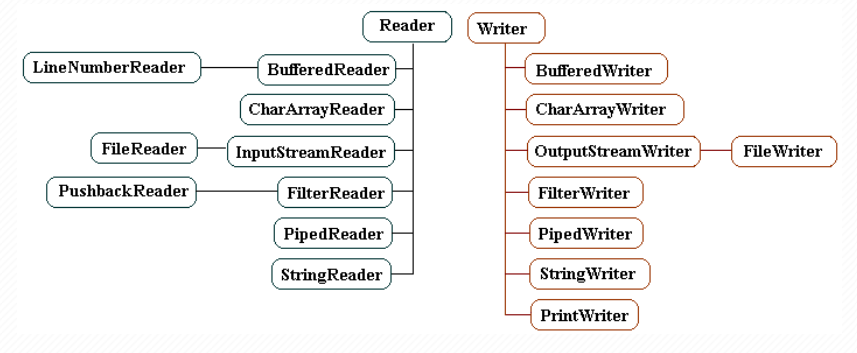

__________________________________________________________________________________________________________________________________________________________________________________

## NỘI DUNG

1. [Writer](#1)
2. [Reader](#2)
3. [OutputStreamWriter](#3)
4. [InputStreamReader](#4)
5. [FileWriter](#5)
6. [FileReader](#6)
7. [CharArrayWriter](#7)
8. [CharArrayReader](#8)
9. [FilterWriter](#9)
10. [FilterReader](#10)
11. [PushbackReader](#11)
12. [BufferedWriter](#12)
13. [BufferedReader](#13)
14. [LineNumberReader](#14)
15. [StringWriter](#15)
16. [StringReader](#16)
17. [PipedWriter](#17)
18. [PipedReader](#18)
19. [LineNumberReader](#19)
20. [PrintWriter](#20)
21. [PrintStream](#21)

__________________________________________________________________________________________________________________________________________________________________________________

## 1. Writer <a id="1"></a>
* **Writer** là 1 **abstract class** nằm trong package **java.io**
```java
public abstract class Writer extends Object implements Appendable, Closeable, Flushable {
    // ...
}
```
* **abstract class Writer** đại diện cho **character output stream** để **write** các **character** vào 1 mục tiêu nào đó, ví dụ như file văn bản

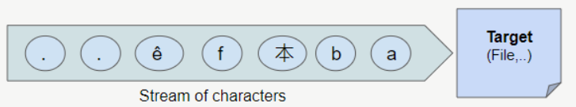

* ta không thể sử dụng trực tiếp **Writer** vì nó là 1 **abstract class**, tùy tình huống cụ thể mà ta có thể sử dụng các **subclass** của **Writer**
* các **subclass** của **Writer**
    * ``BufferedWriter``
    * ``CharArrayWriter``
    * ``FilterWriter``
    * ``OutputStreamWriter``
    * ``PipedWriter``
    * ``PrintWriter``
    * ``StringWriter``

* xét ví dụ ghi các ký tự sau vào 1 file với **UTF-8**


* Java sử dụng 2 **bytes** để lưu trữ 1 ký tự, và đây là hình minh họa của văn bản trên

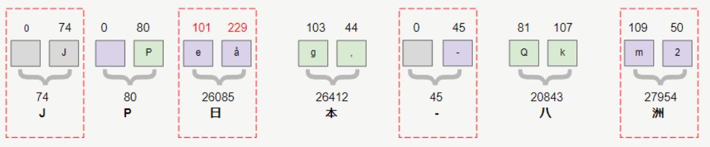

* **FileWriter** là 1 **subclass** của **Writer** thường được sử dụng để ghi các ký tự vào 1 file văn bản
* mỗi ký tự trên **Writer** là 2 bytes
* nhưng khi ghi các ký tự vào 1 file văn bản với **UTF-8**, mỗi ký tự có thể được lưu trữ bởi 1, 2, 3 hoặc 4 bytes

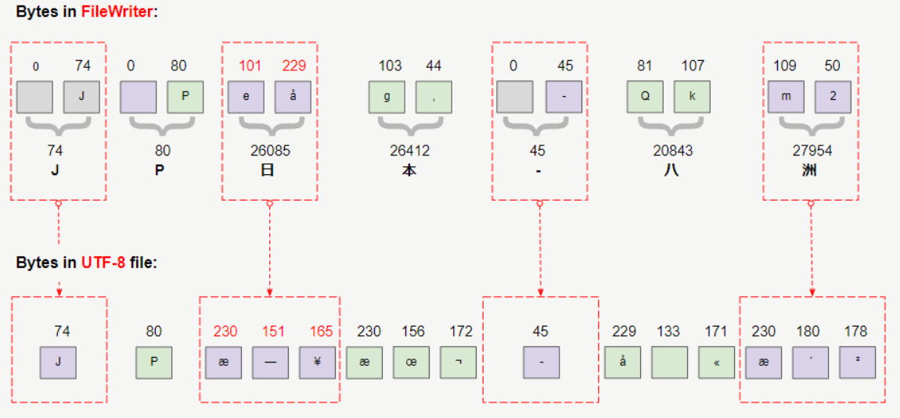
__________________________________________________________________________________________________________________________________________________________________________________

### 1.1. Fields in Writer
```java
public abstract class Writer extends Object implements Appendable, Closeable, Flushable {
    // Field    
    protected Object lock;
    private char[] writeBuffer;
    private static final int WRITE_BUFFER_SIZE = 1024;
}
```
* ``lock`` là 1 object được sử dụng để **synchronize** các hoạt động trên **character output stream**
* For efficiency, a character-stream object may use an object other than itself to protect critical sections.
* A subclass should therefore use the object in this field rather than this or a synchronized method.
__________________________________________________________________________________________________________________________________________________________________________________

### 1.2. Constructors in Writer
```java
public abstract class Writer extends Object implements Appendable, Closeable, Flushable {
    // Constructor
    protected Writer() { // ... }
    protected Writer(Object lock) { // ... }
        }
```
* **protected Writer()**
    * _tạo 1 character stream writer có các phần quan trọng sẽ synchronize trên chính writer_<br/><br/>
* **protected Writer(Object lock)**
    * _tạo 1 character stream writer có các phần quan trọng sẽ synchronize trên chính object chỉ định_
__________________________________________________________________________________________________________________________________________________________________________________

### 1.3. Methods in Writer
```java
public abstract class Writer extends Object implements Appendable, Closeable, Flushable {
    // Methods
    public abstract void write(char cbuf[], int off, int len) throws IOException;
    public abstract void flush() throws IOException;
    public abstract void close() throws IOException;

    public static Writer nullWriter() { // ...}

        public void write(int c) throws IOException { // ...}
            public void write(char cbuf[]) throws IOException { // ...}
                public void write(String str) throws IOException { // ...} 
                    public void write(String str, int off, int len) throws IOException { // ...}

                        public Writer append(CharSequence csq) throws IOException { // ...}
                            public Writer append(CharSequence csq, int start, int end) throws IOException { // ...}
                                public Writer append(char c) throws IOException { // ...}         
                                }
```
__________________________________________________________________________________________________________________________________________________________________________________

#### write(int)
``public void write(int c) throws IOException``
* **write** 1 character **c** vào **Writer**
* tham số **c** là code của ký tự, là 1 giá trị **integer** nằm trong khoảng **[0 ; 65535]**
* nếu giá trị code của **c** nằm ngoài phạm vi nói trên, nó sẽ bị bỏ qua

```java
import java.io.File;
import java.io.FileWriter;
import java.io.IOException;
import java.io.Writer;
import java.nio.charset.StandardCharsets;

public class Writer_Ex1 {
    private static final String path = "D:\\Learning\\Java\\JavaOOP\\src\\_45_Java_IO\\_04_CharacterIO_Streams\\outWriterFile.txt";

    public static void main(String[] args) throws IOException {
        File file = new File(path);
        file.getParentFile().mkdirs();

        Writer writer = new FileWriter(file, StandardCharsets.UTF_8);

        writer.write((int)'J'); // 74
        writer.write((int)'P'); // 80
        writer.write((int)'日'); // 26085
        writer.write(26412); // 本
        writer.write((int)'-'); // 45
        writer.write(20843); // 八
        writer.write((int)'洲'); // 27954

        writer.close();
    }
}
```
* OUTPUT

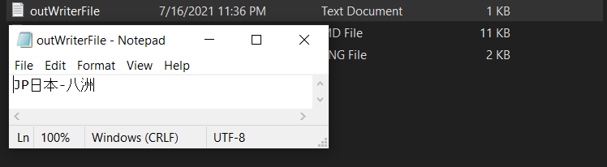

__________________________________________________________________________________________________________________________________________________________________________________

#### write(char[])
``public void write(char cbuf[]) throws IOException``
* **write** 1 character array **cbuf[]** vào **Writer**

```java
import java.io.File;
import java.io.FileWriter;
import java.io.IOException;
import java.io.Writer;
import java.nio.charset.StandardCharsets;

public class write_char_array {
    private static final String path = "D:\\Learning\\Java\\JavaOOP\\src\\_45_Java_IO\\_04_CharacterIO_Streams\\writeCharArray.txt";

    public static void main(String[] args) throws IOException {
        File file = new File(path);
        file.getParentFile().mkdirs();

        Writer writer = new FileWriter(file, StandardCharsets.UTF_8);

        writer.write((int) 'J');

        char[] cbuf = new char[] {'P', '日', '本', '-', '八', '洲'};

        writer.write(cbuf);

        writer.close();
    }
}
```
* OUTPUT

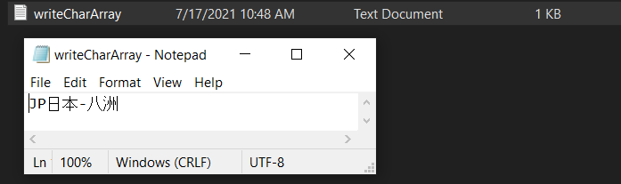

__________________________________________________________________________________________________________________________________________________________________________________

#### write(char[], int, int)
``public void write(char[] cbuf, int off, int len) throws IOException``
* **write** 1 phần của character array vào **Writer**
* **write** các character từ vị trí **off** đến **off+len**
```java
import java.io.StringWriter;

public class write_char_arr_off_len {
    public static void main(String[] args) {
        StringWriter stringWriter = new StringWriter();

        char[] cbuf = new char[] {'0', '1', '2', '3', '4', '5', '6', '7', '8', '9'};

        stringWriter.write(cbuf, 2, 5); // '2'...'6'

        String s = stringWriter.toString();

        System.out.println(s);
    }
}
```
* OUTPUT
```
23456
```
__________________________________________________________________________________________________________________________________________________________________________________
#### close()
``public void close() throws IOException``
* method **close()** được sử dụng để **đóng stream**
* method **flush()** sẽ được gọi đầu tiên
* khi stream đã bị đóng, các lệnh gọi thêm **write()** hoặc **flush()** sẽ khiến **IOException** được **throws** ra
* đóng stream đã đóng trước đó không có tác dụng
* **abstract class Writer implements Closeable**, **interface Closeable extends AutoCloseable**, vì vậy nếu ta viết code theo quy tắc của **AutoCloseable** thì hệ thống sẽ tự đóng stream mà không cần gọi method **close()**

```java
import java.io.File;
import java.io.FileWriter;
import java.io.IOException;
import java.io.Writer;
import java.nio.charset.StandardCharsets;

public class close_automation {
    private static final String path = "D:\\Learning\\Java\\JavaOOP\\src\\_45_Java_IO\\_04_CharacterIO_Streams\\close_automation.txt";

    public static void main(String[] args) throws IOException {
        File file = new File(path);
        file.getParentFile().mkdirs();

        try (Writer writer = new FileWriter(file, StandardCharsets.UTF_8)) {
            writer.write((int) 'J'); // 74
            writer.write((int) 'P'); // 80
            writer.write((int) '日'); // 26085
            writer.write(26412); // 本
            writer.write((int) '-'); // 45
            writer.write(20843); // 八
            writer.write((int) '洲'); // 27954
        }
    }
}
```
* OUTPUT

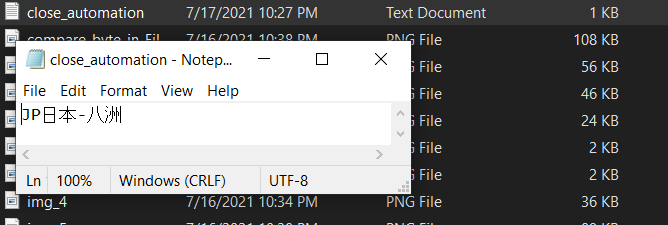

__________________________________________________________________________________________________________________________________________________________________________________
#### write(String)
``public void write(String str) throws IOException``
* **write** 1 **String** vào **Writer**
* ví dụ:
```java
writer.write("Some String");
```
__________________________________________________________________________________________________________________________________________________________________________________
#### write(String, int, int)
``public void write(String str, int offset, int len) throws IOException``
* **write** 1 phần của 1 **String** vào **Writer**
* **write** các character từ chỉ số **offset** đến chỉ số **offset + len** vào **Writer**
* ví dụ:
```java
writer.write("0123456789", 2, 5); // 23456
```
__________________________________________________________________________________________________________________________________________________________________________________
#### append(CharSequence)
``public Writer append(CharSequence csq) throws IOException``
* nối chuỗi ký tự của **CharSequence** vào **Writer**
* method này trả về object **Writer** hiện tại, điều này cho phép gọi tiếp 1 method khác của **Writer** thay vì kết thúc bởi dấu chấm phẩy ``;``
```java
import java.io.IOException;
import java.io.StringWriter;
import java.io.Writer;

public class append_CharSequence {
    public static void main(String[] args) throws IOException {
        Writer writer = new StringWriter();

        writer.append("01234").append("5678").write("9");

        System.out.println(writer.toString());

        writer.close();
    }
}
```
* OUTPUT
```
0123456789
```
__________________________________________________________________________________________________________________________________________________________________________________
#### append(CharSequence, int, int)
``public Writer append(CharSequence csq, int start, int end) throws IOException``
* nối 1 phần chuỗi ký tự của **CharSequence** vào **Writer**
* vị trí bắt đầu lấy ký tự để nối là ``start``
* vị trí kết thúc lấy ký tự để nối là ``end``
* method này trả về object **Writer** hiện tại, điều này cho phép gọi tiếp 1 method khác của **Writer** thay vì kết thúc bởi dấu chấm phẩy ``;``
```java
import java.io.IOException;
import java.io.StringWriter;
import java.io.Writer;

public class append_CharSequence_int_int {
    public static void main(String[] args) throws IOException {
        Writer writer = new StringWriter();

        String s = "0123456789";

        writer.append(s, 0, 3)
                .append(s, 3, 7)
                .append(s, 7, 9)
                .write("9");

        System.out.println(writer.toString());

        writer.close();
    }
}
```
* OUTPUT
```
0123456789
```
__________________________________________________________________________________________________________________________________________________________________________________
#### append(char)
``public Writer append(char chr) throws IOException``
* nối 1 ký tự vào **Writer**
* method này trả về object **Writer** hiện tại, điều này cho phép gọi tiếp 1 method khác của **Writer** thay vì kết thúc bởi dấu chấm phẩy ``;``
```java
import java.io.IOException;
import java.io.StringWriter;
import java.io.Writer;

public class append_char {
    public static void main(String[] args) throws IOException {
        Writer writer = new StringWriter();

        writer.append('J')
                .append('P')
                .append('日')
                .append('本');

        System.out.println(writer.toString());

        writer.close();
    }
}
```
* OUTPUT
```
JP日本
```
__________________________________________________________________________________________________________________________________________________________________________________
#### flush()
``public void flush() throws IOException``
* dữ liệu được ghi vào **Writer**, đôi khi được lưu trữ 1 cách tạm thời trên bộ đệm, method **flush()** được sử dụng để xả (flush) toàn bộ dữ liệu trên bộ đệm vào mục tiêu
* nếu mục tiêu dự kiến của **Writer** này là 1 phần trừu tượng được cung cấp bên dưới hệ điều hành, chẳng hạn như 1 tệp, <br/>
  thì việc **xả stream** chỉ đảm bảo rằng các ký tự trước đó đã được ghi vào stream sẽ được chuyển đến hệ điều hành để ghi, nó không đảm bảo rằng chúng thực sự được ghi<br/>
  vào 1 thiết bị vật lý như ổ đĩa
__________________________________________________________________________________________________________________________________________________________________________________

## 2. Reader <a id="2"></a>
* **abstract class Reader** nằm trong package **java.io**
* **Reader** là cơ sỡ đại diện cho các **Character Input Stream**
* **Reader** dùng để đọc 1 nguồn dữ liệu nào đó

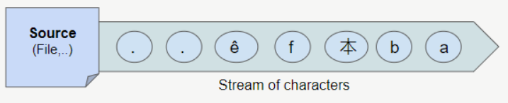

* **Reader** được định nghĩa như sau
```java
public abstract class Reader extends Object implements Readable, Closeable {
    // ...    
}
```
* ta không thể sử dụng **Reader** 1 cách trực tiếp, vì nó là một **abstract class**, tùy theo tình huống cụ thể, ta có thể sử dụng các **subclass** của nó
* các **subclass** của **Reader**
    * ``BufferedReader``
    * ``LineNumberReader``
    * ``CharArrayReader``
    * ``FilterReader``
    * ``PushbackReader``
    * ``InputStreamReader``
    * ``FileReader``
    * ``PipedReader``
    * ``StringReader``

* xét ví dụ đọc 1 file văn bản với **encoding UTF-8**


* **UTF-8** sử dụng 1, 2, 3 hoặc 4 bytes để lưu trữ 1 ký tự, hình ảnh dưới đây cho thấy các byte trong file nói trên

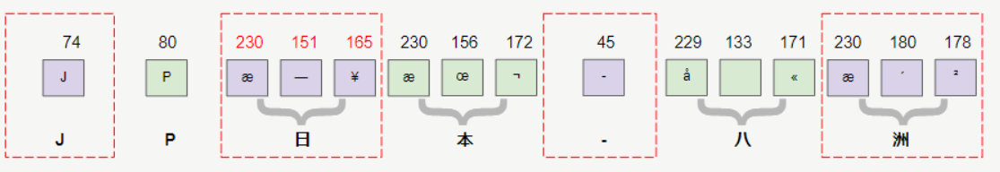

* **FileReader** là 1 **subclass** của **Reader** thường được sử dụng để đọc các file văn bản, và chúng ta sẽ nhận được 1 **stream of characters**
* bằng 1 cách nào đó các ký tự **UTF-8** sẽ được chuyển đổi thành các ký tự của **Java**
* kiểu **char** trong **Java** có kích thước 2 bytes, như vậy các ký tự trên **FileReader** có kích thước là 2 bytes

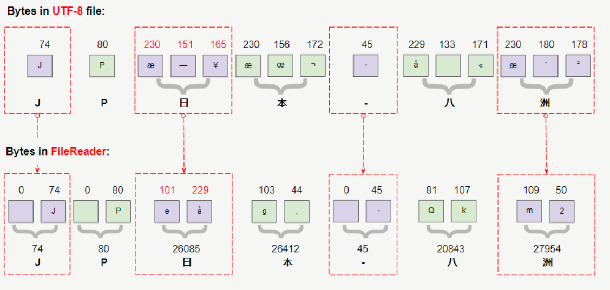

__________________________________________________________________________________________________________________________________________________________________________________

### Reader Fields
```java
public abstract class Reader extends Object implements Readable, Closeable {
    private static final int TRANSFER_BUFFER_SIZE = 8192;
    private static final int maxSkipBufferSize = 8192;
    private char skipBuffer[] = null;
    protected Object lock;
    // ...    
}
```
* ``lock`` là object được sử dụng để **synchronize** các hoạt động trên stream này
__________________________________________________________________________________________________________________________________________________________________________________
### Reader Constructor
```java
public abstract class Reader extends Object implements Readable, Closeable {
    protected Reader() {// ...}
    protected Reader(Object lock) {// ...}
        }
```
* ``protected Reader()``
    * tạo mới 1 character stream reader với các phần quan trọng sẽ được synchronize trên chính Reader

* ``protected Reader(Object lock)``
    * tạo mới 1 character stream reader với các phần quan trọng sẽ được synchronize trên chính object chỉ định
__________________________________________________________________________________________________________________________________________________________________________________
### Reader Methods
```java
public abstract class Reader extends Object implements Readable, Closeable {
    public static Reader nullReader() {//...}

        public abstract int read(char cbuf[], int off, int len) throws IOException;
        public abstract void close() throws IOException;

        public int read(java.nio.CharBuffer target) throws IOException {//...}
            public int read() throws IOException {//...}
                public int read(char cbuf[]) throws IOException {//...}

                    public boolean ready() throws IOException {//...}
                        public boolean markSupported() {//...}
                            public void mark(int readAheadLimit) throws IOException {//...}
                                public void reset() throws IOException {//...}
                                    public long skip(long n) throws IOException {//...}
                                        public long transferTo(Writer out) throws IOException {//...}
                                        }
```
__________________________________________________________________________________________________________________________________________________________________________________

#### read()
* ``public int read() throws IOException``
    * method **read()** được sử dụng để **read** 1 character
    * nó trả về mã code của character vừa đọc được, là 1 giá trị integer trong khoảng **[0 ; 65535]**
    * hoặc trả về **-1** nếu đọc tới cuối stream
    * method này sẽ bị block cho đến khi có character ready để read, hoặc xảy ra lỗi **IO**, hoặc đã tiến tới cuối stream

* ví dụ về method **read()**
```java
import java.io.IOException;
import java.io.Reader;
import java.io.StringReader;

public class read {
    public static void main(String[] args) throws IOException {
        Reader reader = new StringReader("JP日本-八洲");

        int charCode = 0;

        while ((charCode = reader.read()) != -1) {
            System.out.println((char) charCode + "\t" + charCode);
        }

        reader.close();
    }
}
```
* OUTPUT
```
J	74
P	80
日	26085
本	26412
-	45
八	20843
洲	27954
```
__________________________________________________________________________________________________________________________________________________________________________________
#### read(char[])
* ``public int read(char[] cbuf) throws IOException``
    * method **read(char[])** đọc các ký tự và gán các ký tự vào mảng **char[]**, số lượng ký tự mỗi lần đọc đúng bằng kích thước của mảng
    * method này trả về số lượng ký tự đọc được sau mỗi lần đọc từ stream
    * method này trả về **-1** nếu đọc tới cuối stream
    * method này sẽ bị block cho đến khi có các ký tự **ready** để đọc, hoặc xảy ra lỗi **IO**, hoặc đã tiến tới cuối stream
    * về cơ bản sử dụng method **read(char[])** sẽ có hiệu suất cao hơn so với method **read()**, vì nó giảm số lần đọc từ stream

* ví dụ về method **read(char[])**
```java
import java.io.IOException;
import java.io.Reader;
import java.io.StringReader;

public class read_to_char_array {
    public static void main(String[] args) throws IOException {
        Reader reader = new StringReader("1234567891234567891100");

        char[] cbuf = new char[10];
        int charCount = -1;

        while ((charCount = reader.read(cbuf)) != -1) {
            String s = new String(cbuf, 0, charCount);
            System.out.println(charCount + "\t" + s);
        }

        reader.close();
    }
}
```
* OUTPUT
```
10	1234567891
10	2345678911
2	00
```
__________________________________________________________________________________________________________________________________________________________________________________
#### read(char[], int, int)
* ``public int read(char[] cbuf, int offset, int len) throws IOException``
    * method **read(char[], int, int)** đọc các ký tự, và gán các ký tự vào mảng **char[]** từ chỉ số **offset** đến chỉ số **offset + len**
    * method này trả về số lượng ký tự mỗi lần đọc được từ stream
    * method này trả về **-1** nếu đã đọc tới cuối stream
    * method này sẽ bị block cho đến khi có các ký tự sẵn sàng để đọc, xảy ra lỗi **IO**, hoặc đã tiến tới cuối stream

__________________________________________________________________________________________________________________________________________________________________________________
#### read(java.nio.CharBuffer)
* ``public int read(java.nio.CharBuffer target) throws IOException``
    * method **read(CharBuffer)** đọc các ký tự, và truyền các ký tự vào object chỉ định của **CharBuffer** là ``target``
    * method này trả về số ký tự đọc được từ stream
    * hoặc trả về **-1** nếu tiến tới cuối stream
    * method này sẽ bị block cho đến khi có các ký tự sẵn sàng để đọc, xảy ra lỗi **IO**, hoặc đã tiến tới cuối stream**

* ví dụ về method **read(CharBuffer)**
```java
import java.io.IOException;
import java.io.Reader;
import java.io.StringReader;
import java.nio.CharBuffer;

public class read_CharBuffer {
    public static void main(String[] args) throws IOException {
        Reader reader = new StringReader("0123456789012456789");

        CharBuffer charBuffer = CharBuffer.allocate(7);

        int charCount;

        while ((charCount = reader.read(charBuffer)) != -1) {
            System.out.println(charCount + "\t" + charBuffer.flip().toString());
        }

        reader.close();
    }
}
```
* OUTPUT
```
7	0123456
7	7890124
5	56789
```
__________________________________________________________________________________________________________________________________________________________________________________
#### close()
* ``public void close() throws IOException ``
    * đóng stream và giải phóng mọi **system resource** đang liên kết đến stream
    * khi stream bị đóng, các lệnh gọi tiếp **read(), ready(), mark(), reset(), skip()** sẽ tạo ra 1 **IOException**
    * đóng stream đã đóng trước đó không có tác dụng
    * **abstract class Reader implements Closeable**, **interface Closeable extends AutoCloseable**, nếu lập trình theo quy tắc của **AutoCloseable** thì hệ thống sẽ tự đóng stream mà không cần gọi thủ công method **close()**

```java
import java.io.IOException;
import java.io.Reader;
import java.io.StringReader;

public class close_AutoCloseable {
    public static void main(String[] args) throws IOException {
        try (Reader reader = new StringReader("01234567890123456789")){
            int charCount;
            char[] cbuf = new char[5];
            while ((charCount = reader.read(cbuf)) != -1) {
                String s = new String(cbuf, 0, charCount);
                System.out.println(charCount +"\t" + s);
            }
        }
    }
}
```
* OUTPUT
```
5	01234
5	56789
5	01234
5	56789
```
__________________________________________________________________________________________________________________________________________________________________________________
#### skip(long)
* ``public long skip(long n) throws IOException``
    * method **skip(long)** bỏ qua không đọc ``n`` ký tự trong stream
    * method này sẽ bị block cho đến khi có các ký tự sẵn có, hoặc xảy ra lỗi **IO**, hoặc đã tiến tới cuối stream

* ví dụ về method **skip(long)**
```java
import java.io.IOException;
import java.io.Reader;
import java.io.StringReader;

public class skip {
    public static void main(String[] args) throws IOException {
        Reader reader = new StringReader("0123456789ABCDEF");

        System.out.println((char) reader.read());
        System.out.println((char) reader.read());
        reader.skip(8);

        int charCode;
        while ((charCode = reader.read()) != -1) {
            System.out.println((char) charCode);
        }

        reader.close();
    }
}
```
* OUTPUT
```
0
1
A
B
C
D
E
F
```
__________________________________________________________________________________________________________________________________________________________________________________
#### transferTo(Writer)
* ``public long transferTo(Writer out) throws IOException``
    * method **transferTo(Writer)** được sử dụng để đọc tất cả các ký tự từ **Reader** hiện tại, và ghi chúng vào đối tượng **Writer** chỉ định
    * method này trả về số lượng ký tự đã chuyển sang **Writer**, sau khi kết thúc, đối tượng **Reader** hiện tại sẽ ở cuối stream
    * method này sẽ **không đóng** đối tượng **Reader** hiện tại cũng như đối tượng **Writer**
* ví dụ về method **transferTo(Writer)
```java
import java.io.*;

public class transferTo_Writer {
    public static void main(String[] args) throws IOException {
        Reader reader = new StringReader("123456789-987654321-ABCDE");

        File file = new File("D:\\Learning\\Java\\JavaOOP\\src\\_45_Java_IO\\_04_CharacterIO_Streams\\transferToWriter.txt");
        file.getParentFile().mkdirs();
        Writer writer = new FileWriter(file);

        reader.skip(10);

        reader.transferTo(writer);

        writer.close();
        reader.close();
    }
}
```

* OUTPUT

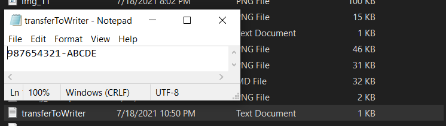


__________________________________________________________________________________________________________________________________________________________________________________
#### markSupported()
* ``public boolean markSupported()``
    * method **markSupported()** được sử dụng để kiểm tra đối tượng **Reader** có hỗ trợ hoạt động **mark(int)** hay không

Reader              | markSupported() ?
:-------------------|:-----------------
StringReader        |true
CharArrayReader     |true
BufferedReader      |true
LineNumberReader    |true
FilterReader        |true or false
InputStreamReader   |false
FileReader          |false
PushbackReader      |false

__________________________________________________________________________________________________________________________________________________________________________________
#### mark(int)
* ``public void mark(int readAheadLimit) throws IOException``
    * method **mark(int)** cho phép đánh dấu vị trí hiện tại trên stream
    * sau khi **mark(int)** có thể đọc tiếp các ký tự tiếp theo, và gọi method **reset()** để quay trở lại vị trí đã **mark(int)** trước đó
    * ``readAheadLimit`` là số lượng ký tự tối đa có thể đọc sau khi **mark(int)** mà không làm mất vị trí đã **mark(int)**
    * không phải tất cả các **subclass** của **Reader** có hỗ trợ **mark(int)**, <br/>
      để chắc chắn, trước khi thực hiện thao tác **mark(int)** cần gọi method **markSupported()** để kiểm tra xem đối tượng **Reader** hiện tại có hỗ trợ hoạt động **mark(int)** hay không

* ví dụ về method **mark(int)**
```java
import java.io.IOException;
import java.io.Reader;
import java.io.StringReader;

public class mark_int {
    public static void main(String[] args) throws IOException {
        Reader reader = new StringReader("----------ABCDEF123456");

        reader.skip(10);

        System.out.println("markSupported() ? - " + reader.markSupported());
        reader.mark(6);
        System.out.println("mark(int)");

        int count = 0;

        while (!(count == 6)) {
            char c = (char) reader.read();
            System.out.println(c);
            count++;
        }

        reader.reset();
        System.out.println("reset()");

        int charCode = 0;
        while ((charCode = reader.read()) != -1) {
            System.out.println((char) charCode);
        }

        reader.close();
    }
}
```
* OUTPUT
```
markSupported() ? - true
mark(int)
A
B
C
D
E
F
reset()
A
B
C
D
E
F
1
2
3
4
5
6
```

__________________________________________________________________________________________________________________________________________________________________________________
#### reset()
* ``public void reset() throws IOException``
    * nếu đối tượng **Reader** hiện tại hỗ trợ việc đánh dấu vị trí hiện tại thông qua method **mark(int)**, sau khi đã kiểm tra trả về ``true`` với method **markSupported()**
    * thì method **reset()** được sử dụng để quay trở lại vị trí đã được đánh dấu, với điều kiện vị trí đang đọc không vượt quá giới hạn trong method **mark(int)**

__________________________________________________________________________________________________________________________________________________________________________________
#### ready()
* ``public boolean ready() throws IOException``
    * method **ready()** trả về ``true`` nếu sẵn có 1 ký tự trên stream để đọc mà không phải chờ đợi, ngược lại trả về ``false``
__________________________________________________________________________________________________________________________________________________________________________________

## 3. OutputStreamWriter <a id="3"></a>
* **OutputStreamWriter** được đóng gói trong package **java.io**
* **OutputStreamWriter** là 1 **subclass** của **abstract class Writer**, nó là 1 cầu nối cho phép chuyển 1 **character stream** thành 1 **byte stream**, hay nói cách khác là 1 **Writer** thành 1 **OutputStream**
* **OutputStreamWriter** hoạt động với các **output stream** khác, là cầu nối giữa **character stream** và **byte stream**, điều này là do **OutputStreamWriter** chuyển đối các ký tự thành dạng byte
* ví dụ, 1 số ký tự yêu cầu 2 byte được lưu trữ trong bộ nhớ, để ghi dữ liệu như vậy, chúng ta có thể sử dụng **OutputStreamWriter** để chuyển đổi ký tự thành các byte tương ứng và lưu trữ các byte lại với nhau


### OutputStreamWriter Constructors
```java
public class OutputStreamWriter extends Writer {

    public OutputStreamWriter(OutputStream out) {//...}
    public OutputStreamWriter(OutputStream out, String charsetName) throws UnsupportedEncodingException {//...}
    public OutputStreamWriter(OutputStream out, Charset cs) {//...}
    public OutputStreamWriter(OutputStream out, CharsetEncoder enc) {//...}
}
```
Constructor                                                 |Description
:-----------------------------------------------------------|:--------------------------------------------------------------
OutputStreamWriter(OutputStream out)                        |tạo 1 đối tượng OutputStreamWriter sử dụng character encoding mặc định, <br/>tham số là 1 đối tượng OutputStream
OutputStreamWriter(OutputStream out, String charsetName)    |tạo 1 đối tương OutputStreamWriter sử dụng charset được đặt tên, <br/>tham số 1 là OutputStream, tham số 2 là chuỗi tên của charset được hỗ trợ, <br/>UnsupportedEncodingException được ném ra nếu encoding được đặt tên không hỗ trợ
OutputStreamWriter(OutputStream out, Charset cs)            |tạo 1 đối tượng OutputStreamWriter sử dụng charset được chỉ định, <br/>tham số 1 là OutputStream, tham số 2 là CharSet chỉ định
OutputStreamWriter(OutputStream out, CharsetEncoder enc)    |tạo 1 đối tượng OutputStreamWriter sử dụng charset encoder chỉ định, <br/>tham số 1 là OutputStream, tham số 2 là CharsetEncoder

__________________________________________________________________________________________________________________________________________________________________________________

### OutputStreamWriter Methods
```java
public class OutputStreamWriter extends Writer {

    public String getEncoding() {//...}
    void flushBuffer() throws IOException {//...}
    public void write(int c) throws IOException {//...}
    public void write(char cbuf[], int off, int len) throws IOException {//...}
    public void write(String str, int off, int len) throws IOException {//...}

    @Override
    public Writer append(CharSequence csq, int start, int end) throws IOException {//...}
    
    @Override
    public Writer append(CharSequence csq) throws IOException {//...}
    public void flush() throws IOException {//...}
    public void close() throws IOException {//...}
}
```
* những method của riêng **OutputStreamWriter** 

Return Data |Methods                                |Description
:-----------|:--------------------------------------|:-------------------
String      |getEncoding()                          |trả về tên của character encoding đang được sử dụng bởi stream này, <br/>trả về ``null`` nếu stream đã bị đóng
void        |write(int c)                           |ghi 1 ký tự vào stream, <br/>tham số là mã code của ký tự có kiểu integer
void        |write(char[] cbuf, int off, int len)   |ghi 1 phần của mảng ký tự vào stream, <br/>``cbuf`` : mảng ký tự cần ghi, <br/>``off`` : vị trí bắt đầu lấy dữ liệu trong mảng, <br/>``len`` : số lượng ký tự trong mảng cần lấy bắt đầu từ ``off``
void        |write(String str, int off, int len)    |ghi 1 phần của chuỗi vào stream, <br/>``str`` : chuỗi ký tự cần ghi, <br/>``off`` : vị trí bắt đầu lấy dữ liệu trong chuỗi để ghi, <br/>``len`` : số lượng ký tự trong chuỗi cần lấy bắt đầu từ ``off``
void        |flush()                                |đẩy toàn bộ dữ liệu trên stream xuống mục tiêu cần lưu trữ

__________________________________________________________________________________________________________________________________________________________________________________

### OutputStreamWriter với UTF-16
* **UTF-16** là mã hóa (encoding) khá phổ biến đối với văn bản tiếng Trung Quốc hoặc tiếng Nhật
* ví dụ ghi 1 file với **encoding UTF-16**
    * nội dung cần ghi vào file: ``JP日本-八洲``
    * chúng ta sử dụng **UTF-16 OutputStreamWriter** để ghi các ký tự vào 1 file
    * sau đó sử dụng **FileInputStream** để đọc từng byte dữ liệu của file đã được ghi
    
```java
import java.io.*;
import java.nio.charset.StandardCharsets;

public class OutputStreamWriter_UTF16_Ex1 {
    private static String path = "D:\\Learning\\Java\\JavaOOP\\src\\_45_Java_IO\\_04_CharacterIO_Streams\\_03_OutputStreamWriter\\utf16_file_out.txt";

    public static void main(String[] args) throws IOException {
        System.out.println("--- write UTF-16 file ---");
        write_UTF16_Character_stream();

        System.out.println("--- read file as a binary stream ---");
        read_as_a_Binary_stream();
    }

    private static void write_UTF16_Character_stream() throws IOException {
        File file = new File(path);
        file.getParentFile().mkdirs();

        OutputStream os = new FileOutputStream(file);
        Writer osw = new OutputStreamWriter(os, StandardCharsets.UTF_16);

        String s = "JP日本-八洲";

        osw.write(s);

        osw.close();
        os.close();
    }

    private static void read_as_a_Binary_stream() throws IOException {
        InputStream is = new FileInputStream(path);

        int byteCode;
        while ((byteCode = is.read()) != -1) {
            System.out.println((char) byteCode + "\t" + byteCode);
        }

        is.close();
    }
}
```
* OUTPUT

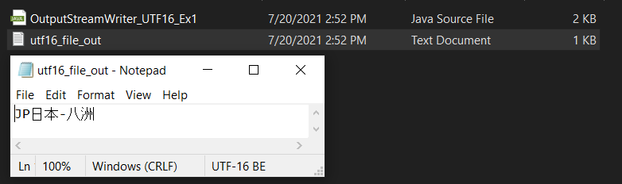

```
--- write UTF-16 file ---
--- read file as a binary stream ---
þ	254
ÿ	255
 	0
J	74
 	0
P	80
e	101
å	229
g	103
,	44
 	0
-	45
Q	81
k	107
m	109
2	50
```
* trong **Java**, kiểu dữ liệu **char** có kích thước 2 **byte**, và **UTF-16** được sử dụng để mã hóa kiểu **String**
* hình ảnh dưới đây cho thấy các ký tự trên **OutputStreamWriter**

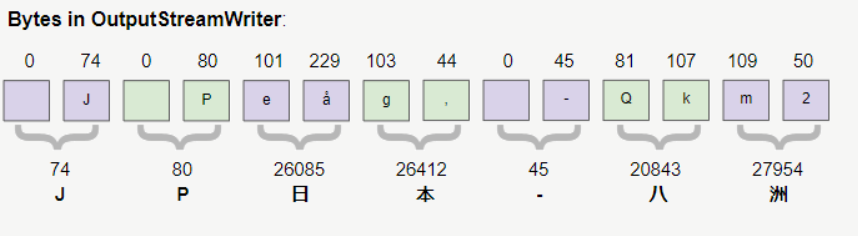

* phân tích các **byte** trên file vừa được tạo ra cho thấy:
    * 2 byteCode đầu tiên là: **(254, 255)** được sử dụng để đánh dấu rằng đây là 1 văn bản được mã hóa **UTF-16**, chúng còn được gọi là **BOM (Byte Order Mark)**
    * các **byte** tiếp theo giống các **byte** trên **OutputStreamWriter**
  


__________________________________________________________________________________________________________________________________________________________________________________
### OutputStreamWriter với UTF-8
* **UTF-8** là mã hóa (encoding) phổ biến nhất thế giới, nó có thể mã hóa mọi chữ viết trên thế giới bao gồm cả ký tự của Trung Quốc, Nhật Bản
* bắt đầu từ **Java5, UTF-8** là mã hóa mặc định khi đọc ghi file
* các file **UTF-8** được tạo ra bởi **Java** sẽ không có **BOM (Byte Order Mark)** - các bytes đầu tiên của file để đánh dấu rằng đây là 1 file **UTF-16**
* ví dụ ghi 1 file với **encoding UTF-8**
  * nội dung cần ghi vào file: ``JP日本-八洲``
  * chúng ta sử dụng **UTF-8 OutputStreamWriter** để ghi các ký tự vào 1 file
  * sau đó sử dụng **FileInputStream** để đọc từng byte dữ liệu của file đã được ghi
  
```java
import java.io.*;
import java.nio.charset.StandardCharsets;

public class OutputStreamWriter_UTF8 {
    private static String path = "D:\\Learning\\Java\\JavaOOP\\src\\_45_Java_IO\\_04_CharacterIO_Streams\\_03_OutputStreamWriter\\utf8_file_out.txt";

    public static void main(String[] args) throws IOException {
        System.out.println("--- write UTF-8 file ---");
        write_UTF8_Character_stream();

        System.out.println("--- read as a Binary stream ---");
        read_as_a_Binary_stream();
    }

    private static void write_UTF8_Character_stream() throws IOException {
        File file = new File(path);
        file.getParentFile().mkdirs();

        OutputStream os = new FileOutputStream(file);
        Writer osw = new OutputStreamWriter(os, StandardCharsets.UTF_8);

        String s = "JP日本-八洲";

        osw.write(s);

        osw.close();
        os.close();
    }

    private static void read_as_a_Binary_stream() throws IOException {
        InputStream is = new FileInputStream(path);

        int byteCode;
        while ((byteCode = is.read()) != -1) {
            System.out.println((char) byteCode + "\t" + byteCode);
        }

        is.close();
    }
}
```
* OUTPUT
```
--- write UTF-8 file ---
--- read as a Binary stream ---
J	74
P	80
æ	230
—	151
¥	165
æ	230
œ	156
¬	172
-	45
å	229
…	133
«	171
æ	230
´	180
²	178
```
* trong **Java**, kiểu dữ liệu **char** có kích thước 2 **byte**, **UTF-16** được sử dụng để mã hóa kiểu **String**
* hình ảnh dưới đây cho thấy các ký tự trên **OutputStreamWriter**

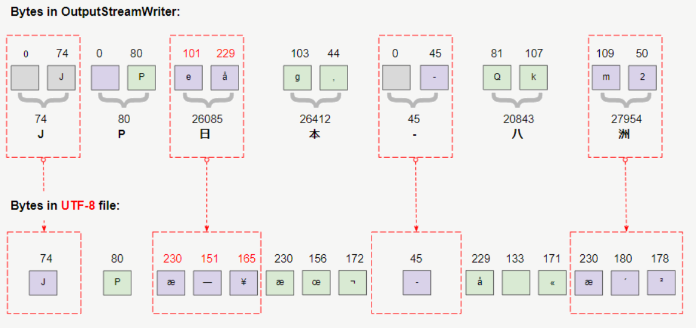

* **UTF-8** được mã hóa phức tạp hơn khá nhiều so với **UTF-16**, nó sử dụng **1, 2, 3** hoặc **4 bytes** để lưu trữ 1 ký tự
* phân tích các byte trên file **UTF-8** được tạo ra cho thấy điều đó

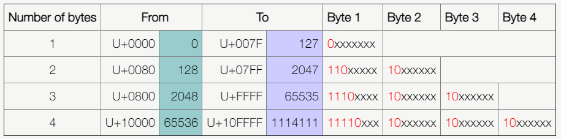

* ví dụ ký tự **"日"** có mã số là **26085** thuộc phạm vi **[2048 ; 65535]**, **UTF-8** sẽ cần 3 **bytes** để lưu trữ nó

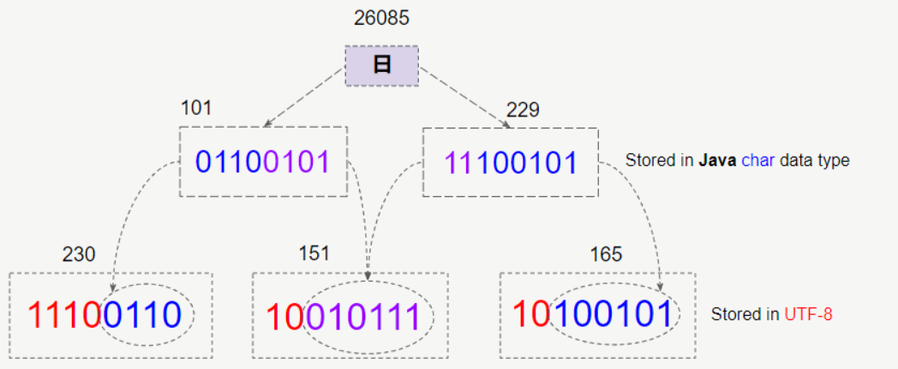

__________________________________________________________________________________________________________________________________________________________________________________

## 4. InputStreamReader <a id="4"></a>
* **InputStreamReader** được đóng gói trong package **java.io**
* **InputStreamReader** là cầu nối từ 1 **byte stream** sang 1 **character stream**, nó đọc các bytes và decode chúng thành các characters bằng cách sử dụng 1 **charset** chỉ định
* **charset** mà **InputStreamReader** sử dụng có thể được chỉ định theo tên, hoặc được chỉ định 1 cách tường minh, hoặc là mặc định theo platform

### InputStreamReader Constructors
```java
public class InputStreamReader extends Reader {
  public InputStreamReader(InputStream in) {//...}
  public InputStreamReader(InputStream in, String charsetName) throws UnsupportedEncodingException {//...}
  public InputStreamReader(InputStream in, Charset cs) {//...}
  public InputStreamReader(InputStream in, CharsetDecoder dec) {//...}
}
```

Constructor                                                 |Description
:-----------------------------------------------------------|:--------------------------------------------------------------
InputStreamReader(InputStream in)                           |tạo 1 đối tượng **InputStreamReader** sử dụng bộ **charset** mặc định, <br/>``in`` : tham số truyền vào là **InputStream**
InputStreamReader(InputStream in, String charsetName)       |tạo 1 đối tượng **InputStreamReader** sử dụng bộ **charset** chỉ định theo tên được đặt,<br/>``in`` : tham số 1 là đối tượng **InputStream**,<br/>``charsetName`` : tham số 2 là tên của bộ **charset** đã được đặt tên
InputStreamReader(InputStream in, Charset cs)               |tạo 1 đối tượng **InputStreamReader** sử dụng bộ **charset** chỉ định tường minh,<br/>``in`` : tham số 1 là đối tượng **InputStream**,<br/>``cs`` : tham số 2 là bộ **charset** chỉ định tường minh
InputStreamReader(InputStream in, CharsetDecoder dec)       |tạo 1 đối tượng **InputStreamReader** sử dụng bộ **charset decoder** chỉ định,<br/>``in`` : tham số 1 là đối tượng **InputStream**,<br/>``dec`` : tham số 2 là bộ **charset decoder** chỉ định

### InputStreamReader Methods
```java
public class InputStreamReader extends Reader {
  public String getEncoding() {//...}
  public int read() throws IOException {//...}
  public int read(char cbuf[], int offset, int length) throws IOException {//...}
  public boolean ready() throws IOException {//...}
  public void close() throws IOException {//...}
}
```

Return Data |Method                                     |Description
:-----------|:------------------------------------------|:-------------------------------------------------------
String      |getEncoding()                              |trả về tên của **character encoding** đang được sử dụng bởi stream này
int         |read()                                     |trả về **byteCode** của ký tự đọc được trong stream<br/>trả về **-1** nếu tiến tới cuối stream
int         |read(char cbuf[], int offset, int length)  |đọc các ký tự trong stream, gán các ký tự vào mảng **char** ``cbuf`` từ vị trí ``offset`` đến vị trí ``offset + length``<br/>trả về số lượng ký tự đọc được trong stream<br/>trả về **-1** nếu tiến tới cuối stream
boolean     |ready()                                    |trả về ``true`` nếu có sẵn ký tự kế tiếp có thể đọc mà không bị **block**
void        |close()                                    |đóng stream hiện tại

__________________________________________________________________________________________________________________________________________________________________________________

### InputStreamReader với UTF16
* ví dụ về sử dụng **InputStreamReader** để đọc 1 file **UTF16**
```java
import java.io.*;
import java.nio.charset.StandardCharsets;

public class InputStreamReader_UTF16 {
    private static String path = "D:\\Learning\\Java\\JavaOOP\\src\\_45_Java_IO\\_04_CharacterIO_Streams\\_03_OutputStreamWriter\\utf16_file_out.txt";

    public static void main(String[] args) throws IOException {
        System.out.println("--- read character in character stream using InputStreamReader with utf16 file ---");
        readAs_UTF16_CharacterStream();
        System.out.println();

        System.out.println("--- read as a binary stream ---");
        readAs_BinaryStream();
    }

    private static void readAs_UTF16_CharacterStream() throws IOException {
        File file = new File(path);
        InputStream is = new FileInputStream(file);
        Reader isr = new InputStreamReader(is, StandardCharsets.UTF_16);

        int charCode;
        while ((charCode = isr.read()) != -1) {
            System.out.println((char) charCode + "\t" + charCode);
        }

        isr.close();
        is.close();
    }

    private static void readAs_BinaryStream() throws IOException {
        File file = new File(path);
        InputStream is = new FileInputStream(file);

        int charCode;
        while ((charCode = is.read()) != -1) {
            System.out.println((char) charCode + "\t" + charCode);
        }

        is.close();
    }
}
```
* OUTPUT
```
--- read character in character stream using InputStreamReader with utf16 file ---
J	74
P	80
日	26085
本	26412
-	45
八	20843
洲	27954

--- read as a binary stream ---
þ	254
ÿ	255
 	0
J	74
 	0
P	80
e	101
å	229
g	103
,	44
 	0
-	45
Q	81
k	107
m	109
2	50
```
* hình ảnh dưới đây cho thấy các **bytes** trong file **UTF16**, 2 **bytes** đầu tiên **(254, 255)** được sử dụng để đánh dấu nó bắt đầu của 1 văn bản **UTF16**

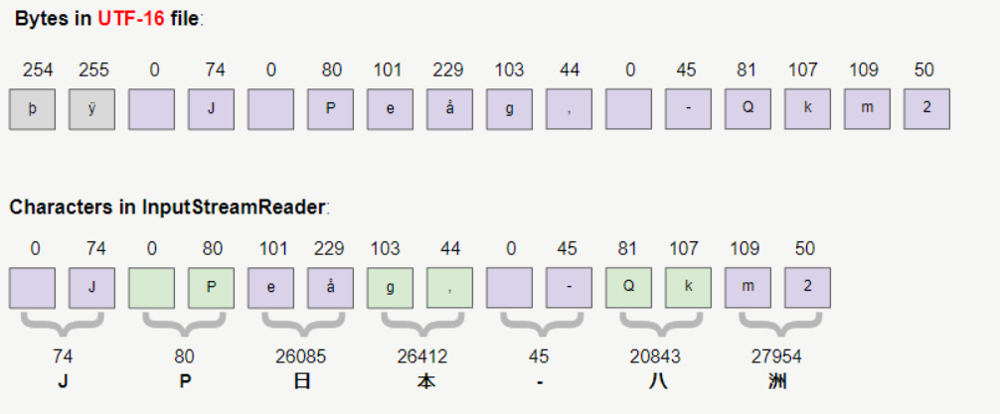

* **UTF16 InputStreamReader** đọc 2 **bytes** đầu tiên để xác định kiểu mã hóa của văn bản, và biết rằng nó đang làm việc với 1 văn bản **UTF16**, nó tiến hành ghép 2 byte liên tiếp thành 1 ký tự
__________________________________________________________________________________________________________________________________________________________________________________
### InputStreamReader với UTF8
* **UTF-8** là mã hóa (encoding) phổ biến nhất trên thế giới, nó có thể mã hóa mọi chữ viết trên thế giới bao gồm cả ký tự Trung Quốc, Nhật Bản
* bây giờ chúng ta hãy phân tích làm thế nào **InputStreamReader** đọc được các văn bản **UTF-8**

```java
import java.io.*;
import java.nio.charset.StandardCharsets;

public class InputStreamReader_UTF8 {
    private static final String path = "D:\\Learning\\Java\\JavaOOP\\src\\_45_Java_IO\\_04_CharacterIO_Streams\\_03_OutputStreamWriter\\utf8_file_out.txt";

    public static void main(String[] args) throws IOException {
        System.out.println("--- readAs_UTF8_CharacterStream ---");
        readAs_UTF8_CharacterStream();
        System.out.println();

        System.out.println("--- readAs_BinaryStream ---");
        readAs_BinaryStream();
    }

    private static void readAs_UTF8_CharacterStream() throws IOException {
        InputStream is = new FileInputStream(path);
        Reader isr = new InputStreamReader(is, StandardCharsets.UTF_8);

        int charCode;
        while ((charCode = isr.read()) != -1) {
            System.out.println((char) charCode + "\t" + charCode);
        }

        isr.close();
        is.close();
    }

    private static void readAs_BinaryStream() throws IOException {
        InputStream is = new FileInputStream(path);

        int charCode;
        while ((charCode = is.read()) != -1) {
            System.out.println((char) charCode + "\t" + charCode);
        }

        is.close();
    }
}
```
* OUTPUT
```
--- readAs_UTF8_CharacterStream ---
J	74
P	80
日	26085
本	26412
-	45
八	20843
洲	27954

--- readAs_BinaryStream ---
J	74
P	80
æ	230
—	151
¥	165
æ	230
œ	156
¬	172
-	45
å	229
…	133
«	171
æ	230
´	180
²	178
```
* hình ảnh dưới đây cho thấy các **bytes** trong file **UTF-8**

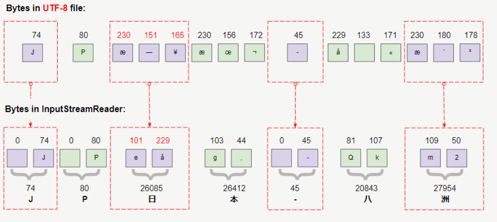

* mã hóa ký tự **UTF-8** phức tạp hơn rất nhiều so với **UTF-16**, nó cần **1, 2, 3,** hoặc **4 bytes** để lưu trữ 1 ký tự, điều này phụ thuộc vào mã của ký tự


* hình ảnh dưới đây, là 1 ví dụ cho thấy cách **UTF-8 InputStreamReader** biến **3 bytes** của **UTF-8** thành 1 ký tự **2 bytes** của Java

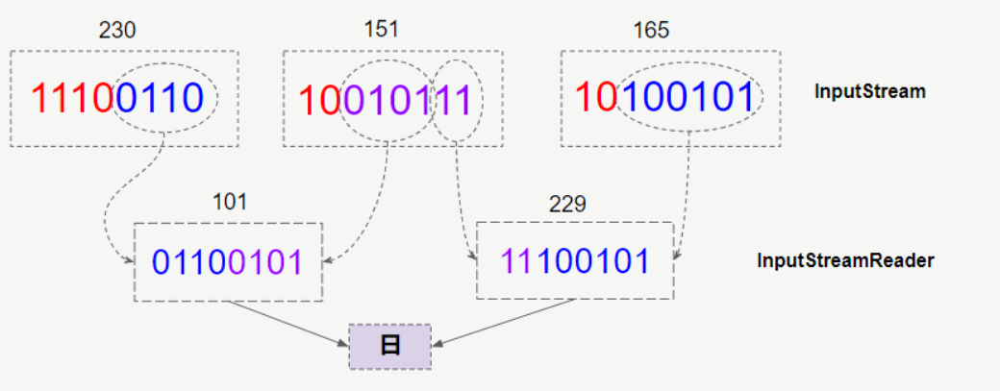

__________________________________________________________________________________________________________________________________________________________________________________

## 5. FileWriter <a id="5"></a>
* **FileWriter** là 1 **subclass** của **OutputStreamWriter**, nó được sử dụng để ghi các file văn bản
* **FileWriter** khôn có thêm các phương thức nào cho chính nó, nó hoàn toàn sử dụng các phương thức của **superclass** là **OutputStreamWriter**
* thực tế bạn có thể sử dụng **OutputStreamWriter** để ghi các ký tự vào bất kỳ mục tiêu nào, tuy nhiên **FileWriter** được thiết kế riêng để ghi các ký tự vào file hệ thống

### FileWriter Constructors
```java
public class FileWriter extends OutputStreamWriter {
  public FileWriter(String fileName) throws IOException {//...}
  public FileWriter(String fileName, boolean append) throws IOException {//...}
  public FileWriter(File file) throws IOException {//...}
  public FileWriter(File file, boolean append) throws IOException {//...}
  public FileWriter(FileDescriptor fd) {//...}
  public FileWriter(String fileName, Charset charset) throws IOException {//...}
  public FileWriter(String fileName, Charset charset, boolean append) throws IOException {//...}
  public FileWriter(File file, Charset charset) throws IOException {//...}
  public FileWriter(File file, Charset charset, boolean append) throws IOException {//...}
}
```
* các Constructors có tham số **Charset** được thêm vào **FileWriter** từ phiên bản **JDK 11**, vì vậy nếu bạn đang sử dụng phiên bản cũ hơn, và muốn ghi 1 file với mã hóa (encoding) được chỉ định, hãy sử dụng **OutputStreamWriter**

Method                                                        |Description
:-------------------------------------------------------------|:-----------------------------------------------------------
FileWriter(String fileName)                                   |tạo 1 **FileWriter** để ghi nội dung vào 1 **fileName** chỉ định (là đường dẫn đến tên file trong hệ thống), sử dụng **charset** mặc định của platform <br/> ``fileName`` : chuỗi đường dẫn đến file nằm trong hệ thống
FileWriter(String fileName, boolean append)                   |tạo 1 **FileWriter** để ghi đè hoặc nối thêm nội dung vào 1 **fileName** chỉ định (là đường dẫn đến tên file trong hệ thống) bằng cách truyền tham số **boolean**, <br/>**FileWriter** này sử dụng **charset** mặc định của platform <br/> ``fileName`` : chuỗi đường dẫn đến file nằm trong hệ thống <br/>``append`` : giá trị **boolean** cho biết nối thêm hay ghi đè nội dung vào file, nếu ``true`` các bytes sẽ được ghi nối thêm vào cuối file thay vì ghi đè từ đầu file
FileWriter(File file)                                         |tạo 1 **FileWriter** để ghi nội dung vào 1 **File** chỉ định, sử dụng **charset** mặc định của platform <br/>``file`` : là tham số, file chỉ định để ghi nội dung
FileWriter(File file, boolean append)                         |tạo 1 **FileWriter** để ghi đè hoặc nối thêm nội dung vào 1 **File** chỉ định bằng cách truyền tham số **boolean**, **FileWriter** này sử dụng **charset** mặc định của platform <br/>``file`` : tham số 1, file chỉ định để ghi nội dung <br/>``append`` : giá trị **boolean** cho biết nối thêm hay ghi đè nội dung vào file, nếu ``true`` các bytes sẽ được ghi nối thêm vào cuối file thay vì ghi đè từ đầu file
FileWriter(FileDescriptor fd)                                 |tạo 1 **FileWriter** để ghi nội dung vào 1 **FileDescriptor**, sử dụng **charset** mặc định của platfom <br/> ``fd`` : là tham số, **FileDescriptor** chỉ định để ghi nội dung
FileWriter(String fileName, Charset charset)                  |tạo 1 **FileWriter** để ghi nội dung vào file nằm ở đường dẫn chỉ định trong hệ thống, sử dụng **Charset** chỉ định để ghi <br/> ``fileName`` : đường dẫn đến file chỉ định <br/>``charset`` : Charset chỉ định
FileWriter(String fileName, Charset charset, boolean append)  |tạo 1 **FileWriter** để ghi đè hoặc nối thêm nội dung vào 1 file nằm ở đường dẫn chỉ định trong hệ thống,  <br/>bằng cách truyền 1 tham số **boolean** cho biết có hay không việc nối thêm nội dung vào file <br/>``fileName`` : đường dẫn của file chỉ định <br/>``charset`` : Charset chỉ định <br/>``append`` : giá trị **boolean** cho biết nối thêm nội dung vào cuối file hay ghi đè từ đầu 
public FileWriter(File file, Charset charset)                 |tạo 1 **FileWriter** để ghi nội dung vào 1 file chỉ định, sử dụng **Charset** chỉ định để ghi nội dung vào file <br/>``file`` : File chỉ định <br/>``charset`` : Charset chỉ định
FileWriter(File file, Charset charset, boolean append)        |tạo 1 **FileWriter** để ghi đè hoặc nối thêm nội dung vào file chỉ định, bằn cách truyền 1 tham số **boolean** cho biết có hay không việc nối thêm nội dung vào file <br/>``file`` : File chỉ định <br/>``charset`` : Charset chỉ định <br/>``append`` : giá trị **boolean** cho biết nối thêm nội dung vào cuối file hay ghi đè từ đầu

__________________________________________________________________________________________________________________________________________________________________________________

### FileWriter EX1
* sử dụng **FileWriter** để ghi nội dung vào 1 file chỉ định
```java
import java.io.File;
import java.io.FileWriter;
import java.io.IOException;

public class FileWriter_write {
    private static final String path = "D:\\Learning\\Java\\JavaOOP\\src\\_45_Java_IO\\_04_CharacterIO_Streams\\_05_FileWriter\\FileWriter_write.txt";

    public static void main(String[] args) throws IOException {
        File file = new File(path);
        file.getParentFile().mkdirs();

        FileWriter fileWriter = new FileWriter(file);

        fileWriter.write(file.getAbsolutePath());
        fileWriter.write("\n");
        fileWriter.write(fileWriter.getEncoding());
        fileWriter.write("\n");

        fileWriter.write("Line 1");
        fileWriter.write("\n");

        fileWriter.write("Line 2");
        fileWriter.write("\n");

        fileWriter.write("Line 3");
        fileWriter.write("\n");

        fileWriter.write("Line 4");
        fileWriter.write("\n");

        fileWriter.close();
    }
}
```
* OUTPUT

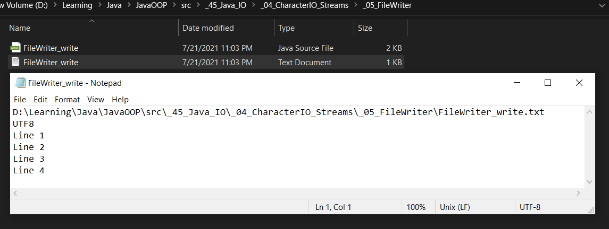

__________________________________________________________________________________________________________________________________________________________________________________

### FileWriter EX2
* sử dụng **FileWriter** để ghi nối thêm nội dung vào file chỉ định
```java
import java.io.File;
import java.io.FileWriter;
import java.io.IOException;

public class FileWriter_write_append {
    private static final String path = "D:\\Learning\\Java\\JavaOOP\\src\\_45_Java_IO\\_04_CharacterIO_Streams\\_05_FileWriter\\FileWriter_write - Copy.txt";

    public static void main(String[] args) throws IOException {
        File file = new File(path);
        file.getParentFile().mkdirs();

        FileWriter fileWriter = new FileWriter(file, true);

        System.out.println(file.getAbsoluteFile());
        System.out.println(fileWriter.getEncoding());

        fileWriter.write("\n");
        fileWriter.write("Line 5");
        fileWriter.write("\n");
        fileWriter.append("Line 6").append("\n").append("Line 7").append("\n");

        fileWriter.close();
    }
}
```
* OUTPUT

```
D:\Learning\Java\JavaOOP\src\_45_Java_IO\_04_CharacterIO_Streams\_05_FileWriter\FileWriter_write - Copy.txt
UTF8
```

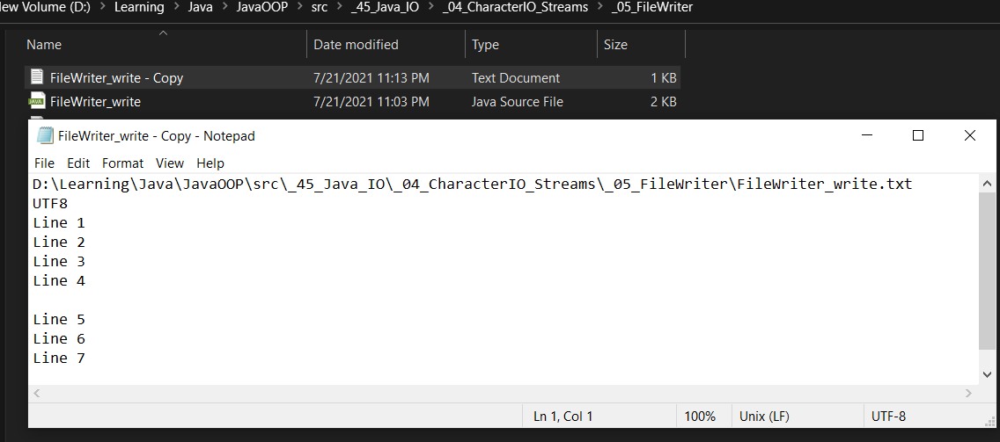

__________________________________________________________________________________________________________________________________________________________________________________
### FileWriter ghi với UTF16, đọc bằng FileInputStream
* sử dụng **FileWriter** để ghi 1 file với mã hóa (encoding) với **UTF-16**
* sau đó đọc file vừa ghi bằng **FileInputStream** để xem các **bytes** trên file
```java
import java.io.*;
import java.nio.charset.StandardCharsets;

public class FileWriter_UTF16 {
    private static final String path = "D:\\Learning\\Java\\JavaOOP\\src\\_45_Java_IO\\_04_CharacterIO_Streams\\_05_FileWriter\\FileWriter_UTF16.txt";

    public static void main(String[] args) throws IOException {
        System.out.println("WriterFile in UTF-16");
        write_UTF16_FileWriter();

        System.out.println("read file as BinaryStream");
        readAs_BinaryStream();
    }

    private static void write_UTF16_FileWriter() throws IOException {
        File file = new File(path);
        file.getParentFile().mkdirs();

        Writer writer = new FileWriter(file, StandardCharsets.UTF_16);

        String s = "JP日本-八洲";

        writer.write(s);

        writer.close();
    }

    private static void readAs_BinaryStream() throws IOException {
        File file = new File(path);
        InputStream fis = new FileInputStream(file  );

        int byteCode;
        while ((byteCode = fis.read()) != -1) {
            System.out.println((char) byteCode + "\t" + byteCode);
        }

        fis.close();
    }
}
```
* OUTPUT

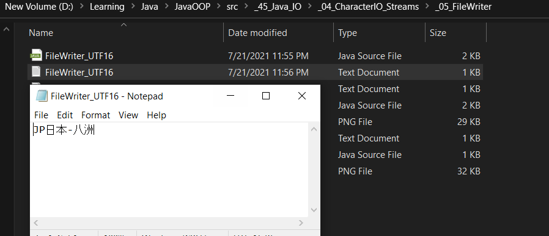

```
WriterFile in UTF-16
read file as BinaryStream
þ	254
ÿ	255
 	0
J	74
 	0
P	80
e	101
å	229
g	103
,	44
 	0
-	45
Q	81
k	107
m	109
2	50
```

* Dưới đây là hình minh hoạ các **bytes** trên **FileWriter** và các **bytes** trong file vừa được ghi ra bởi **FileWriter**:

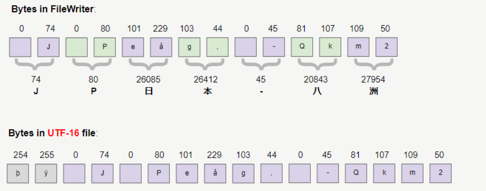

* Hai bytes đầu tiên **(254,255)** trong file **UTF-16** được sử dụng để đánh dấu rằng nó bắt đầu một dữ liệu mã hoá bằng **UTF-16**
__________________________________________________________________________________________________________________________________________________________________________________

## 6. FileReader <a id="6"></a>
* **FileReader** là 1 **subclass** của **InputStreamReader**, nó được sử dụng để đọc các file văn bản
* **FileReader** không có thêm bất cứ method nào khác ngoài trừ các method của **InputStreamReader**
* thực tế bạn có thể sử dụng **InputStreamReader** để đọc các ký tự từ bất kỳ nguồn nào, tuy nhiên **FileReader** được thiết kế riêng để đọc các file từ hệ thống
```java
public class FileReader extends InputStreamReader {
  public FileReader(String fileName) throws FileNotFoundException {//...}
  public FileReader(File file) throws FileNotFoundException {//...}
  public FileReader(FileDescriptor fd) {//...}
  public FileReader(String fileName, Charset charset) throws IOException {//...}
  public FileReader(File file, Charset charset) throws IOException {//...}
}
```
* các Constructor có tham số **Charset** được thêm vào **FileReader** từ phiên bản **JDK 11**, vì vậy nếu sử dụng **Java** phiên bản cũ hơn, nhưng muốn đọc file với mã hóa (encoding) chỉ định hãy sử dụng **InputStreamReader** thay thế

Method                                          |Description
:-----------------------------------------------|:----------------------------------------------------------------------------------------------
FileReader(String fileName)                     |tạo 1 **FileReader** để đọc nội dung từ đường dẫn đến tên file chỉ định, sử dụng **charset** mặc định của platform <br/>``fileName`` : đường dẫn đến tên file chỉ định để đọc
FileReader(File file)                           |tạo 1 **FileReader** để đọc nội dung từ **File** chỉ định, sử dụng **charset** mặc định của platform <br/>``file`` : File chỉ định để đọc
FileReader(FileDescriptor fd)                   |tạo 1 **FileReader** để đọc nội dung từ **FileDescriptor** chỉ định, sử dụng **charset** mặc định của platform <br/>``fd`` : FileDescriptor chỉ định để đọc
FileReader(String fileName, Charset charset)    |tạo 1 **FileReader** để đọc nội dung từ đường dẫn đến tên file chỉ định, sử dụng **Charset** chỉ định để chuyển đổi nội dung <br/>``fileName`` : đường dẫn đến tên file chỉ định để đọc <br/>``charset`` : Charset chỉ định 
FileReader(File file, Charset charset)          |tạo 1 **FileReader** để đọc nội dung từ **File** chỉ định, sử dụng **Charset** chỉ định để chuyển đổi nội dung <br/>``file`` : File chỉ định để đọc <br/>``charset`` : Charset chỉ định

__________________________________________________________________________________________________________________________________________________________________________________
### FileReader_Ex1
* ví dụ sử dụng **FileReader** để đọc các bytes từ file chỉ định
```java
import java.io.*;

public class FileReader_Ex1 {
    private static final String path = "D:\\Learning\\Java\\JavaOOP\\src\\_45_Java_IO\\_04_CharacterIO_Streams\\_06_FileReader\\FileReader_Ex1.txt";

    public static void main(String[] args) throws IOException {
        File file = new File(path);

        Reader reader = new FileReader(file);

        int charCode;
        while ((charCode = reader.read()) != -1) {
            System.out.println((char) charCode + "\t" + charCode);
        }

        reader.close();
    }
}
```
* OUTPUT
```
F	70
i	105
l	108
e	101
 	32
C	67
o	111
n	110
t	116
e	101
n	110
t	116
```
__________________________________________________________________________________________________________________________________________________________________________________
### FileReader với BufferedReader để tăng hiệu suất (1)
* khi đọc 1 file văn bản, nên kết hợp giữa **FileReader** và **BufferedReader** để tăng hiệu suất sử dụng
* ví dụ đọc 1 file danh sách Student.txt
```text
# Students:
 
John P
Sarah M
# Sarah B
Charles B
Mary T
Sophia B
```
* class chương trình
```java
import java.io.*;

public class FileReader_in_BufferedReader {
    private static final String path = "D:\\Learning\\Java\\JavaOOP\\src\\_45_Java_IO\\_04_CharacterIO_Streams\\_06_FileReader\\Student.txt";

    public static void main(String[] args) throws IOException {
        File file = new File(path);

        Reader reader = new FileReader(file);

        BufferedReader bufferedReader = new BufferedReader(reader);

        String line;
        while ((line = bufferedReader.readLine()) != null) {
            System.out.println(line);
        }

        bufferedReader.close();
        reader.close();
    }
}
```
* OUTPUT
```text
# Students:
 
John P
Sarah M
# Sarah B
Charles B
Mary T
Sophia B
```
__________________________________________________________________________________________________________________________________________________________________________________
### FileReader với BufferedReader để tăng hiệu suất (2)
* đọc nội dung file trên, kết hợp giữa **BufferedReader** và **FileReader**, nhưng bỏ qua những dòng bắt đầu với dấu ``#``
```java
import java.io.*;

public class FileReader_in_BufferedReader_without_sharp_sign {
    private static final String path = "D:\\Learning\\Java\\JavaOOP\\src\\_45_Java_IO\\_04_CharacterIO_Streams\\_06_FileReader\\Student.txt";

    public static void main(String[] args) throws IOException {
        File file = new File(path);

        Reader reader = new FileReader(file);

        BufferedReader bufferedReader = new BufferedReader(reader);

        bufferedReader.lines()
                .filter(line -> !line.startsWith("#"))
                .forEach(System.out::println);

        bufferedReader.close();
        reader.close();
    }
}
```
* OUTPUT
```text
 
John P
Sarah M
Charles B
Mary T
Sophia B
```
__________________________________________________________________________________________________________________________________________________________________________________
### UTF-8 BOM (Byte Order Mark)
* trước khi **UTF-8** trở nên phổ biến, các công cụ tạo ra file **UTF-8** luôn thêm vào **3 bytes** đầu tiên để đánh dấu rằng đây là file được mã hóa **UTF-8**, **3 bytes** này được gọi là **BOM (Byte Order Mark)**
* trong khi các file **UTF-8** được tạo ra bởi **Java** không bao gồm **BOM**
* **FileReader** không tự động loại bỏ **BOM** khi đọc các file **UTF-8**, đội ngũ thiết kế **Java** hiểu được điều này, tuy nhiên không 1 bản cập nhật nào được thực hiện, vì nó sẽ phá vỡ các thư viện của bên thứ 3 viết trên **Java** trước đó như **XML Parser**
* dưới đây là link download 1 file **UTF-8** với **BOM**

[https://s3.o7planning.com/txt/utf8-file-with-bom-test.txt](https://s3.o7planning.com/txt/utf8-file-with-bom-test.txt)

* hoặc có thể tạo ra 1 file **UTF-8** với **BOM** bằng cách thêm ký tự có mã code = 65279 (được lưu trữ 3 bytes)
```java
import java.io.File;
import java.io.FileWriter;
import java.io.IOException;
import java.io.Writer;

public class Create_file_UTF8_with_BOM {
    private static final String path = "D:\\Learning\\Java\\JavaOOP\\src\\_45_Java_IO\\_04_CharacterIO_Streams\\_06_FileReader\\file_UTF8_with_BOM.txt";

    public static void main(String[] args) throws IOException {
        File file = new File(path);
        file.getParentFile().mkdirs();

        Writer writer = new FileWriter(file);
        writer.write(65279);
        writer.write(72);
        writer.write(101);
        writer.write(108);
        writer.write(108);
        writer.write(111);

        writer.close();
    }
}
```
* OUTPUT

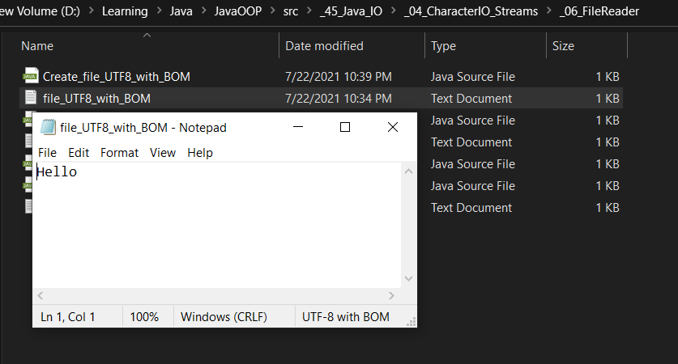

* tiến hành đọc file trên để thấy ký tự 3 **bytes** có tồn tại trong file
```java
import java.io.*;
import java.nio.charset.StandardCharsets;

public class FileReader_UTF8_BOM {
    private static final String path = "D:\\Learning\\Java\\JavaOOP\\src\\_45_Java_IO\\_04_CharacterIO_Streams\\_06_FileReader\\file_UTF8_with_BOM.txt";

    public static void main(String[] args) throws IOException {
        File file = new File(path);

        System.out.println("read by FileReader");
        readByFileReader(file);
        System.out.println();

        System.out.println("read by InputStreamReader");
        readByInputStreamReader(file);

    }

    public static void readByFileReader(File file) throws IOException {
        Reader reader = new FileReader(file, StandardCharsets.UTF_8);

        int charCode;
        while ((charCode = reader.read()) != -1) {
            System.out.println((char) charCode + "\t" + charCode);
        }

        reader.close();
    }

    public static void readByInputStreamReader(File file) throws IOException {
        InputStream inputStream = new FileInputStream(file);
        Reader reader = new InputStreamReader(inputStream, StandardCharsets.UTF_8);

        int charCode;
        while ((charCode = reader.read()) != -1) {
            System.out.println((char) charCode + "\t" + charCode);
        }

        reader.close();
        inputStream.close();
    }
}
```
* OUTPUT
```text
read by FileReader
	65279
H	72
e	101
l	108
l	108
o	111

read by InputStreamReader
	65279
H	72
e	101
l	108
l	108
o	111
```
* ký tự với mã code = **65279** là ký tự không mong muốn nếu ta đọc các file **UTF-8** cũ với việc thêm **BOM** vào đầu file
__________________________________________________________________________________________________________________________________________________________________________________
### BOMInputStream
* **BOMInputStream** là một lớp trong thư viện **Apache Commons IO** hỗ trợ **loại bỏ BOM**.
  

* **Maven dependency**
```xml
<!-- https://mvnrepository.com/artifact/commons-io/commons-io -->
<dependency>
    <groupId>commons-io</groupId>
    <artifactId>commons-io</artifactId>
    <version>2.8.0</version>
</dependency>
```
* **BOMInputStreamEx1.java**
```java
package org.o7planning.filereader.ex;
 
import java.io.File;
import java.io.FileInputStream;
import java.io.IOException;
import java.io.InputStreamReader;
import java.nio.charset.StandardCharsets;
 
import org.apache.commons.io.input.BOMInputStream;
 
public class BOMInputStreamEx1 {
 
    public static void main(String[] args) throws IOException {
        File file = new File("utf8-file-with-bom-test.txt");
        FileInputStream fis = new FileInputStream(file);
 
        BOMInputStream bis = new BOMInputStream(fis);
 
        InputStreamReader isr = new InputStreamReader(bis, StandardCharsets.UTF_8);
 
        int charCode;
        while ((charCode = isr.read()) != -1) {
            System.out.println((char) charCode + "  " + charCode);
        }
        isr.close();
    }
}
```
* OUTPUT
```text
H  72
e  101
l  108
l  108
o  111
```
__________________________________________________________________________________________________________________________________________________________________________________
### UnicodeReader
* **UnicodeReader** là một lớp nằm trong thư viện **"Google Data Java Client Library"** hỗ trợ **loại bỏ BOM**.


* **Maven dependency**
```xml
<!-- https://mvnrepository.com/artifact/com.google.gdata/core -->
<dependency>
  <groupId>com.google.gdata</groupId>
  <artifactId>core</artifactId>
  <version>1.47.1</version>
</dependency>
```
* **UnicodeReaderEx1.java**
```java
package org.o7planning.filereader.ex;
 
import java.io.File;
import java.io.FileInputStream;
import java.io.IOException;
 
import com.google.gdata.util.io.base.UnicodeReader;
 
public class UnicodeReaderEx1 {
 
    public static void main(String[] args) throws IOException {
        File file = new File("utf8-file-with-bom-test.txt");
        FileInputStream fis = new FileInputStream(file);
         
        UnicodeReader isr = new UnicodeReader(fis, "UTF-8");
 
        int charCode;
        while ((charCode = isr.read()) != -1) {
            System.out.println((char) charCode + "  " + charCode);
        }
        isr.close();
    }  
}
```
* OUTPUT
```text
H  72
e  101
l  108
l  108
o  111
```
__________________________________________________________________________________________________________________________________________________________________________________

## 7. CharArrayWriter <a id="7"></a>
* **CharArrayWriter** là 1 **subclass** của **Writer**, nó được sử dụng để ghi các **Char** vào **Array** theo cách của **Writer**
* các ký tự được ghi vào **CharArrayWriter** sẽ được gán vào các phần tử của mảng đệm bên trong **CharArrayWriter** đang quản lý

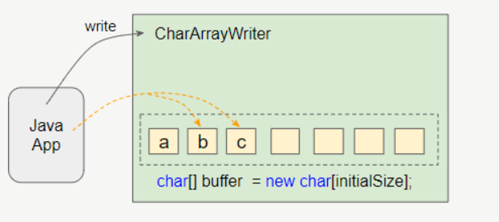

* khi số lượng các ký tự ghi vào **CharArrayWriter** lớn hơn độ dài của mảng bên trong **CharArrayWriter**, thì **CharArrayWriter** sẽ tạo ra mảng mới với độ dài lớn hơn và copy các ký tự từ mảng cũ sang

### CharArrayWriter Constructors
```java
public class CharArrayWriter extends Writer {
  public CharArrayWriter() {//...}
  public CharArrayWriter(int initialSize) {//...}
}
```

Constructor                       |Description
:---------------------------------|:-----------------------------------------------
CharArrayWriter()                 |tạo 1 **CharArrayWriter** với **Array** của các **Char** với **size** mặc định là **32** để ghi các ký tự vào **CharArrayWriter**
CharArrayWriter(int initialSize)  |tạo 1 **CharArrayWriter** với **Array** của các **Char** với **size** chỉ định là ``initialSize`` để ghi các ký tự vào **CharArrayWriter** <br/>``initialSize`` : kích thước chỉ định ban đầu cho mảng đệm


### CharArrayWriter Methods
```java
public class CharArrayWriter extends Writer {
  public void write(int c) {//...}
  public void write(char[] c, int off, int len) {//...}
  public void write(String str, int off, int len) {//...}
  public void writeTo(Writer out) throws IOException {//...}
      
  public CharArrayWriter append(char c) {//...}    
  public CharArrayWriter append(CharSequence csq) {//...}
  public CharArrayWriter append(CharSequence csq, int start, int end) {//...}
      
  public char[] toCharArray() {//...}
  public String toString() {//...}
      
  public void flush() { }
  public void close() { }
  public void reset() {//...}
  public int size() {//...}
}
```

Return Data       |Method                                       |Description
:-----------------|:--------------------------------------------|:-----------------------------------------------------------
void              |write(int c)                                 |ghi 1 ký tự vào mảng đệm <br/>``c`` : ký tự chỉ định
void              |write(char[] c, int off, int len)            |ghi 1 phần của mảng ký tự vào mảng đệm, bắt đầu từ vị trí ``off`` ghi số lượng ký tự là ``len`` của mảng đầu vào <br/>``c`` : mảng dữ liệu chỉ định để ghi <br/>``off`` : vị trí bắt đầu lấy dữ liệu <br/>``len`` : số lượng ký tự tối đa lấy dữ liệu để ghi bắt đầu từ ``off`` 
void              |write(String str, int off, int len)          |ghi 1 phần của chuỗi String vào mảng đệm, bắt đầu tự vị trí ``off`` ghi số lượng ký tự là ``len`` của String đầu vào <br/>``str`` : String chỉ định lấy dữ liệu để ghi <br/>``off`` : vị trí bắt đầu trên String chỉ định <br/>``len`` : số lượng ký tự lấy tối đa trên String
void              |writeTo(Writer out)                          |ghi nội dung của mảng đệm trong **CharArrayWriter** vào character stream khác <br/>``out`` : output character stream đích chỉ định 
CharArrayWriter   |append(char c)                               |nối 1 ký tự chỉ định vào writer này <br/>``c`` : ký tự chỉ định
CharArrayWriter   |append(CharSequence csq)                     |nối 1 chuỗi ký tự **CharSequence** chỉ định vào writer này <br/>``csq`` : **CharSequence** chỉ định
CharArrayWriter   |append(CharSequence csq, int start, int end) |nối 1 phần của chuỗi ký tự **CharSequence** chỉ định vào writer này <br/>``csq`` : **CharSequence** chỉ định <br/>``start`` : vị trí bắt đầu lấy ký tự trong **CharSequence** <br/>``end`` : vị trí kết thúc lấy ký tự
char[]            |toCharArray()                                |trả về bản sao dữ liệu nhập vào trong mảng đệm buffer trong **CharArrayWriter**
String            |toString()                                   |trả về 1 dữ liệu bản sao của dữ liệu nhập vào trong mảng buffer được chuyển sang kiểu 1 String
void              |flush()                                      |xả dữ liệu trên stream xuống mục tiêu
void              |close()                                      |đóng stream
void              |reset()                                      |thiết lập lại mảng buffer về trạng thái ban đầu để tái sử dụng, mà không cần phải lãng phí bộ nhớ
int               |size()                                       |lấy **size** hiện tại của mảng buffer trong **CharArrayWriter**

__________________________________________________________________________________________________________________________________________________________________________________

### CharArrayWriter Example 1
* write, append các ký tự, chuỗi vào 1 **CharArrayWriter**
* lấy dữ liệu của **CharArrayWriter** dưới dạng 1 mảng ký tự

```java
import java.io.CharArrayWriter;
import java.io.IOException;

public class CharArrayWriter_write_to_array {
    public static void main(String[] args) throws IOException {
        CharArrayWriter charArrayWriter = new CharArrayWriter(1024);

        charArrayWriter.write("One");

        charArrayWriter.append(' ').append("Two");

        charArrayWriter.write(' ');
        charArrayWriter.append("Three");

        char[] charArray = charArrayWriter.toCharArray();

        System.out.println(charArray);
        
        charArrayWriter.close();
    }
}
```
* OUTPUT
```text
One Two Three
```
__________________________________________________________________________________________________________________________________________________________________________________
### CharArrayWriter Example 2
* ghi 2 mảng ký tự vào 1 CharArrayWriter, in ra mảng ký tự bản sao của dữ liệu của CharArrayWriter

```java
import java.io.CharArrayWriter;
import java.io.IOException;

public class CharArrayWriter_combile_2_char_array {
    public static void main(String[] args) {
        String s = "Hello";
        char[] arr1 = s.toCharArray();

        char[] arr2 = new char[] {'W','o','r','l','d','!'};

        char[] result = add(arr1, arr2);

        System.out.println(result);
    }

    private static char[] add(char[] arr1, char[] arr2) {
        if (arr1 == null) {
            return arr2;
        }
        if (arr2 == null) {
            return arr1;
        }
        CharArrayWriter charArrayWriter = new CharArrayWriter();
        try {
            charArrayWriter.write(arr1);
            charArrayWriter.write(arr2);
        } catch (IOException e) {
            e.printStackTrace();
        }

        return charArrayWriter.toCharArray();
    }
}
```
* OUTPUT
```text
HelloWorld!
```
__________________________________________________________________________________________________________________________________________________________________________________

## 8. CharArrayReader <a id="8"></a>
* **CharArrayReader** là 1 **subclass** của **Reader**, nó được sử dụng để đọc 1 **Array** các **Char** theo cách cách của 1 **Reader**

### CharArrayReader Constructors
```java
public class CharArrayReader extends Reader {
  public CharArrayReader(char[] buf) {//...}
  public CharArrayReader(char[] buf, int offset, int length) {//...}
}
```

Constructor                                         |Description
:---------------------------------------------------|:---------------------------------------------------------------------------------
CharArrayReader(char[] buf)                         |tạo 1 **CharArrayReader** để đọc các ký tự từ 1 mảng ký tự chỉ định <br/>``buf`` : **char[]** chỉ định để đọc các ký tự
CharArrayReader(char[] buf, int offset, int length) |tạo 1 **CharArrayReader** để đọc các ký tự từ 1 phần của mảng ký tự chỉ định, bắt đầu từ vị trí ``offset`` trong mảng đọc tối đa số lượng ký tự là ``length`` <br/>``buf`` : **char[]** chỉ định để đọc các ký tự <br/>``offset`` : vị trí bắt đầu đọc ký tự trong ``buf`` <br/>``length`` : số lượng ký tự tối đa đọc được bắt đầu từ ``offset`` <br/>

__________________________________________________________________________________________________________________________________________________________________________________
### CharArrayReader Methods
```java
public class CharArrayReader extends Reader {
  private void ensureOpen() throws IOException {//...}
  public int read() throws IOException {//...}
  public int read(char[] b, int off, int len) throws IOException {//...}
  public long skip(long n) throws IOException {//...}
  public boolean ready() throws IOException {//...}
  public boolean markSupported() {//...}
  public void mark(int readAheadLimit) throws IOException {//...}
  public void reset() throws IOException {//...}
  public void close() {//...}
}
```

Return Data   |Method                           |Description
:-------------|:--------------------------------|:------------------------------------------------
void          |ensureOpen()                     |kiểm tra xem stream có bị đóng chưa
int           |read()                           |đọc 1 ký tự trong mảng ký tự<br/>trả về charCode của ký tự là giá trị kiểu ``int`` trong khoảng **(0 ; 65535)** <br/>trả về **-1** nếu đã đọc đến cuối stream
int           |read(char[] b, int off, int len) |đọc các ký tự trong 1 phần của mảng ký tự chỉ định <br/>trả về số lượng ký tự đã đọc được trong mảng <br/>trả về **-1** nếu đã đọc đến cuối stream <br/>``b`` : **char[]** chỉ định để đọc ký tự <br/>``off`` : vị trí bắt đầu đọc trong``b`` <br/>``len`` : số lượng ký tự tối đa 1 lần đọc trong ``b`` bắt đầu từ ``off``
long          |skip(long n)                     |bỏ qua không đọc 1 số lượng ``n`` ký tự trong mảng ký tự <br/>trả về số lượng ký tự thực tế bị bỏ qua <br/>``n`` : số lượng ký tự bỏ qua
boolean       |ready()                          |kiểm tra có sẵn ký tự để đọc hay không <br/>trả về ``true`` nếu có sẵn ký tự để đọc và lệnh đọc tiếp theo được đảm bảo sẽ không bị block đầu vào ngược lại là ``false`` 
boolean       |markSupported()                  |kiểm tra có hỗ trợ thao tác đánh dấu hay không, trả về ``true`` nếu có, ngược lại là ``false``
void          |mark(int readAheadLimit)         |đánh dấu vị trí hiện tại, lệnh gọi tiếp theo reset sẽ quay lại đọc từ vị trí này, nếu chưa đọc quá giới hạn của lệnh mark<br/>``readAheadLimit`` : giới hạn đọc số lượng ký tự để lệnh **reset()** có thể quay trở lại vị trí đã đanh dấu
void          |reset()                          |quay trở lại vị trí đã đánh dấu, hoặc trở lại từ đầu nếu lệnh **mark()** chưa được gọi lần nào
void          |close()                          |đóng stream

### CharArrayReader Example 1
* sử dụng **CharArrayReader** để đọc các ký tự từ 1 mảng char[]

```java
import java.io.CharArrayReader;
import java.io.IOException;
import java.io.Reader;

public class CharArrayReader_read_a_charArray {
    public static void main(String[] args) throws IOException {
        String s = "This is a text !!!";
        char[] charArray = s.toCharArray();

        Reader reader = new CharArrayReader(charArray);

        int charCode;
        while ((charCode = reader.read()) != -1) {
            char c = (char) charCode;
            System.out.println(c);
        }

        reader.close();
    }
}
```
* OUTPUT
```text
T
h
i
s
 
i
s
 
a
 
t
e
x
t
 
!
!
!
```
### CharArrayReader Example 2
* sử dụng **CharArrayReader** để đọc 1 mảng **char[]**, sau đó loại bỏ không đọc những ký tự không phải là số
* tiến hành ghi những ký tự số vào **CharArrayWriter**

```java
import java.io.*;

public class CharArrayReader_read_digit_only {
    public static void main(String[] args) throws IOException {
        String s = "Log20210217.txt";
        char[] origin = s.toCharArray();

        CharArrayReader reader = new CharArrayReader(origin);
        CharArrayWriter writer = new CharArrayWriter();

        int charCode;
        while ((charCode = reader.read()) != -1) {
            if (charCode >= 48 && charCode <= 57) {
                writer.write(charCode);
            }
        }

        char[] newCharArray = writer.toCharArray();
        System.out.println(newCharArray);

        String newText = writer.toString();
        System.out.println(newText);
    }
}
```
* OUTPUT
```text
20210217
20210217
```
__________________________________________________________________________________________________________________________________________________________________________________
### CharArrayReader Example 3
* xử lý 1 đoạn văn bản với nhiều khoảng trắng ở đầu và cuối dòng
* kết hợp **CharArrayReader** và **BufferedReader** để tăng hiệu suất sử dụng bằng cách đọc từng dòng
* sử dụng **StringBuilder** để nối những dòng đã được trim() khoảng trắng ở 2 đầu với nhau
* lấy 1 chuỗi **String** từ **StringBuilder**
```java
public class CharArrayReader_trim {
    public static void main(String[] args) throws IOException {
        String originText = "  One \n Two \t\n \t\t Three ";
        System.out.println(originText);
        System.out.println("---------------------------------------------------------------");

        String newText = trimLine(originText);
        System.out.println(newText);
    }

    private static String trimLine(String str) throws IOException {
        char[] cbuf = str.toCharArray();
        CharArrayReader charArrayReader = new CharArrayReader(cbuf);
        BufferedReader bufferedReader = new BufferedReader(charArrayReader);
        StringBuilder stringBuilder = new StringBuilder(str.length());

        String line;
        while ((line = bufferedReader.readLine()) != null) {
            stringBuilder.append(line.trim()).append('\n');
        }

        return stringBuilder.toString();
    }
}
```
* OUTPUT
```text
  One 
 Two 	
 		 Three 
---------------------------------------------------------------
One
Two
Three

```
__________________________________________________________________________________________________________________________________________________________________________________

## 9. FilterWriter <a id="9"></a>
* **FilterWriter** là **1 abstract class**, nó là **subclass** của **Writer**
* **FilterWriter** là lớp cơ sỡ để tạo ra các **subclass** có thể ghi 1 cách có chọn lọc các ký tự theo yêu cầu<br/><br/>

* **FilterWriter** không trực tiếp ghi các ký tự vào mục tiêu (ví dụ như file), thay vào đó nó quản lý 1 *Writer** khác mà **Writer** đó chịu trách nhiệm ghi dữ liệu vào mục tiêu
* **FilterWriter** chịu trách nhiệm lọc, chỉnh sửa các ký tự được ghi vào nó, sau đó nó mới ghi kết quả sang **Writer** mà nó quản lý


* trong mã nguồn của **FilterWriter**, tất cả các method mà nó kế thừa từ **superclass** đều đã được **override** (ghi đè) để hoạt động như 1 trình ủy quyền của class **Writer** mà nó quản lý

```java
package java.io;

public abstract class FilterWriter extends Writer {  
    protected Writer out;
     
    protected FilterWriter(Writer out) {
        super(out);
        this.out = out;
    }
    public void write(int c) throws IOException {
        out.write(c);
    }
    public void write(char cbuf[], int off, int len) throws IOException {
        out.write(cbuf, off, len);
    }
    public void write(String str, int off, int len) throws IOException {
        out.write(str, off, len);
    }
    public void flush() throws IOException {
        out.flush();
    }
    public void close() throws IOException {
        out.close();
    }
}
```
__________________________________________________________________________________________________________________________________________________________________________________
### FilterWriter Constructor
* **access modifier** constructor của **FilterWriter** là **protected** nên chỉ được sử dụng bởi **subclass** của nó

Constructor              |Description
:------------------------|:--------------------------------------------------------
FilterWriter(Writer out) |tạo 1 **FilterWriter** <br/>``out`` : **Writer** mà **FilterWriter** quản lý

__________________________________________________________________________________________________________________________________________________________________________________
### FilterWriter Example 1
* tạo 1 class dùng để mã hóa dữ liệu kiểu mật mã tên là **ROT13** (rotate 13)
* **ROT13** sẽ chuyển ký tự đầu vào sang ký tự đầu ra cách đó 13 ký tự
* trong bảng chữ cái latinh gồm [a ; z] và [A ; Z]
* **ROT13** là một mật mã thay thế chữ cái (letter substitution cipher) đơn giản, nó thay thế mỗi chữ cái bởi 1 chữ cái đứng sau nó 13 vị trí trên bảng chữ cái
* **ROT13** là 1 trường hợp đơn giản của mật mã **Caesar** (**Caesar** cipher)
* Dưới đây là bảng các chữ cái và các chữ cái thay thế tương ứng của chúng, kết quả của việc sử dụng thuật toán **ROT13**.

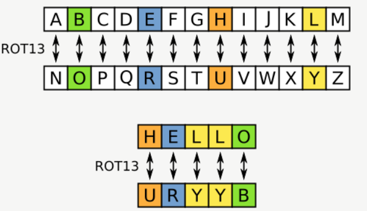

* bảng chữ cái latinh về cơ bản có 26 (2x13) chữ cái, nên về cơ bản thuật toán **ROT13** sẽ biến đổi 1 chữ cái thành 1 chữ cái khác, và sử dụng chính thuật toán này để đảo ngược kết quả
* chẳng hạn thuật toán **ROT13** biến chữ "**A**" thành chữ "**N**", và sử dụng thuật toán **ROT13** cho "**N**" để biến thành chữ "**A**"
* **ROT13** được coi là 1 ví dụ điển hình về 1 mật mã hóa (encryption) yếu
* class **ROT13** dưới đây cung cấp 1 method static **rotate(int)** chấp nhận đầu vào là 1 chữ cái và trả về 1 chữ cái theo thuật toán **ROT13**
```java
public class ROT13 {
    public static int rotate(int inChar) {
        int outChar;

        if (inChar >= 'a' && inChar <= 'z') {
            outChar = (((inChar - 'a') + 13) % 26) + 'a';
        } else if (inChar >= 'A' && inChar <= 'Z') {
            outChar = (((inChar - 'A') + 13) % 26) + 'A';
        } else {
            outChar = inChar;
        }

        return outChar;
    }
    
    // TEST
    public static void main(String[] args) {
        for (char i = 'a'; i <= 'z' ; i++) {
            char n = (char) rotate(i);
            System.out.println(i + " " + n);
        }
        for (char i = 'A'; i < 'Z'; i++) {
            char n = (char) rotate(i);
            System.out.println(i + " " + n);
        }
    }
}
```
* viết lớp **ROT13Writer** extends từ **FilterWriter**, các ký tự được ghi vào **ROT13Writer** sẽ được thay thế theo thuật toán của **ROT13**
```java
import java.io.FilterWriter;
import java.io.IOException;
import java.io.Writer;

public class ROT13Writer extends FilterWriter {
    /**
     * Create a new filtered writer.
     *
     * @param out a Writer object to provide the underlying stream.
     * @throws NullPointerException if <code>out</code> is <code>null</code>
     */
    protected ROT13Writer(Writer out) {
        super(out);
    }

    @Override
    public void write(int c) throws IOException {
        super.write(ROT13.rotate(c));
    }

    @Override
    public void write(char[] cbuf, int off, int len) throws IOException {
        char[] tempBuff = new char[len];
        for (int i = 0; i < len; i++) {
            tempBuff[i] = (char) ROT13.rotate(off + i);
        }
        super.write(tempBuff, 0, len);
    }

    @Override
    public void write(String str, int off, int len) throws IOException {
        char[] cbuf = str.toCharArray();
        this.write(cbuf, off, len);
    }
}
```
* ví dụ sử dụng **ROT13Writer**
```java
import java.io.FilterWriter;
import java.io.IOException;
import java.io.StringWriter;
import java.io.Writer;

public class ROT13Writer_Test {
    public static void main(String[] args) throws IOException {
        Writer targetWriter = new StringWriter();
        FilterWriter filterWriter = new ROT13Writer(targetWriter);

        String inputString = "Hello World !!!";

        filterWriter.write(inputString);
        filterWriter.close();

        String outputString = targetWriter.toString();
        System.out.println(inputString + " ----> " + outputString);
    }
}
```
* OUTPUT
```text
Hello World !!! ----> Uryyb Jbeyq !!!
```
* ví dụ sử dụng **ROT13Writer** để ghi dữ liệu vào file
```java
import java.io.*;

public class ROT13Writer_Test2 {
    private static final String path = "D:\\Learning\\Java\\JavaOOP\\src\\_45_Java_IO\\_04_CharacterIO_Streams\\_09_FilterWriter\\RotWriter-out-file.txt";

    public static void main(String[] args) throws IOException {
        File file = new File(path);
        file.getParentFile().mkdirs();

        Writer writer = new FileWriter(file);
        FilterWriter filterWriter = new ROT13Writer(writer);

        String inputString = "Hello World !!!";

        filterWriter.write(inputString);
        filterWriter.close();
    }
}
```
* OUTPUT

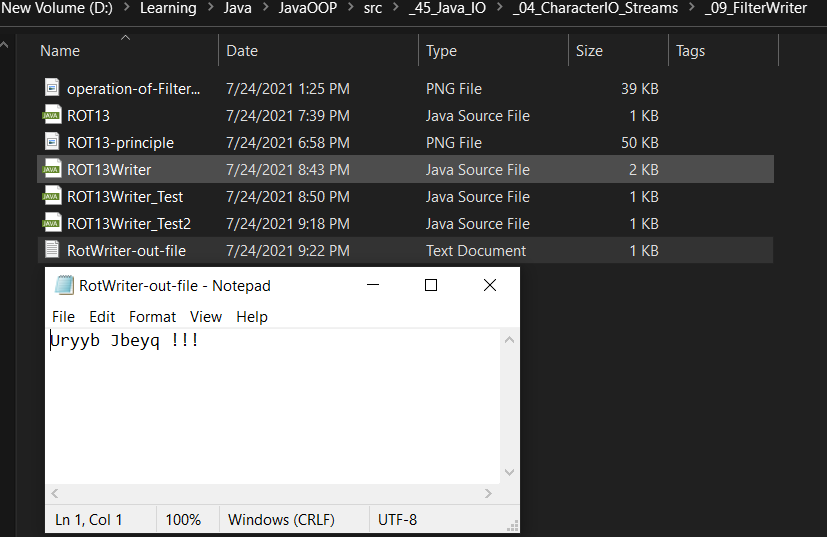


__________________________________________________________________________________________________________________________________________________________________________________

## 10. FilterReader <a id="10"></a>
* **FilterReader** là 1 **abstract class**, là **subclass** của **abstract class Reader**
* **FilterReader** là 1 lớp cơ sở để tạo ra các lớp con để đọc 1 cách có chọn lọc các ký tự theo yêu cầu
* bạn không thể sử dụng trực tiếp lớp **FilterReader** vì nó là 1 lớp trừu tượng (**abstract class**)
* ví dụ nếu muốn đọc 1 văn bản **HTML**, và bỏ qua các thẻ (**tag**), bạn cần viết 1 lớp con của **FilterReader**<br/><br/>

* **FilterReader** không trực tiếp đọc dữ liệu từ nguồn gốc (chẳng hạn như file) mà nó quản lý 1 **Reader** khác, **Reader** này chịu trách nhiệm đọc dữ liệu từ nguồn gốc
* **FilterReader** xử lý 1 cách có chọn lọc các dữ liệu có được từ **Reader** mà nó quản lý

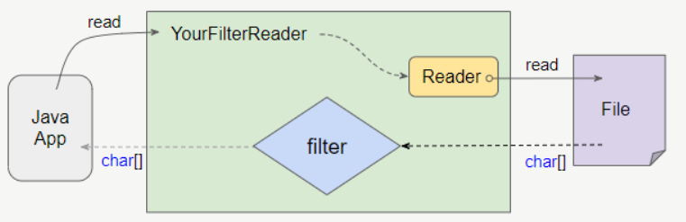

* mã nguồn của **FilterReader** cho thấy, tất cả các phương thức mà nó kế thừa từ lớp **Reader** đã được ghi đè (**override**) để hoạt động như 1 trình ủy quyền của đối tượng **Reader** mà nó quản lý
```java
package java.io;
 
public abstract class FilterReader extends Reader {
    protected Reader in;
  
    protected FilterReader(Reader in) {
        super(in);
        this.in = in;
    }
    public int read() throws IOException {
        return in.read();
    }
    public int read(char cbuf[], int off, int len) throws IOException {
        return in.read(cbuf, off, len);
    }
    public long skip(long n) throws IOException {
        return in.skip(n);
    }  
    public boolean ready() throws IOException {
        return in.ready();
    }
    public boolean markSupported() {
        return in.markSupported();
    }
    public void mark(int readAheadLimit) throws IOException {
        in.mark(readAheadLimit);
    }
    public void reset() throws IOException {
        in.reset();
    }
    public void close() throws IOException {
        in.close();
    }
}
```
### FilterReader Constructor
* **access modifier** constructor của **FilterReader** là **protected** nên nó chỉ được sử dụng bởi **subclass** của nó

Constructor             |Description
:-----------------------|:---------------------------------------------------------
FilterReader(Reader in) |tạo 1 **FilterReader** mới với ``in`` là 1 **Reader** tham số đầu vào dùng để đọc stream

### FilterReader Example 1
* viết 1 class **extends FilterReader** để đọc văn bản **HTML** nhưng bỏ qua các **tag** (thẻ)
```java
import java.io.FilterReader;
import java.io.IOException;
import java.io.Reader;

public class RemoveHtmlTagReader extends FilterReader {

    private boolean intag = false;

    public RemoveHtmlTagReader(Reader in) {
        super(in);
    }

    // We override this method.
    // The principle will be:
    // Read only characters outside of the tags.
    @Override
    public int read(char[] buf, int from, int len) throws IOException {
        // charCount : biến dùng để đếm số ký tự cần đọc
        int charCount = 0;

        // vòng lặp while khi nào charCount != 0 thì thoát
        // đồng thời copy nội dung cần lấy sau khi loại bỏ các tag HTML
        while (charCount == 0) {

            // lấy số ký tự cần đọc, lúc này bao gồm cả ký tự tag của HTML
            charCount = super.read(buf, from, len);

            // nếu đọc các ký tự mà bị trả về cuối stream = -1 thì return = -1 và thoát while
            if (charCount == -1) {
                // Ends of
                return -1;
            }

            //
            int last = from;

            // vòng lặp for chạy từ from đến charCount
            // if-else dùng để kiểm tra tag bắt đầu và tag kết thúc
            // chỉ khi nào đã kiểm tra gặp tag kết thúc mới tiến hành gán ký tự ở vị trí hiện tại
            for (int i = from; i < from + charCount; i++) {
                // ở đây có 2 trường hợp để lệnh if này true
                // giá trị ban đầu intag=false -> if(true)
                // vị trị hiện tại là tag kết thúc '>' , nên intag=false -> if(true)
                if (!this.intag) {
                    // lệnh if này chỉ xảy ra khi intag=false
                    if (buf[i] == '<') {
                        this.intag = true;
                    // lệnh else này chỉ được xảy ra khi đã duyệt qua tag kết thúc '>' , intag=false, nhưng
                        // vị trí hiện tại không phải tag bắt đầu '<', -> đã mở tag và đóng tag, và vị trí hiện
                        // tại không phải đang mở tag mới, mà là nội dung cần đọc
                        // ===> tiến hành sao chép dữ liệu tại vị trí hiện tại [i] cho [last], sau đó tăng last = last + 1
                    } else {
                        buf[last] = buf[i];
                        last++;
                        // có thể viết gọn
                        // buf[last] = buf[i];
                        // last++;
                        // ==> thành
                        // buf[last++] = buf[i];
                    }
                // else if này chỉ xảy ra khi đã duyệt qua tag bắt đầu '<', intag=true, -> if(false)
                } else if (buf[i] == '>') {
                    // lệnh intaf=false chỉ được thực hiện khi gặp tag kết thúc '>'
                    // sau đó nhảy đến lệnh kiểm tra có phải tag bắt đầu, nếu không phải tag bắt đầu, chính là dữ liệu cần copy
                    this.intag = false;
                }
            }
            charCount = last - from;
        }
        return charCount;
    }

    // Also need to override this method.
    @Override
    public int read() throws IOException {
        char[] buf = new char[1];
        int result = read(buf, 0, 1);
        if (result == -1) {
            return -1;
        } else {
            return (int) buf[0];
        }
    }
}
```
* chương trình test
```java
import java.io.BufferedReader;
import java.io.IOException;
import java.io.Reader;
import java.io.StringReader;

public class RemoveHtmlTagTest {
    public static void main(String[] args) throws IOException {
        // Create a Reader.
        Reader in = new StringReader("<h1>Hello \n <b>World</b><h1>");

        RemoveHtmlTagReader filterReader = new RemoveHtmlTagReader(in);
        BufferedReader br = new BufferedReader(filterReader);

        String s = null;
        while ((s = br.readLine()) != null) {
            System.out.println(s);
        }
        br.close();
    }
}
```
* OUTPUT
```text
Hello 
 World
 
```

__________________________________________________________________________________________________________________________________________________________________________________

## 11. PushbackReader <a id="11"></a>
__________________________________________________________________________________________________________________________________________________________________________________

## 12. BufferedWriter <a id="12"></a>
__________________________________________________________________________________________________________________________________________________________________________________

## 13. BufferedReader <a id="13"></a>
__________________________________________________________________________________________________________________________________________________________________________________

## 14. LineNumberReader <a id="14"></a>
__________________________________________________________________________________________________________________________________________________________________________________

## 15. StringWriter <a id="15"></a>
__________________________________________________________________________________________________________________________________________________________________________________

## 16. StringReader <a id="16"></a>
__________________________________________________________________________________________________________________________________________________________________________________

## 17. PipedWriter <a id="17"></a>
__________________________________________________________________________________________________________________________________________________________________________________

## 18. PipedReader <a id="18"></a>
__________________________________________________________________________________________________________________________________________________________________________________

## 19. LineNumberReader <a id="19"></a>
__________________________________________________________________________________________________________________________________________________________________________________

## 20. PrintWriter <a id="20"></a>
__________________________________________________________________________________________________________________________________________________________________________________

## 21. PrintStream <a id="21"></a>
__________________________________________________________________________________________________________________________________________________________________________________

