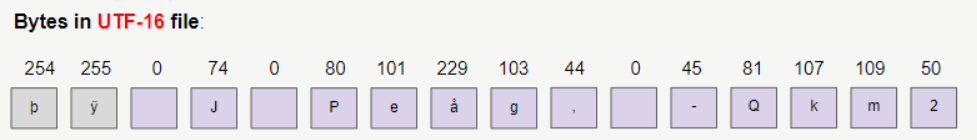

# HƯỚNG DẪN SỬ DỤNG CHARACTER I/O STREAM
__________________________________________________________________________________________________________________________________________________________________________________
## GIỚI THIỆU
* trong **Binary I/O Stream** (Luồng vào ra nhị phân)
    * mỗi lần **write/read** là **1 byte** (tương đương với 8 bit nhị phân)

* trong **Character I/O Stream** (Luồng vào ra ký tự)
    * tùy thuộc vào kiểu mã hóa **(encoding)** **UTF-8, UTF-16, ...** dẫn đến mỗi lần **write/read** là 1, 2, hoặc 3 bytes

* trong Java có nhiều class hỗ trợ các thao tác với **Character I/O Stream**, dẫn đầu là 2 class **Reader** & **Writer**
    * **java.io.Writer**: được sử dụng để ghi dữ liệu đến đích (destination)
    * **java.io.Reader**: được sử dụng để đọc dữ liệu từ một nguồn (source)


__________________________________________________________________________________________________________________________________________________________________________________

## NỘI DUNG

1. [Writer](#1)
2. [Reader](#2)
3. [OutputStreamWriter](#3)
4. [InputStreamReader](#4)
5. [FileWriter](#5)
6. [FileReader](#6)
7. [CharArrayWriter](#7)
8. [CharArrayReader](#8)
9. [FilterWriter](#9)
10. [FilterReader](#10)
11. [PushbackReader](#11)
12. [BufferedWriter](#12)
13. [BufferedReader](#13)
14. [LineNumberReader](#14)
15. [StringWriter](#15)
16. [StringReader](#16)
17. [PipedWriter](#17)
18. [PipedReader](#18)
19. [PrintWriter](#19)
20. [PrintStream](#20)

__________________________________________________________________________________________________________________________________________________________________________________

## 1. Writer <a id="1"></a>
* **Writer** là 1 **abstract class** nằm trong package **java.io**
```java
public abstract class Writer extends Object implements Appendable, Closeable, Flushable {
    // ...
}
```
* **abstract class Writer** đại diện cho **character output stream** để **write** các **character** vào 1 mục tiêu nào đó, ví dụ như file văn bản


* ta không thể sử dụng trực tiếp **Writer** vì nó là 1 **abstract class**, tùy tình huống cụ thể mà ta có thể sử dụng các **subclass** của **Writer**
* các **subclass** của **Writer**
    * ``BufferedWriter``
    * ``CharArrayWriter``
    * ``FilterWriter``
    * ``OutputStreamWriter``
    * ``PipedWriter``
    * ``PrintWriter``
    * ``StringWriter``

* xét ví dụ ghi các ký tự sau vào 1 file với **UTF-8**


* Java sử dụng 2 **bytes** để lưu trữ 1 ký tự, và đây là hình minh họa của văn bản trên


* **FileWriter** là 1 **subclass** của **Writer** thường được sử dụng để ghi các ký tự vào 1 file văn bản
* mỗi ký tự trên **Writer** là 2 bytes
* nhưng khi ghi các ký tự vào 1 file văn bản với **UTF-8**, mỗi ký tự có thể được lưu trữ bởi 1, 2, 3 hoặc 4 bytes


__________________________________________________________________________________________________________________________________________________________________________________

### 1.1. Fields in Writer
```java
public abstract class Writer extends Object implements Appendable, Closeable, Flushable {
    // Field    
    protected Object lock;
    private char[] writeBuffer;
    private static final int WRITE_BUFFER_SIZE = 1024;
}
```
* ``lock`` là 1 object được sử dụng để **synchronize** các hoạt động trên **character output stream**
* For efficiency, a character-stream object may use an object other than itself to protect critical sections.
* A subclass should therefore use the object in this field rather than this or a synchronized method.
__________________________________________________________________________________________________________________________________________________________________________________

### 1.2. Constructors in Writer
```java
public abstract class Writer extends Object implements Appendable, Closeable, Flushable {
    // Constructor
    protected Writer() { // ... }
    protected Writer(Object lock) { // ... }
        }
```
* **protected Writer()**
    * _tạo 1 character stream writer có các phần quan trọng sẽ synchronize trên chính writer_<br/><br/>
* **protected Writer(Object lock)**
    * _tạo 1 character stream writer có các phần quan trọng sẽ synchronize trên chính object chỉ định_
__________________________________________________________________________________________________________________________________________________________________________________

### 1.3. Methods in Writer
```java
public abstract class Writer extends Object implements Appendable, Closeable, Flushable {
    // Methods
    public abstract void write(char cbuf[], int off, int len) throws IOException;
    public abstract void flush() throws IOException;
    public abstract void close() throws IOException;

    public static Writer nullWriter() { // ...}

        public void write(int c) throws IOException { // ...}
            public void write(char cbuf[]) throws IOException { // ...}
                public void write(String str) throws IOException { // ...} 
                    public void write(String str, int off, int len) throws IOException { // ...}

                        public Writer append(CharSequence csq) throws IOException { // ...}
                            public Writer append(CharSequence csq, int start, int end) throws IOException { // ...}
                                public Writer append(char c) throws IOException { // ...}         
                                }
```
__________________________________________________________________________________________________________________________________________________________________________________

#### write(int)
``public void write(int c) throws IOException``
* **write** 1 character **c** vào **Writer**
* tham số **c** là code của ký tự, là 1 giá trị **integer** nằm trong khoảng **[0 ; 65535]**
* nếu giá trị code của **c** nằm ngoài phạm vi nói trên, nó sẽ bị bỏ qua

```java
import java.io.File;
import java.io.FileWriter;
import java.io.IOException;
import java.io.Writer;
import java.nio.charset.StandardCharsets;

public class Writer_Ex1 {
    private static final String path = "D:\\Learning\\Java\\JavaOOP\\src\\_45_Java_IO\\_04_CharacterIO_Streams\\outWriterFile.txt";

    public static void main(String[] args) throws IOException {
        File file = new File(path);
        file.getParentFile().mkdirs();

        Writer writer = new FileWriter(file, StandardCharsets.UTF_8);

        writer.write((int)'J'); // 74
        writer.write((int)'P'); // 80
        writer.write((int)'日'); // 26085
        writer.write(26412); // 本
        writer.write((int)'-'); // 45
        writer.write(20843); // 八
        writer.write((int)'洲'); // 27954

        writer.close();
    }
}
```
* OUTPUT


__________________________________________________________________________________________________________________________________________________________________________________

#### write(char[])
``public void write(char cbuf[]) throws IOException``
* **write** 1 character array **cbuf[]** vào **Writer**

```java
import java.io.File;
import java.io.FileWriter;
import java.io.IOException;
import java.io.Writer;
import java.nio.charset.StandardCharsets;

public class write_char_array {
    private static final String path = "D:\\Learning\\Java\\JavaOOP\\src\\_45_Java_IO\\_04_CharacterIO_Streams\\writeCharArray.txt";

    public static void main(String[] args) throws IOException {
        File file = new File(path);
        file.getParentFile().mkdirs();

        Writer writer = new FileWriter(file, StandardCharsets.UTF_8);

        writer.write((int) 'J');

        char[] cbuf = new char[] {'P', '日', '本', '-', '八', '洲'};

        writer.write(cbuf);

        writer.close();
    }
}
```
* OUTPUT


__________________________________________________________________________________________________________________________________________________________________________________

#### write(char[], int, int)
``public void write(char[] cbuf, int off, int len) throws IOException``
* **write** 1 phần của character array vào **Writer**
* **write** các character từ vị trí **off** đến **off+len**
```java
import java.io.StringWriter;

public class write_char_arr_off_len {
    public static void main(String[] args) {
        StringWriter stringWriter = new StringWriter();

        char[] cbuf = new char[] {'0', '1', '2', '3', '4', '5', '6', '7', '8', '9'};

        stringWriter.write(cbuf, 2, 5); // '2'...'6'

        String s = stringWriter.toString();

        System.out.println(s);
    }
}
```
* OUTPUT
```
23456
```
__________________________________________________________________________________________________________________________________________________________________________________
#### close()
``public void close() throws IOException``
* method **close()** được sử dụng để **đóng stream**
* method **flush()** sẽ được gọi đầu tiên
* khi stream đã bị đóng, các lệnh gọi thêm **write()** hoặc **flush()** sẽ khiến **IOException** được **throws** ra
* đóng stream đã đóng trước đó không có tác dụng
* **abstract class Writer implements Closeable**, **interface Closeable extends AutoCloseable**, vì vậy nếu ta viết code theo quy tắc của **AutoCloseable** thì hệ thống sẽ tự đóng stream mà không cần gọi method **close()**

```java
import java.io.File;
import java.io.FileWriter;
import java.io.IOException;
import java.io.Writer;
import java.nio.charset.StandardCharsets;

public class close_automation {
    private static final String path = "D:\\Learning\\Java\\JavaOOP\\src\\_45_Java_IO\\_04_CharacterIO_Streams\\close_automation.txt";

    public static void main(String[] args) throws IOException {
        File file = new File(path);
        file.getParentFile().mkdirs();

        try (Writer writer = new FileWriter(file, StandardCharsets.UTF_8)) {
            writer.write((int) 'J'); // 74
            writer.write((int) 'P'); // 80
            writer.write((int) '日'); // 26085
            writer.write(26412); // 本
            writer.write((int) '-'); // 45
            writer.write(20843); // 八
            writer.write((int) '洲'); // 27954
        }
    }
}
```
* OUTPUT


__________________________________________________________________________________________________________________________________________________________________________________
#### write(String)
``public void write(String str) throws IOException``
* **write** 1 **String** vào **Writer**
* ví dụ:
```java
writer.write("Some String");
```
__________________________________________________________________________________________________________________________________________________________________________________
#### write(String, int, int)
``public void write(String str, int offset, int len) throws IOException``
* **write** 1 phần của 1 **String** vào **Writer**
* **write** các character từ chỉ số **offset** đến chỉ số **offset + len** vào **Writer**
* ví dụ:
```java
writer.write("0123456789", 2, 5); // 23456
```
__________________________________________________________________________________________________________________________________________________________________________________
#### append(CharSequence)
``public Writer append(CharSequence csq) throws IOException``
* nối chuỗi ký tự của **CharSequence** vào **Writer**
* method này trả về object **Writer** hiện tại, điều này cho phép gọi tiếp 1 method khác của **Writer** thay vì kết thúc bởi dấu chấm phẩy ``;``
```java
import java.io.IOException;
import java.io.StringWriter;
import java.io.Writer;

public class append_CharSequence {
    public static void main(String[] args) throws IOException {
        Writer writer = new StringWriter();

        writer.append("01234").append("5678").write("9");

        System.out.println(writer.toString());

        writer.close();
    }
}
```
* OUTPUT
```
0123456789
```
__________________________________________________________________________________________________________________________________________________________________________________
#### append(CharSequence, int, int)
``public Writer append(CharSequence csq, int start, int end) throws IOException``
* nối 1 phần chuỗi ký tự của **CharSequence** vào **Writer**
* vị trí bắt đầu lấy ký tự để nối là ``start``
* vị trí kết thúc lấy ký tự để nối là ``end``
* method này trả về object **Writer** hiện tại, điều này cho phép gọi tiếp 1 method khác của **Writer** thay vì kết thúc bởi dấu chấm phẩy ``;``
```java
import java.io.IOException;
import java.io.StringWriter;
import java.io.Writer;

public class append_CharSequence_int_int {
    public static void main(String[] args) throws IOException {
        Writer writer = new StringWriter();

        String s = "0123456789";

        writer.append(s, 0, 3)
                .append(s, 3, 7)
                .append(s, 7, 9)
                .write("9");

        System.out.println(writer.toString());

        writer.close();
    }
}
```
* OUTPUT
```
0123456789
```
__________________________________________________________________________________________________________________________________________________________________________________
#### append(char)
``public Writer append(char chr) throws IOException``
* nối 1 ký tự vào **Writer**
* method này trả về object **Writer** hiện tại, điều này cho phép gọi tiếp 1 method khác của **Writer** thay vì kết thúc bởi dấu chấm phẩy ``;``
```java
import java.io.IOException;
import java.io.StringWriter;
import java.io.Writer;

public class append_char {
    public static void main(String[] args) throws IOException {
        Writer writer = new StringWriter();

        writer.append('J')
                .append('P')
                .append('日')
                .append('本');

        System.out.println(writer.toString());

        writer.close();
    }
}
```
* OUTPUT
```
JP日本
```
__________________________________________________________________________________________________________________________________________________________________________________
#### flush()
``public void flush() throws IOException``
* dữ liệu được ghi vào **Writer**, đôi khi được lưu trữ 1 cách tạm thời trên bộ đệm, method **flush()** được sử dụng để xả (flush) toàn bộ dữ liệu trên bộ đệm vào mục tiêu
* nếu mục tiêu dự kiến của **Writer** này là 1 phần trừu tượng được cung cấp bên dưới hệ điều hành, chẳng hạn như 1 tệp, <br/>
  thì việc **xả stream** chỉ đảm bảo rằng các ký tự trước đó đã được ghi vào stream sẽ được chuyển đến hệ điều hành để ghi, nó không đảm bảo rằng chúng thực sự được ghi<br/>
  vào 1 thiết bị vật lý như ổ đĩa
__________________________________________________________________________________________________________________________________________________________________________________

## 2. Reader <a id="2"></a>
* **abstract class Reader** nằm trong package **java.io**
* **Reader** là cơ sỡ đại diện cho các **Character Input Stream**
* **Reader** dùng để đọc 1 nguồn dữ liệu nào đó


* **Reader** được định nghĩa như sau
```java
public abstract class Reader extends Object implements Readable, Closeable {
    // ...    
}
```
* ta không thể sử dụng **Reader** 1 cách trực tiếp, vì nó là một **abstract class**, tùy theo tình huống cụ thể, ta có thể sử dụng các **subclass** của nó
* các **subclass** của **Reader**
    * ``BufferedReader``
    * ``LineNumberReader``
    * ``CharArrayReader``
    * ``FilterReader``
    * ``PushbackReader``
    * ``InputStreamReader``
    * ``FileReader``
    * ``PipedReader``
    * ``StringReader``

* xét ví dụ đọc 1 file văn bản với **encoding UTF-8**


* **UTF-8** sử dụng 1, 2, 3 hoặc 4 bytes để lưu trữ 1 ký tự, hình ảnh dưới đây cho thấy các byte trong file nói trên


* **FileReader** là 1 **subclass** của **Reader** thường được sử dụng để đọc các file văn bản, và chúng ta sẽ nhận được 1 **stream of characters**
* bằng 1 cách nào đó các ký tự **UTF-8** sẽ được chuyển đổi thành các ký tự của **Java**
* kiểu **char** trong **Java** có kích thước 2 bytes, như vậy các ký tự trên **FileReader** có kích thước là 2 bytes


__________________________________________________________________________________________________________________________________________________________________________________

### Reader Fields
```java
public abstract class Reader extends Object implements Readable, Closeable {
    private static final int TRANSFER_BUFFER_SIZE = 8192;
    private static final int maxSkipBufferSize = 8192;
    private char skipBuffer[] = null;
    protected Object lock;
    // ...    
}
```
* ``lock`` là object được sử dụng để **synchronize** các hoạt động trên stream này
__________________________________________________________________________________________________________________________________________________________________________________
### Reader Constructor
```java
public abstract class Reader extends Object implements Readable, Closeable {
    protected Reader() {// ...}
    protected Reader(Object lock) {// ...}
        }
```
* ``protected Reader()``
    * tạo mới 1 character stream reader với các phần quan trọng sẽ được synchronize trên chính Reader

* ``protected Reader(Object lock)``
    * tạo mới 1 character stream reader với các phần quan trọng sẽ được synchronize trên chính object chỉ định
__________________________________________________________________________________________________________________________________________________________________________________
### Reader Methods
```java
public abstract class Reader extends Object implements Readable, Closeable {
    public static Reader nullReader() {//...}

        public abstract int read(char cbuf[], int off, int len) throws IOException;
        public abstract void close() throws IOException;

        public int read(java.nio.CharBuffer target) throws IOException {//...}
            public int read() throws IOException {//...}
                public int read(char cbuf[]) throws IOException {//...}

                    public boolean ready() throws IOException {//...}
                        public boolean markSupported() {//...}
                            public void mark(int readAheadLimit) throws IOException {//...}
                                public void reset() throws IOException {//...}
                                    public long skip(long n) throws IOException {//...}
                                        public long transferTo(Writer out) throws IOException {//...}
                                        }
```
__________________________________________________________________________________________________________________________________________________________________________________

#### read()
* ``public int read() throws IOException``
    * method **read()** được sử dụng để **read** 1 character
    * nó trả về mã code của character vừa đọc được, là 1 giá trị integer trong khoảng **[0 ; 65535]**
    * hoặc trả về **-1** nếu đọc tới cuối stream
    * method này sẽ bị block cho đến khi có character ready để read, hoặc xảy ra lỗi **IO**, hoặc đã tiến tới cuối stream

* ví dụ về method **read()**
```java
import java.io.IOException;
import java.io.Reader;
import java.io.StringReader;

public class read {
    public static void main(String[] args) throws IOException {
        Reader reader = new StringReader("JP日本-八洲");

        int charCode = 0;

        while ((charCode = reader.read()) != -1) {
            System.out.println((char) charCode + "\t" + charCode);
        }

        reader.close();
    }
}
```
* OUTPUT
```
J	74
P	80
日	26085
本	26412
-	45
八	20843
洲	27954
```
__________________________________________________________________________________________________________________________________________________________________________________
#### read(char[])
* ``public int read(char[] cbuf) throws IOException``
    * method **read(char[])** đọc các ký tự và gán các ký tự vào mảng **char[]**, số lượng ký tự mỗi lần đọc đúng bằng kích thước của mảng
    * method này trả về số lượng ký tự đọc được sau mỗi lần đọc từ stream
    * method này trả về **-1** nếu đọc tới cuối stream
    * method này sẽ bị block cho đến khi có các ký tự **ready** để đọc, hoặc xảy ra lỗi **IO**, hoặc đã tiến tới cuối stream
    * về cơ bản sử dụng method **read(char[])** sẽ có hiệu suất cao hơn so với method **read()**, vì nó giảm số lần đọc từ stream

* ví dụ về method **read(char[])**
```java
import java.io.IOException;
import java.io.Reader;
import java.io.StringReader;

public class read_to_char_array {
    public static void main(String[] args) throws IOException {
        Reader reader = new StringReader("1234567891234567891100");

        char[] cbuf = new char[10];
        int charCount = -1;

        while ((charCount = reader.read(cbuf)) != -1) {
            String s = new String(cbuf, 0, charCount);
            System.out.println(charCount + "\t" + s);
        }

        reader.close();
    }
}
```
* OUTPUT
```
10	1234567891
10	2345678911
2	00
```
__________________________________________________________________________________________________________________________________________________________________________________
#### read(char[], int, int)
* ``public int read(char[] cbuf, int offset, int len) throws IOException``
    * method **read(char[], int, int)** đọc các ký tự, và gán các ký tự vào mảng **char[]** từ chỉ số **offset** đến chỉ số **offset + len**
    * method này trả về số lượng ký tự mỗi lần đọc được từ stream
    * method này trả về **-1** nếu đã đọc tới cuối stream
    * method này sẽ bị block cho đến khi có các ký tự sẵn sàng để đọc, xảy ra lỗi **IO**, hoặc đã tiến tới cuối stream

__________________________________________________________________________________________________________________________________________________________________________________
#### read(java.nio.CharBuffer)
* ``public int read(java.nio.CharBuffer target) throws IOException``
    * method **read(CharBuffer)** đọc các ký tự, và truyền các ký tự vào object chỉ định của **CharBuffer** là ``target``
    * method này trả về số ký tự đọc được từ stream
    * hoặc trả về **-1** nếu tiến tới cuối stream
    * method này sẽ bị block cho đến khi có các ký tự sẵn sàng để đọc, xảy ra lỗi **IO**, hoặc đã tiến tới cuối stream**

* ví dụ về method **read(CharBuffer)**
```java
import java.io.IOException;
import java.io.Reader;
import java.io.StringReader;
import java.nio.CharBuffer;

public class read_CharBuffer {
    public static void main(String[] args) throws IOException {
        Reader reader = new StringReader("0123456789012456789");

        CharBuffer charBuffer = CharBuffer.allocate(7);

        int charCount;

        while ((charCount = reader.read(charBuffer)) != -1) {
            System.out.println(charCount + "\t" + charBuffer.flip().toString());
        }

        reader.close();
    }
}
```
* OUTPUT
```
7	0123456
7	7890124
5	56789
```
__________________________________________________________________________________________________________________________________________________________________________________
#### close()
* ``public void close() throws IOException ``
    * đóng stream và giải phóng mọi **system resource** đang liên kết đến stream
    * khi stream bị đóng, các lệnh gọi tiếp **read(), ready(), mark(), reset(), skip()** sẽ tạo ra 1 **IOException**
    * đóng stream đã đóng trước đó không có tác dụng
    * **abstract class Reader implements Closeable**, **interface Closeable extends AutoCloseable**, nếu lập trình theo quy tắc của **AutoCloseable** thì hệ thống sẽ tự đóng stream mà không cần gọi thủ công method **close()**

```java
import java.io.IOException;
import java.io.Reader;
import java.io.StringReader;

public class close_AutoCloseable {
    public static void main(String[] args) throws IOException {
        try (Reader reader = new StringReader("01234567890123456789")){
            int charCount;
            char[] cbuf = new char[5];
            while ((charCount = reader.read(cbuf)) != -1) {
                String s = new String(cbuf, 0, charCount);
                System.out.println(charCount +"\t" + s);
            }
        }
    }
}
```
* OUTPUT
```
5	01234
5	56789
5	01234
5	56789
```
__________________________________________________________________________________________________________________________________________________________________________________
#### skip(long)
* ``public long skip(long n) throws IOException``
    * method **skip(long)** bỏ qua không đọc ``n`` ký tự trong stream
    * method này sẽ bị block cho đến khi có các ký tự sẵn có, hoặc xảy ra lỗi **IO**, hoặc đã tiến tới cuối stream

* ví dụ về method **skip(long)**
```java
import java.io.IOException;
import java.io.Reader;
import java.io.StringReader;

public class skip {
    public static void main(String[] args) throws IOException {
        Reader reader = new StringReader("0123456789ABCDEF");

        System.out.println((char) reader.read());
        System.out.println((char) reader.read());
        reader.skip(8);

        int charCode;
        while ((charCode = reader.read()) != -1) {
            System.out.println((char) charCode);
        }

        reader.close();
    }
}
```
* OUTPUT
```
0
1
A
B
C
D
E
F
```
__________________________________________________________________________________________________________________________________________________________________________________
#### transferTo(Writer)
* ``public long transferTo(Writer out) throws IOException``
    * method **transferTo(Writer)** được sử dụng để đọc tất cả các ký tự từ **Reader** hiện tại, và ghi chúng vào đối tượng **Writer** chỉ định
    * method này trả về số lượng ký tự đã chuyển sang **Writer**, sau khi kết thúc, đối tượng **Reader** hiện tại sẽ ở cuối stream
    * method này sẽ **không đóng** đối tượng **Reader** hiện tại cũng như đối tượng **Writer**
* ví dụ về method **transferTo(Writer)
```java
import java.io.*;

public class transferTo_Writer {
    public static void main(String[] args) throws IOException {
        Reader reader = new StringReader("123456789-987654321-ABCDE");

        File file = new File("D:\\Learning\\Java\\JavaOOP\\src\\_45_Java_IO\\_04_CharacterIO_Streams\\transferToWriter.txt");
        file.getParentFile().mkdirs();
        Writer writer = new FileWriter(file);

        reader.skip(10);

        reader.transferTo(writer);

        writer.close();
        reader.close();
    }
}
```

* OUTPUT


__________________________________________________________________________________________________________________________________________________________________________________
#### markSupported()
* ``public boolean markSupported()``
    * method **markSupported()** được sử dụng để kiểm tra đối tượng **Reader** có hỗ trợ hoạt động **mark(int)** hay không

Reader              | markSupported() ?
:-------------------|:-----------------
StringReader        |true
CharArrayReader     |true
BufferedReader      |true
LineNumberReader    |true
FilterReader        |true or false
InputStreamReader   |false
FileReader          |false
PushbackReader      |false

__________________________________________________________________________________________________________________________________________________________________________________
#### mark(int)
* ``public void mark(int readAheadLimit) throws IOException``
    * method **mark(int)** cho phép đánh dấu vị trí hiện tại trên stream
    * sau khi **mark(int)** có thể đọc tiếp các ký tự tiếp theo, và gọi method **reset()** để quay trở lại vị trí đã **mark(int)** trước đó
    * ``readAheadLimit`` là số lượng ký tự tối đa có thể đọc sau khi **mark(int)** mà không làm mất vị trí đã **mark(int)**
    * không phải tất cả các **subclass** của **Reader** có hỗ trợ **mark(int)**, <br/>
      để chắc chắn, trước khi thực hiện thao tác **mark(int)** cần gọi method **markSupported()** để kiểm tra xem đối tượng **Reader** hiện tại có hỗ trợ hoạt động **mark(int)** hay không

* ví dụ về method **mark(int)**
```java
import java.io.IOException;
import java.io.Reader;
import java.io.StringReader;

public class mark_int {
    public static void main(String[] args) throws IOException {
        Reader reader = new StringReader("----------ABCDEF123456");

        reader.skip(10);

        System.out.println("markSupported() ? - " + reader.markSupported());
        reader.mark(6);
        System.out.println("mark(int)");

        int count = 0;

        while (!(count == 6)) {
            char c = (char) reader.read();
            System.out.println(c);
            count++;
        }

        reader.reset();
        System.out.println("reset()");

        int charCode = 0;
        while ((charCode = reader.read()) != -1) {
            System.out.println((char) charCode);
        }

        reader.close();
    }
}
```
* OUTPUT
```
markSupported() ? - true
mark(int)
A
B
C
D
E
F
reset()
A
B
C
D
E
F
1
2
3
4
5
6
```

__________________________________________________________________________________________________________________________________________________________________________________
#### reset()
* ``public void reset() throws IOException``
    * nếu đối tượng **Reader** hiện tại hỗ trợ việc đánh dấu vị trí hiện tại thông qua method **mark(int)**, sau khi đã kiểm tra trả về ``true`` với method **markSupported()**
    * thì method **reset()** được sử dụng để quay trở lại vị trí đã được đánh dấu, với điều kiện vị trí đang đọc không vượt quá giới hạn trong method **mark(int)**

__________________________________________________________________________________________________________________________________________________________________________________
#### ready()
* ``public boolean ready() throws IOException``
    * method **ready()** trả về ``true`` nếu sẵn có 1 ký tự trên stream để đọc mà không phải chờ đợi, ngược lại trả về ``false``
__________________________________________________________________________________________________________________________________________________________________________________

## 3. OutputStreamWriter <a id="3"></a>
* **OutputStreamWriter** được đóng gói trong package **java.io**
* **OutputStreamWriter** là 1 **subclass** của **abstract class Writer**, nó là 1 cầu nối cho phép chuyển 1 **character stream** thành 1 **byte stream**, hay nói cách khác là 1 **Writer** thành 1 **OutputStream**
* **OutputStreamWriter** hoạt động với các **output stream** khác, là cầu nối giữa **character stream** và **byte stream**, điều này là do **OutputStreamWriter** chuyển đối các ký tự thành dạng byte
* ví dụ, 1 số ký tự yêu cầu 2 byte được lưu trữ trong bộ nhớ, để ghi dữ liệu như vậy, chúng ta có thể sử dụng **OutputStreamWriter** để chuyển đổi ký tự thành các byte tương ứng và lưu trữ các byte lại với nhau


### OutputStreamWriter Constructors
```java
public class OutputStreamWriter extends Writer {

    public OutputStreamWriter(OutputStream out) {//...}
    public OutputStreamWriter(OutputStream out, String charsetName) throws UnsupportedEncodingException {//...}
    public OutputStreamWriter(OutputStream out, Charset cs) {//...}
    public OutputStreamWriter(OutputStream out, CharsetEncoder enc) {//...}
}
```
Constructor                                                 |Description
:-----------------------------------------------------------|:--------------------------------------------------------------
OutputStreamWriter(OutputStream out)                        |tạo 1 đối tượng OutputStreamWriter sử dụng character encoding mặc định, <br/>tham số là 1 đối tượng OutputStream
OutputStreamWriter(OutputStream out, String charsetName)    |tạo 1 đối tương OutputStreamWriter sử dụng charset được đặt tên, <br/>tham số 1 là OutputStream, tham số 2 là chuỗi tên của charset được hỗ trợ, <br/>UnsupportedEncodingException được ném ra nếu encoding được đặt tên không hỗ trợ
OutputStreamWriter(OutputStream out, Charset cs)            |tạo 1 đối tượng OutputStreamWriter sử dụng charset được chỉ định, <br/>tham số 1 là OutputStream, tham số 2 là CharSet chỉ định
OutputStreamWriter(OutputStream out, CharsetEncoder enc)    |tạo 1 đối tượng OutputStreamWriter sử dụng charset encoder chỉ định, <br/>tham số 1 là OutputStream, tham số 2 là CharsetEncoder

__________________________________________________________________________________________________________________________________________________________________________________

### OutputStreamWriter Methods
```java
public class OutputStreamWriter extends Writer {

    public String getEncoding() {//...}
    void flushBuffer() throws IOException {//...}
    public void write(int c) throws IOException {//...}
    public void write(char cbuf[], int off, int len) throws IOException {//...}
    public void write(String str, int off, int len) throws IOException {//...}

    @Override
    public Writer append(CharSequence csq, int start, int end) throws IOException {//...}
    
    @Override
    public Writer append(CharSequence csq) throws IOException {//...}
    public void flush() throws IOException {//...}
    public void close() throws IOException {//...}
}
```
* những method của riêng **OutputStreamWriter** 

Return Data |Methods                                |Description
:-----------|:--------------------------------------|:-------------------
String      |getEncoding()                          |trả về tên của character encoding đang được sử dụng bởi stream này, <br/>trả về ``null`` nếu stream đã bị đóng
void        |write(int c)                           |ghi 1 ký tự vào stream, <br/>tham số là mã code của ký tự có kiểu integer
void        |write(char[] cbuf, int off, int len)   |ghi 1 phần của mảng ký tự vào stream, <br/>``cbuf`` : mảng ký tự cần ghi, <br/>``off`` : vị trí bắt đầu lấy dữ liệu trong mảng, <br/>``len`` : số lượng ký tự trong mảng cần lấy bắt đầu từ ``off``
void        |write(String str, int off, int len)    |ghi 1 phần của chuỗi vào stream, <br/>``str`` : chuỗi ký tự cần ghi, <br/>``off`` : vị trí bắt đầu lấy dữ liệu trong chuỗi để ghi, <br/>``len`` : số lượng ký tự trong chuỗi cần lấy bắt đầu từ ``off``
void        |flush()                                |đẩy toàn bộ dữ liệu trên stream xuống mục tiêu cần lưu trữ

__________________________________________________________________________________________________________________________________________________________________________________

### OutputStreamWriter với UTF-16
* **UTF-16** là mã hóa (encoding) khá phổ biến đối với văn bản tiếng Trung Quốc hoặc tiếng Nhật
* ví dụ ghi 1 file với **encoding UTF-16**
    * nội dung cần ghi vào file: ``JP日本-八洲``
    * chúng ta sử dụng **UTF-16 OutputStreamWriter** để ghi các ký tự vào 1 file
    * sau đó sử dụng **FileInputStream** để đọc từng byte dữ liệu của file đã được ghi
    
```java
import java.io.*;
import java.nio.charset.StandardCharsets;

public class OutputStreamWriter_UTF16_Ex1 {
    private static String path = "D:\\Learning\\Java\\JavaOOP\\src\\_45_Java_IO\\_04_CharacterIO_Streams\\_03_OutputStreamWriter\\utf16_file_out.txt";

    public static void main(String[] args) throws IOException {
        System.out.println("--- write UTF-16 file ---");
        write_UTF16_Character_stream();

        System.out.println("--- read file as a binary stream ---");
        read_as_a_Binary_stream();
    }

    private static void write_UTF16_Character_stream() throws IOException {
        File file = new File(path);
        file.getParentFile().mkdirs();

        OutputStream os = new FileOutputStream(file);
        Writer osw = new OutputStreamWriter(os, StandardCharsets.UTF_16);

        String s = "JP日本-八洲";

        osw.write(s);

        osw.close();
        os.close();
    }

    private static void read_as_a_Binary_stream() throws IOException {
        InputStream is = new FileInputStream(path);

        int byteCode;
        while ((byteCode = is.read()) != -1) {
            System.out.println((char) byteCode + "\t" + byteCode);
        }

        is.close();
    }
}
```
* OUTPUT


```
--- write UTF-16 file ---
--- read file as a binary stream ---
þ	254
ÿ	255
 	0
J	74
 	0
P	80
e	101
å	229
g	103
,	44
 	0
-	45
Q	81
k	107
m	109
2	50
```
* trong **Java**, kiểu dữ liệu **char** có kích thước 2 **byte**, và **UTF-16** được sử dụng để mã hóa kiểu **String**
* hình ảnh dưới đây cho thấy các ký tự trên **OutputStreamWriter**


* phân tích các **byte** trên file vừa được tạo ra cho thấy:
    * 2 byteCode đầu tiên là: **(254, 255)** được sử dụng để đánh dấu rằng đây là 1 văn bản được mã hóa **UTF-16**, chúng còn được gọi là **BOM (Byte Order Mark)**
    * các **byte** tiếp theo giống các **byte** trên **OutputStreamWriter**
  


__________________________________________________________________________________________________________________________________________________________________________________
### OutputStreamWriter với UTF-8
* **UTF-8** là mã hóa (encoding) phổ biến nhất thế giới, nó có thể mã hóa mọi chữ viết trên thế giới bao gồm cả ký tự của Trung Quốc, Nhật Bản
* bắt đầu từ **Java5, UTF-8** là mã hóa mặc định khi đọc ghi file
* các file **UTF-8** được tạo ra bởi **Java** sẽ không có **BOM (Byte Order Mark)** - các bytes đầu tiên của file để đánh dấu rằng đây là 1 file **UTF-16**
* ví dụ ghi 1 file với **encoding UTF-8**
  * nội dung cần ghi vào file: ``JP日本-八洲``
  * chúng ta sử dụng **UTF-8 OutputStreamWriter** để ghi các ký tự vào 1 file
  * sau đó sử dụng **FileInputStream** để đọc từng byte dữ liệu của file đã được ghi
  
```java
import java.io.*;
import java.nio.charset.StandardCharsets;

public class OutputStreamWriter_UTF8 {
    private static String path = "D:\\Learning\\Java\\JavaOOP\\src\\_45_Java_IO\\_04_CharacterIO_Streams\\_03_OutputStreamWriter\\utf8_file_out.txt";

    public static void main(String[] args) throws IOException {
        System.out.println("--- write UTF-8 file ---");
        write_UTF8_Character_stream();

        System.out.println("--- read as a Binary stream ---");
        read_as_a_Binary_stream();
    }

    private static void write_UTF8_Character_stream() throws IOException {
        File file = new File(path);
        file.getParentFile().mkdirs();

        OutputStream os = new FileOutputStream(file);
        Writer osw = new OutputStreamWriter(os, StandardCharsets.UTF_8);

        String s = "JP日本-八洲";

        osw.write(s);

        osw.close();
        os.close();
    }

    private static void read_as_a_Binary_stream() throws IOException {
        InputStream is = new FileInputStream(path);

        int byteCode;
        while ((byteCode = is.read()) != -1) {
            System.out.println((char) byteCode + "\t" + byteCode);
        }

        is.close();
    }
}
```
* OUTPUT
```
--- write UTF-8 file ---
--- read as a Binary stream ---
J	74
P	80
æ	230
—	151
¥	165
æ	230
œ	156
¬	172
-	45
å	229
…	133
«	171
æ	230
´	180
²	178
```
* trong **Java**, kiểu dữ liệu **char** có kích thước 2 **byte**, **UTF-16** được sử dụng để mã hóa kiểu **String**
* hình ảnh dưới đây cho thấy các ký tự trên **OutputStreamWriter**


* **UTF-8** được mã hóa phức tạp hơn khá nhiều so với **UTF-16**, nó sử dụng **1, 2, 3** hoặc **4 bytes** để lưu trữ 1 ký tự
* phân tích các byte trên file **UTF-8** được tạo ra cho thấy điều đó


* ví dụ ký tự **"日"** có mã số là **26085** thuộc phạm vi **[2048 ; 65535]**, **UTF-8** sẽ cần 3 **bytes** để lưu trữ nó


__________________________________________________________________________________________________________________________________________________________________________________

## 4. InputStreamReader <a id="4"></a>
* **InputStreamReader** được đóng gói trong package **java.io**
* **InputStreamReader** là cầu nối từ 1 **byte stream** sang 1 **character stream**, nó đọc các bytes và decode chúng thành các characters bằng cách sử dụng 1 **charset** chỉ định
* **charset** mà **InputStreamReader** sử dụng có thể được chỉ định theo tên, hoặc được chỉ định 1 cách tường minh, hoặc là mặc định theo platform

### InputStreamReader Constructors
```java
public class InputStreamReader extends Reader {
  public InputStreamReader(InputStream in) {//...}
  public InputStreamReader(InputStream in, String charsetName) throws UnsupportedEncodingException {//...}
  public InputStreamReader(InputStream in, Charset cs) {//...}
  public InputStreamReader(InputStream in, CharsetDecoder dec) {//...}
}
```

Constructor                                                 |Description
:-----------------------------------------------------------|:--------------------------------------------------------------
InputStreamReader(InputStream in)                           |tạo 1 đối tượng **InputStreamReader** sử dụng bộ **charset** mặc định, <br/>``in`` : tham số truyền vào là **InputStream**
InputStreamReader(InputStream in, String charsetName)       |tạo 1 đối tượng **InputStreamReader** sử dụng bộ **charset** chỉ định theo tên được đặt,<br/>``in`` : tham số 1 là đối tượng **InputStream**,<br/>``charsetName`` : tham số 2 là tên của bộ **charset** đã được đặt tên
InputStreamReader(InputStream in, Charset cs)               |tạo 1 đối tượng **InputStreamReader** sử dụng bộ **charset** chỉ định tường minh,<br/>``in`` : tham số 1 là đối tượng **InputStream**,<br/>``cs`` : tham số 2 là bộ **charset** chỉ định tường minh
InputStreamReader(InputStream in, CharsetDecoder dec)       |tạo 1 đối tượng **InputStreamReader** sử dụng bộ **charset decoder** chỉ định,<br/>``in`` : tham số 1 là đối tượng **InputStream**,<br/>``dec`` : tham số 2 là bộ **charset decoder** chỉ định

### InputStreamReader Methods
```java
public class InputStreamReader extends Reader {
  public String getEncoding() {//...}
  public int read() throws IOException {//...}
  public int read(char cbuf[], int offset, int length) throws IOException {//...}
  public boolean ready() throws IOException {//...}
  public void close() throws IOException {//...}
}
```

Return Data |Method                                     |Description
:-----------|:------------------------------------------|:-------------------------------------------------------
String      |getEncoding()                              |trả về tên của **character encoding** đang được sử dụng bởi stream này
int         |read()                                     |trả về **byteCode** của ký tự đọc được trong stream<br/>trả về **-1** nếu tiến tới cuối stream
int         |read(char cbuf[], int offset, int length)  |đọc các ký tự trong stream, gán các ký tự vào mảng **char** ``cbuf`` từ vị trí ``offset`` đến vị trí ``offset + length``<br/>trả về số lượng ký tự đọc được trong stream<br/>trả về **-1** nếu tiến tới cuối stream
boolean     |ready()                                    |trả về ``true`` nếu có sẵn ký tự kế tiếp có thể đọc mà không bị **block**
void        |close()                                    |đóng stream hiện tại

__________________________________________________________________________________________________________________________________________________________________________________

### InputStreamReader với UTF16
* ví dụ về sử dụng **InputStreamReader** để đọc 1 file **UTF16**
```java
import java.io.*;
import java.nio.charset.StandardCharsets;

public class InputStreamReader_UTF16 {
    private static String path = "D:\\Learning\\Java\\JavaOOP\\src\\_45_Java_IO\\_04_CharacterIO_Streams\\_03_OutputStreamWriter\\utf16_file_out.txt";

    public static void main(String[] args) throws IOException {
        System.out.println("--- read character in character stream using InputStreamReader with utf16 file ---");
        readAs_UTF16_CharacterStream();
        System.out.println();

        System.out.println("--- read as a binary stream ---");
        readAs_BinaryStream();
    }

    private static void readAs_UTF16_CharacterStream() throws IOException {
        File file = new File(path);
        InputStream is = new FileInputStream(file);
        Reader isr = new InputStreamReader(is, StandardCharsets.UTF_16);

        int charCode;
        while ((charCode = isr.read()) != -1) {
            System.out.println((char) charCode + "\t" + charCode);
        }

        isr.close();
        is.close();
    }

    private static void readAs_BinaryStream() throws IOException {
        File file = new File(path);
        InputStream is = new FileInputStream(file);

        int charCode;
        while ((charCode = is.read()) != -1) {
            System.out.println((char) charCode + "\t" + charCode);
        }

        is.close();
    }
}
```
* OUTPUT
```
--- read character in character stream using InputStreamReader with utf16 file ---
J	74
P	80
日	26085
本	26412
-	45
八	20843
洲	27954

--- read as a binary stream ---
þ	254
ÿ	255
 	0
J	74
 	0
P	80
e	101
å	229
g	103
,	44
 	0
-	45
Q	81
k	107
m	109
2	50
```
* hình ảnh dưới đây cho thấy các **bytes** trong file **UTF16**, 2 **bytes** đầu tiên **(254, 255)** được sử dụng để đánh dấu nó bắt đầu của 1 văn bản **UTF16**


* **UTF16 InputStreamReader** đọc 2 **bytes** đầu tiên để xác định kiểu mã hóa của văn bản, và biết rằng nó đang làm việc với 1 văn bản **UTF16**, nó tiến hành ghép 2 byte liên tiếp thành 1 ký tự
__________________________________________________________________________________________________________________________________________________________________________________
### InputStreamReader với UTF8
* **UTF-8** là mã hóa (encoding) phổ biến nhất trên thế giới, nó có thể mã hóa mọi chữ viết trên thế giới bao gồm cả ký tự Trung Quốc, Nhật Bản
* bây giờ chúng ta hãy phân tích làm thế nào **InputStreamReader** đọc được các văn bản **UTF-8**

```java
import java.io.*;
import java.nio.charset.StandardCharsets;

public class InputStreamReader_UTF8 {
    private static final String path = "D:\\Learning\\Java\\JavaOOP\\src\\_45_Java_IO\\_04_CharacterIO_Streams\\_03_OutputStreamWriter\\utf8_file_out.txt";

    public static void main(String[] args) throws IOException {
        System.out.println("--- readAs_UTF8_CharacterStream ---");
        readAs_UTF8_CharacterStream();
        System.out.println();

        System.out.println("--- readAs_BinaryStream ---");
        readAs_BinaryStream();
    }

    private static void readAs_UTF8_CharacterStream() throws IOException {
        InputStream is = new FileInputStream(path);
        Reader isr = new InputStreamReader(is, StandardCharsets.UTF_8);

        int charCode;
        while ((charCode = isr.read()) != -1) {
            System.out.println((char) charCode + "\t" + charCode);
        }

        isr.close();
        is.close();
    }

    private static void readAs_BinaryStream() throws IOException {
        InputStream is = new FileInputStream(path);

        int charCode;
        while ((charCode = is.read()) != -1) {
            System.out.println((char) charCode + "\t" + charCode);
        }

        is.close();
    }
}
```
* OUTPUT
```
--- readAs_UTF8_CharacterStream ---
J	74
P	80
日	26085
本	26412
-	45
八	20843
洲	27954

--- readAs_BinaryStream ---
J	74
P	80
æ	230
—	151
¥	165
æ	230
œ	156
¬	172
-	45
å	229
…	133
«	171
æ	230
´	180
²	178
```
* hình ảnh dưới đây cho thấy các **bytes** trong file **UTF-8**


* mã hóa ký tự **UTF-8** phức tạp hơn rất nhiều so với **UTF-16**, nó cần **1, 2, 3,** hoặc **4 bytes** để lưu trữ 1 ký tự, điều này phụ thuộc vào mã của ký tự


* hình ảnh dưới đây, là 1 ví dụ cho thấy cách **UTF-8 InputStreamReader** biến **3 bytes** của **UTF-8** thành 1 ký tự **2 bytes** của Java


__________________________________________________________________________________________________________________________________________________________________________________

## 5. FileWriter <a id="5"></a>
* **FileWriter** là 1 **subclass** của **OutputStreamWriter**, nó được sử dụng để ghi các file văn bản
* **FileWriter** khôn có thêm các phương thức nào cho chính nó, nó hoàn toàn sử dụng các phương thức của **superclass** là **OutputStreamWriter**
* thực tế bạn có thể sử dụng **OutputStreamWriter** để ghi các ký tự vào bất kỳ mục tiêu nào, tuy nhiên **FileWriter** được thiết kế riêng để ghi các ký tự vào file hệ thống

### FileWriter Constructors
```java
public class FileWriter extends OutputStreamWriter {
  public FileWriter(String fileName) throws IOException {//...}
  public FileWriter(String fileName, boolean append) throws IOException {//...}
  public FileWriter(File file) throws IOException {//...}
  public FileWriter(File file, boolean append) throws IOException {//...}
  public FileWriter(FileDescriptor fd) {//...}
  public FileWriter(String fileName, Charset charset) throws IOException {//...}
  public FileWriter(String fileName, Charset charset, boolean append) throws IOException {//...}
  public FileWriter(File file, Charset charset) throws IOException {//...}
  public FileWriter(File file, Charset charset, boolean append) throws IOException {//...}
}
```
* các Constructors có tham số **Charset** được thêm vào **FileWriter** từ phiên bản **JDK 11**, vì vậy nếu bạn đang sử dụng phiên bản cũ hơn, và muốn ghi 1 file với mã hóa (encoding) được chỉ định, hãy sử dụng **OutputStreamWriter**

Method                                                        |Description
:-------------------------------------------------------------|:-----------------------------------------------------------
FileWriter(String fileName)                                   |tạo 1 **FileWriter** để ghi nội dung vào 1 **fileName** chỉ định (là đường dẫn đến tên file trong hệ thống), sử dụng **charset** mặc định của platform <br/> ``fileName`` : chuỗi đường dẫn đến file nằm trong hệ thống
FileWriter(String fileName, boolean append)                   |tạo 1 **FileWriter** để ghi đè hoặc nối thêm nội dung vào 1 **fileName** chỉ định (là đường dẫn đến tên file trong hệ thống) bằng cách truyền tham số **boolean**, <br/>**FileWriter** này sử dụng **charset** mặc định của platform <br/> ``fileName`` : chuỗi đường dẫn đến file nằm trong hệ thống <br/>``append`` : giá trị **boolean** cho biết nối thêm hay ghi đè nội dung vào file, nếu ``true`` các bytes sẽ được ghi nối thêm vào cuối file thay vì ghi đè từ đầu file
FileWriter(File file)                                         |tạo 1 **FileWriter** để ghi nội dung vào 1 **File** chỉ định, sử dụng **charset** mặc định của platform <br/>``file`` : là tham số, file chỉ định để ghi nội dung
FileWriter(File file, boolean append)                         |tạo 1 **FileWriter** để ghi đè hoặc nối thêm nội dung vào 1 **File** chỉ định bằng cách truyền tham số **boolean**, **FileWriter** này sử dụng **charset** mặc định của platform <br/>``file`` : tham số 1, file chỉ định để ghi nội dung <br/>``append`` : giá trị **boolean** cho biết nối thêm hay ghi đè nội dung vào file, nếu ``true`` các bytes sẽ được ghi nối thêm vào cuối file thay vì ghi đè từ đầu file
FileWriter(FileDescriptor fd)                                 |tạo 1 **FileWriter** để ghi nội dung vào 1 **FileDescriptor**, sử dụng **charset** mặc định của platfom <br/> ``fd`` : là tham số, **FileDescriptor** chỉ định để ghi nội dung
FileWriter(String fileName, Charset charset)                  |tạo 1 **FileWriter** để ghi nội dung vào file nằm ở đường dẫn chỉ định trong hệ thống, sử dụng **Charset** chỉ định để ghi <br/> ``fileName`` : đường dẫn đến file chỉ định <br/>``charset`` : Charset chỉ định
FileWriter(String fileName, Charset charset, boolean append)  |tạo 1 **FileWriter** để ghi đè hoặc nối thêm nội dung vào 1 file nằm ở đường dẫn chỉ định trong hệ thống,  <br/>bằng cách truyền 1 tham số **boolean** cho biết có hay không việc nối thêm nội dung vào file <br/>``fileName`` : đường dẫn của file chỉ định <br/>``charset`` : Charset chỉ định <br/>``append`` : giá trị **boolean** cho biết nối thêm nội dung vào cuối file hay ghi đè từ đầu 
public FileWriter(File file, Charset charset)                 |tạo 1 **FileWriter** để ghi nội dung vào 1 file chỉ định, sử dụng **Charset** chỉ định để ghi nội dung vào file <br/>``file`` : File chỉ định <br/>``charset`` : Charset chỉ định
FileWriter(File file, Charset charset, boolean append)        |tạo 1 **FileWriter** để ghi đè hoặc nối thêm nội dung vào file chỉ định, bằn cách truyền 1 tham số **boolean** cho biết có hay không việc nối thêm nội dung vào file <br/>``file`` : File chỉ định <br/>``charset`` : Charset chỉ định <br/>``append`` : giá trị **boolean** cho biết nối thêm nội dung vào cuối file hay ghi đè từ đầu

__________________________________________________________________________________________________________________________________________________________________________________

### FileWriter EX1
* sử dụng **FileWriter** để ghi nội dung vào 1 file chỉ định
```java
import java.io.File;
import java.io.FileWriter;
import java.io.IOException;

public class FileWriter_write {
    private static final String path = "D:\\Learning\\Java\\JavaOOP\\src\\_45_Java_IO\\_04_CharacterIO_Streams\\_05_FileWriter\\FileWriter_write.txt";

    public static void main(String[] args) throws IOException {
        File file = new File(path);
        file.getParentFile().mkdirs();

        FileWriter fileWriter = new FileWriter(file);

        fileWriter.write(file.getAbsolutePath());
        fileWriter.write("\n");
        fileWriter.write(fileWriter.getEncoding());
        fileWriter.write("\n");

        fileWriter.write("Line 1");
        fileWriter.write("\n");

        fileWriter.write("Line 2");
        fileWriter.write("\n");

        fileWriter.write("Line 3");
        fileWriter.write("\n");

        fileWriter.write("Line 4");
        fileWriter.write("\n");

        fileWriter.close();
    }
}
```
* OUTPUT


__________________________________________________________________________________________________________________________________________________________________________________

### FileWriter EX2
* sử dụng **FileWriter** để ghi nối thêm nội dung vào file chỉ định
```java
import java.io.File;
import java.io.FileWriter;
import java.io.IOException;

public class FileWriter_write_append {
    private static final String path = "D:\\Learning\\Java\\JavaOOP\\src\\_45_Java_IO\\_04_CharacterIO_Streams\\_05_FileWriter\\FileWriter_write - Copy.txt";

    public static void main(String[] args) throws IOException {
        File file = new File(path);
        file.getParentFile().mkdirs();

        FileWriter fileWriter = new FileWriter(file, true);

        System.out.println(file.getAbsoluteFile());
        System.out.println(fileWriter.getEncoding());

        fileWriter.write("\n");
        fileWriter.write("Line 5");
        fileWriter.write("\n");
        fileWriter.append("Line 6").append("\n").append("Line 7").append("\n");

        fileWriter.close();
    }
}
```
* OUTPUT

```
D:\Learning\Java\JavaOOP\src\_45_Java_IO\_04_CharacterIO_Streams\_05_FileWriter\FileWriter_write - Copy.txt
UTF8
```


__________________________________________________________________________________________________________________________________________________________________________________
### FileWriter ghi với UTF16, đọc bằng FileInputStream
* sử dụng **FileWriter** để ghi 1 file với mã hóa (encoding) với **UTF-16**
* sau đó đọc file vừa ghi bằng **FileInputStream** để xem các **bytes** trên file
```java
import java.io.*;
import java.nio.charset.StandardCharsets;

public class FileWriter_UTF16 {
    private static final String path = "D:\\Learning\\Java\\JavaOOP\\src\\_45_Java_IO\\_04_CharacterIO_Streams\\_05_FileWriter\\FileWriter_UTF16.txt";

    public static void main(String[] args) throws IOException {
        System.out.println("WriterFile in UTF-16");
        write_UTF16_FileWriter();

        System.out.println("read file as BinaryStream");
        readAs_BinaryStream();
    }

    private static void write_UTF16_FileWriter() throws IOException {
        File file = new File(path);
        file.getParentFile().mkdirs();

        Writer writer = new FileWriter(file, StandardCharsets.UTF_16);

        String s = "JP日本-八洲";

        writer.write(s);

        writer.close();
    }

    private static void readAs_BinaryStream() throws IOException {
        File file = new File(path);
        InputStream fis = new FileInputStream(file  );

        int byteCode;
        while ((byteCode = fis.read()) != -1) {
            System.out.println((char) byteCode + "\t" + byteCode);
        }

        fis.close();
    }
}
```
* OUTPUT


```
WriterFile in UTF-16
read file as BinaryStream
þ	254
ÿ	255
 	0
J	74
 	0
P	80
e	101
å	229
g	103
,	44
 	0
-	45
Q	81
k	107
m	109
2	50
```

* Dưới đây là hình minh hoạ các **bytes** trên **FileWriter** và các **bytes** trong file vừa được ghi ra bởi **FileWriter**:


* Hai bytes đầu tiên **(254,255)** trong file **UTF-16** được sử dụng để đánh dấu rằng nó bắt đầu một dữ liệu mã hoá bằng **UTF-16**
__________________________________________________________________________________________________________________________________________________________________________________

## 6. FileReader <a id="6"></a>
* **FileReader** là 1 **subclass** của **InputStreamReader**, nó được sử dụng để đọc các file văn bản
* **FileReader** không có thêm bất cứ method nào khác ngoài trừ các method của **InputStreamReader**
* thực tế bạn có thể sử dụng **InputStreamReader** để đọc các ký tự từ bất kỳ nguồn nào, tuy nhiên **FileReader** được thiết kế riêng để đọc các file từ hệ thống
```java
public class FileReader extends InputStreamReader {
  public FileReader(String fileName) throws FileNotFoundException {//...}
  public FileReader(File file) throws FileNotFoundException {//...}
  public FileReader(FileDescriptor fd) {//...}
  public FileReader(String fileName, Charset charset) throws IOException {//...}
  public FileReader(File file, Charset charset) throws IOException {//...}
}
```
* các Constructor có tham số **Charset** được thêm vào **FileReader** từ phiên bản **JDK 11**, vì vậy nếu sử dụng **Java** phiên bản cũ hơn, nhưng muốn đọc file với mã hóa (encoding) chỉ định hãy sử dụng **InputStreamReader** thay thế

Method                                          |Description
:-----------------------------------------------|:----------------------------------------------------------------------------------------------
FileReader(String fileName)                     |tạo 1 **FileReader** để đọc nội dung từ đường dẫn đến tên file chỉ định, sử dụng **charset** mặc định của platform <br/>``fileName`` : đường dẫn đến tên file chỉ định để đọc
FileReader(File file)                           |tạo 1 **FileReader** để đọc nội dung từ **File** chỉ định, sử dụng **charset** mặc định của platform <br/>``file`` : File chỉ định để đọc
FileReader(FileDescriptor fd)                   |tạo 1 **FileReader** để đọc nội dung từ **FileDescriptor** chỉ định, sử dụng **charset** mặc định của platform <br/>``fd`` : FileDescriptor chỉ định để đọc
FileReader(String fileName, Charset charset)    |tạo 1 **FileReader** để đọc nội dung từ đường dẫn đến tên file chỉ định, sử dụng **Charset** chỉ định để chuyển đổi nội dung <br/>``fileName`` : đường dẫn đến tên file chỉ định để đọc <br/>``charset`` : Charset chỉ định 
FileReader(File file, Charset charset)          |tạo 1 **FileReader** để đọc nội dung từ **File** chỉ định, sử dụng **Charset** chỉ định để chuyển đổi nội dung <br/>``file`` : File chỉ định để đọc <br/>``charset`` : Charset chỉ định

__________________________________________________________________________________________________________________________________________________________________________________
### FileReader_Ex1
* ví dụ sử dụng **FileReader** để đọc các bytes từ file chỉ định
```java
import java.io.*;

public class FileReader_Ex1 {
    private static final String path = "D:\\Learning\\Java\\JavaOOP\\src\\_45_Java_IO\\_04_CharacterIO_Streams\\_06_FileReader\\FileReader_Ex1.txt";

    public static void main(String[] args) throws IOException {
        File file = new File(path);

        Reader reader = new FileReader(file);

        int charCode;
        while ((charCode = reader.read()) != -1) {
            System.out.println((char) charCode + "\t" + charCode);
        }

        reader.close();
    }
}
```
* OUTPUT
```
F	70
i	105
l	108
e	101
 	32
C	67
o	111
n	110
t	116
e	101
n	110
t	116
```
__________________________________________________________________________________________________________________________________________________________________________________
### FileReader với BufferedReader để tăng hiệu suất (1)
* khi đọc 1 file văn bản, nên kết hợp giữa **FileReader** và **BufferedReader** để tăng hiệu suất sử dụng
* ví dụ đọc 1 file danh sách Student.txt
```text
# Students:
 
John P
Sarah M
# Sarah B
Charles B
Mary T
Sophia B
```
* class chương trình
```java
import java.io.*;

public class FileReader_in_BufferedReader {
    private static final String path = "D:\\Learning\\Java\\JavaOOP\\src\\_45_Java_IO\\_04_CharacterIO_Streams\\_06_FileReader\\Student.txt";

    public static void main(String[] args) throws IOException {
        File file = new File(path);

        Reader reader = new FileReader(file);

        BufferedReader bufferedReader = new BufferedReader(reader);

        String line;
        while ((line = bufferedReader.readLine()) != null) {
            System.out.println(line);
        }

        bufferedReader.close();
        reader.close();
    }
}
```
* OUTPUT
```text
# Students:
 
John P
Sarah M
# Sarah B
Charles B
Mary T
Sophia B
```
__________________________________________________________________________________________________________________________________________________________________________________
### FileReader với BufferedReader để tăng hiệu suất (2)
* đọc nội dung file trên, kết hợp giữa **BufferedReader** và **FileReader**, nhưng bỏ qua những dòng bắt đầu với dấu ``#``
```java
import java.io.*;

public class FileReader_in_BufferedReader_without_sharp_sign {
    private static final String path = "D:\\Learning\\Java\\JavaOOP\\src\\_45_Java_IO\\_04_CharacterIO_Streams\\_06_FileReader\\Student.txt";

    public static void main(String[] args) throws IOException {
        File file = new File(path);

        Reader reader = new FileReader(file);

        BufferedReader bufferedReader = new BufferedReader(reader);

        bufferedReader.lines()
                .filter(line -> !line.startsWith("#"))
                .forEach(System.out::println);

        bufferedReader.close();
        reader.close();
    }
}
```
* OUTPUT
```text
 
John P
Sarah M
Charles B
Mary T
Sophia B
```
__________________________________________________________________________________________________________________________________________________________________________________
### UTF-8 BOM (Byte Order Mark)
* trước khi **UTF-8** trở nên phổ biến, các công cụ tạo ra file **UTF-8** luôn thêm vào **3 bytes** đầu tiên để đánh dấu rằng đây là file được mã hóa **UTF-8**, **3 bytes** này được gọi là **BOM (Byte Order Mark)**
* trong khi các file **UTF-8** được tạo ra bởi **Java** không bao gồm **BOM**
* **FileReader** không tự động loại bỏ **BOM** khi đọc các file **UTF-8**, đội ngũ thiết kế **Java** hiểu được điều này, tuy nhiên không 1 bản cập nhật nào được thực hiện, vì nó sẽ phá vỡ các thư viện của bên thứ 3 viết trên **Java** trước đó như **XML Parser**
* dưới đây là link download 1 file **UTF-8** với **BOM**

[https://s3.o7planning.com/txt/utf8-file-with-bom-test.txt](https://s3.o7planning.com/txt/utf8-file-with-bom-test.txt)

* hoặc có thể tạo ra 1 file **UTF-8** với **BOM** bằng cách thêm ký tự có mã code = 65279 (được lưu trữ 3 bytes)
```java
import java.io.File;
import java.io.FileWriter;
import java.io.IOException;
import java.io.Writer;

public class Create_file_UTF8_with_BOM {
    private static final String path = "D:\\Learning\\Java\\JavaOOP\\src\\_45_Java_IO\\_04_CharacterIO_Streams\\_06_FileReader\\file_UTF8_with_BOM.txt";

    public static void main(String[] args) throws IOException {
        File file = new File(path);
        file.getParentFile().mkdirs();

        Writer writer = new FileWriter(file);
        writer.write(65279);
        writer.write(72);
        writer.write(101);
        writer.write(108);
        writer.write(108);
        writer.write(111);

        writer.close();
    }
}
```
* OUTPUT


* tiến hành đọc file trên để thấy ký tự 3 **bytes** có tồn tại trong file
```java
import java.io.*;
import java.nio.charset.StandardCharsets;

public class FileReader_UTF8_BOM {
    private static final String path = "D:\\Learning\\Java\\JavaOOP\\src\\_45_Java_IO\\_04_CharacterIO_Streams\\_06_FileReader\\file_UTF8_with_BOM.txt";

    public static void main(String[] args) throws IOException {
        File file = new File(path);

        System.out.println("read by FileReader");
        readByFileReader(file);
        System.out.println();

        System.out.println("read by InputStreamReader");
        readByInputStreamReader(file);

    }

    public static void readByFileReader(File file) throws IOException {
        Reader reader = new FileReader(file, StandardCharsets.UTF_8);

        int charCode;
        while ((charCode = reader.read()) != -1) {
            System.out.println((char) charCode + "\t" + charCode);
        }

        reader.close();
    }

    public static void readByInputStreamReader(File file) throws IOException {
        InputStream inputStream = new FileInputStream(file);
        Reader reader = new InputStreamReader(inputStream, StandardCharsets.UTF_8);

        int charCode;
        while ((charCode = reader.read()) != -1) {
            System.out.println((char) charCode + "\t" + charCode);
        }

        reader.close();
        inputStream.close();
    }
}
```
* OUTPUT
```text
read by FileReader
	65279
H	72
e	101
l	108
l	108
o	111

read by InputStreamReader
	65279
H	72
e	101
l	108
l	108
o	111
```
* ký tự với mã code = **65279** là ký tự không mong muốn nếu ta đọc các file **UTF-8** cũ với việc thêm **BOM** vào đầu file
__________________________________________________________________________________________________________________________________________________________________________________
### BOMInputStream
* **BOMInputStream** là một lớp trong thư viện **Apache Commons IO** hỗ trợ **loại bỏ BOM**.
  

* **Maven dependency**
```xml
<!-- https://mvnrepository.com/artifact/commons-io/commons-io -->
<dependency>
    <groupId>commons-io</groupId>
    <artifactId>commons-io</artifactId>
    <version>2.8.0</version>
</dependency>
```
* **BOMInputStreamEx1.java**
```java
package org.o7planning.filereader.ex;
 
import java.io.File;
import java.io.FileInputStream;
import java.io.IOException;
import java.io.InputStreamReader;
import java.nio.charset.StandardCharsets;
 
import org.apache.commons.io.input.BOMInputStream;
 
public class BOMInputStreamEx1 {
 
    public static void main(String[] args) throws IOException {
        File file = new File("utf8-file-with-bom-test.txt");
        FileInputStream fis = new FileInputStream(file);
 
        BOMInputStream bis = new BOMInputStream(fis);
 
        InputStreamReader isr = new InputStreamReader(bis, StandardCharsets.UTF_8);
 
        int charCode;
        while ((charCode = isr.read()) != -1) {
            System.out.println((char) charCode + "  " + charCode);
        }
        isr.close();
    }
}
```
* OUTPUT
```text
H  72
e  101
l  108
l  108
o  111
```
__________________________________________________________________________________________________________________________________________________________________________________
### UnicodeReader
* **UnicodeReader** là một lớp nằm trong thư viện **"Google Data Java Client Library"** hỗ trợ **loại bỏ BOM**.


* **Maven dependency**
```xml
<!-- https://mvnrepository.com/artifact/com.google.gdata/core -->
<dependency>
  <groupId>com.google.gdata</groupId>
  <artifactId>core</artifactId>
  <version>1.47.1</version>
</dependency>
```
* **UnicodeReaderEx1.java**
```java
package org.o7planning.filereader.ex;
 
import java.io.File;
import java.io.FileInputStream;
import java.io.IOException;
 
import com.google.gdata.util.io.base.UnicodeReader;
 
public class UnicodeReaderEx1 {
 
    public static void main(String[] args) throws IOException {
        File file = new File("utf8-file-with-bom-test.txt");
        FileInputStream fis = new FileInputStream(file);
         
        UnicodeReader isr = new UnicodeReader(fis, "UTF-8");
 
        int charCode;
        while ((charCode = isr.read()) != -1) {
            System.out.println((char) charCode + "  " + charCode);
        }
        isr.close();
    }  
}
```
* OUTPUT
```text
H  72
e  101
l  108
l  108
o  111
```
__________________________________________________________________________________________________________________________________________________________________________________

## 7. CharArrayWriter <a id="7"></a>
* **CharArrayWriter** là 1 **subclass** của **Writer**, nó được sử dụng để ghi các **Char** vào **Array** theo cách của **Writer**
* các ký tự được ghi vào **CharArrayWriter** sẽ được gán vào các phần tử của mảng đệm bên trong **CharArrayWriter** đang quản lý


* khi số lượng các ký tự ghi vào **CharArrayWriter** lớn hơn độ dài của mảng bên trong **CharArrayWriter**, thì **CharArrayWriter** sẽ tạo ra mảng mới với độ dài lớn hơn và copy các ký tự từ mảng cũ sang

### CharArrayWriter Constructors
```java
public class CharArrayWriter extends Writer {
  public CharArrayWriter() {//...}
  public CharArrayWriter(int initialSize) {//...}
}
```

Constructor                       |Description
:---------------------------------|:-----------------------------------------------
CharArrayWriter()                 |tạo 1 **CharArrayWriter** với **Array** của các **Char** với **size** mặc định là **32** để ghi các ký tự vào **CharArrayWriter**
CharArrayWriter(int initialSize)  |tạo 1 **CharArrayWriter** với **Array** của các **Char** với **size** chỉ định là ``initialSize`` để ghi các ký tự vào **CharArrayWriter** <br/>``initialSize`` : kích thước chỉ định ban đầu cho mảng đệm


### CharArrayWriter Methods
```java
public class CharArrayWriter extends Writer {
  public void write(int c) {//...}
  public void write(char[] c, int off, int len) {//...}
  public void write(String str, int off, int len) {//...}
  public void writeTo(Writer out) throws IOException {//...}
      
  public CharArrayWriter append(char c) {//...}    
  public CharArrayWriter append(CharSequence csq) {//...}
  public CharArrayWriter append(CharSequence csq, int start, int end) {//...}
      
  public char[] toCharArray() {//...}
  public String toString() {//...}
      
  public void flush() { }
  public void close() { }
  public void reset() {//...}
  public int size() {//...}
}
```

Return Data       |Method                                       |Description
:-----------------|:--------------------------------------------|:-----------------------------------------------------------
void              |write(int c)                                 |ghi 1 ký tự vào mảng đệm <br/>``c`` : ký tự chỉ định
void              |write(char[] c, int off, int len)            |ghi 1 phần của mảng ký tự vào mảng đệm, bắt đầu từ vị trí ``off`` ghi số lượng ký tự là ``len`` của mảng đầu vào <br/>``c`` : mảng dữ liệu chỉ định để ghi <br/>``off`` : vị trí bắt đầu lấy dữ liệu <br/>``len`` : số lượng ký tự tối đa lấy dữ liệu để ghi bắt đầu từ ``off`` 
void              |write(String str, int off, int len)          |ghi 1 phần của chuỗi String vào mảng đệm, bắt đầu tự vị trí ``off`` ghi số lượng ký tự là ``len`` của String đầu vào <br/>``str`` : String chỉ định lấy dữ liệu để ghi <br/>``off`` : vị trí bắt đầu trên String chỉ định <br/>``len`` : số lượng ký tự lấy tối đa trên String
void              |writeTo(Writer out)                          |ghi nội dung của mảng đệm trong **CharArrayWriter** vào character stream khác <br/>``out`` : output character stream đích chỉ định 
CharArrayWriter   |append(char c)                               |nối 1 ký tự chỉ định vào writer này <br/>``c`` : ký tự chỉ định
CharArrayWriter   |append(CharSequence csq)                     |nối 1 chuỗi ký tự **CharSequence** chỉ định vào writer này <br/>``csq`` : **CharSequence** chỉ định
CharArrayWriter   |append(CharSequence csq, int start, int end) |nối 1 phần của chuỗi ký tự **CharSequence** chỉ định vào writer này <br/>``csq`` : **CharSequence** chỉ định <br/>``start`` : vị trí bắt đầu lấy ký tự trong **CharSequence** <br/>``end`` : vị trí kết thúc lấy ký tự
char[]            |toCharArray()                                |trả về bản sao dữ liệu nhập vào trong mảng đệm buffer trong **CharArrayWriter**
String            |toString()                                   |trả về 1 dữ liệu bản sao của dữ liệu nhập vào trong mảng buffer được chuyển sang kiểu 1 String
void              |flush()                                      |xả dữ liệu trên stream xuống mục tiêu
void              |close()                                      |đóng stream
void              |reset()                                      |thiết lập lại mảng buffer về trạng thái ban đầu để tái sử dụng, mà không cần phải lãng phí bộ nhớ
int               |size()                                       |lấy **size** hiện tại của mảng buffer trong **CharArrayWriter**

__________________________________________________________________________________________________________________________________________________________________________________

### CharArrayWriter Example 1
* write, append các ký tự, chuỗi vào 1 **CharArrayWriter**
* lấy dữ liệu của **CharArrayWriter** dưới dạng 1 mảng ký tự

```java
import java.io.CharArrayWriter;
import java.io.IOException;

public class CharArrayWriter_write_to_array {
    public static void main(String[] args) throws IOException {
        CharArrayWriter charArrayWriter = new CharArrayWriter(1024);

        charArrayWriter.write("One");

        charArrayWriter.append(' ').append("Two");

        charArrayWriter.write(' ');
        charArrayWriter.append("Three");

        char[] charArray = charArrayWriter.toCharArray();

        System.out.println(charArray);
        
        charArrayWriter.close();
    }
}
```
* OUTPUT
```text
One Two Three
```
__________________________________________________________________________________________________________________________________________________________________________________
### CharArrayWriter Example 2
* ghi 2 mảng ký tự vào 1 CharArrayWriter, in ra mảng ký tự bản sao của dữ liệu của CharArrayWriter

```java
import java.io.CharArrayWriter;
import java.io.IOException;

public class CharArrayWriter_combile_2_char_array {
    public static void main(String[] args) {
        String s = "Hello";
        char[] arr1 = s.toCharArray();

        char[] arr2 = new char[] {'W','o','r','l','d','!'};

        char[] result = add(arr1, arr2);

        System.out.println(result);
    }

    private static char[] add(char[] arr1, char[] arr2) {
        if (arr1 == null) {
            return arr2;
        }
        if (arr2 == null) {
            return arr1;
        }
        CharArrayWriter charArrayWriter = new CharArrayWriter();
        try {
            charArrayWriter.write(arr1);
            charArrayWriter.write(arr2);
        } catch (IOException e) {
            e.printStackTrace();
        }

        return charArrayWriter.toCharArray();
    }
}
```
* OUTPUT
```text
HelloWorld!
```
__________________________________________________________________________________________________________________________________________________________________________________

## 8. CharArrayReader <a id="8"></a>
* **CharArrayReader** là 1 **subclass** của **Reader**, nó được sử dụng để đọc 1 **Array** các **Char** theo cách cách của 1 **Reader**

### CharArrayReader Constructors
```java
public class CharArrayReader extends Reader {
  public CharArrayReader(char[] buf) {//...}
  public CharArrayReader(char[] buf, int offset, int length) {//...}
}
```

Constructor                                         |Description
:---------------------------------------------------|:---------------------------------------------------------------------------------
CharArrayReader(char[] buf)                         |tạo 1 **CharArrayReader** để đọc các ký tự từ 1 mảng ký tự chỉ định <br/>``buf`` : **char[]** chỉ định để đọc các ký tự
CharArrayReader(char[] buf, int offset, int length) |tạo 1 **CharArrayReader** để đọc các ký tự từ 1 phần của mảng ký tự chỉ định, bắt đầu từ vị trí ``offset`` trong mảng đọc tối đa số lượng ký tự là ``length`` <br/>``buf`` : **char[]** chỉ định để đọc các ký tự <br/>``offset`` : vị trí bắt đầu đọc ký tự trong ``buf`` <br/>``length`` : số lượng ký tự tối đa đọc được bắt đầu từ ``offset`` <br/>

__________________________________________________________________________________________________________________________________________________________________________________
### CharArrayReader Methods
```java
public class CharArrayReader extends Reader {
  private void ensureOpen() throws IOException {//...}
  public int read() throws IOException {//...}
  public int read(char[] b, int off, int len) throws IOException {//...}
  public long skip(long n) throws IOException {//...}
  public boolean ready() throws IOException {//...}
  public boolean markSupported() {//...}
  public void mark(int readAheadLimit) throws IOException {//...}
  public void reset() throws IOException {//...}
  public void close() {//...}
}
```

Return Data   |Method                           |Description
:-------------|:--------------------------------|:------------------------------------------------
void          |ensureOpen()                     |kiểm tra xem stream có bị đóng chưa
int           |read()                           |đọc 1 ký tự trong mảng ký tự<br/>trả về charCode của ký tự là giá trị kiểu ``int`` trong khoảng **(0 ; 65535)** <br/>trả về **-1** nếu đã đọc đến cuối stream
int           |read(char[] b, int off, int len) |đọc các ký tự trong 1 phần của mảng ký tự chỉ định <br/>trả về số lượng ký tự đã đọc được trong mảng <br/>trả về **-1** nếu đã đọc đến cuối stream <br/>``b`` : **char[]** chỉ định để đọc ký tự <br/>``off`` : vị trí bắt đầu đọc trong``b`` <br/>``len`` : số lượng ký tự tối đa 1 lần đọc trong ``b`` bắt đầu từ ``off``
long          |skip(long n)                     |bỏ qua không đọc 1 số lượng ``n`` ký tự trong mảng ký tự <br/>trả về số lượng ký tự thực tế bị bỏ qua <br/>``n`` : số lượng ký tự bỏ qua
boolean       |ready()                          |kiểm tra có sẵn ký tự để đọc hay không <br/>trả về ``true`` nếu có sẵn ký tự để đọc và lệnh đọc tiếp theo được đảm bảo sẽ không bị block đầu vào ngược lại là ``false`` 
boolean       |markSupported()                  |kiểm tra có hỗ trợ thao tác đánh dấu hay không, trả về ``true`` nếu có, ngược lại là ``false``
void          |mark(int readAheadLimit)         |đánh dấu vị trí hiện tại, lệnh gọi tiếp theo reset sẽ quay lại đọc từ vị trí này, nếu chưa đọc quá giới hạn của lệnh mark<br/>``readAheadLimit`` : giới hạn đọc số lượng ký tự để lệnh **reset()** có thể quay trở lại vị trí đã đanh dấu
void          |reset()                          |quay trở lại vị trí đã đánh dấu, hoặc trở lại từ đầu nếu lệnh **mark()** chưa được gọi lần nào
void          |close()                          |đóng stream

### CharArrayReader Example 1
* sử dụng **CharArrayReader** để đọc các ký tự từ 1 mảng char[]

```java
import java.io.CharArrayReader;
import java.io.IOException;
import java.io.Reader;

public class CharArrayReader_read_a_charArray {
    public static void main(String[] args) throws IOException {
        String s = "This is a text !!!";
        char[] charArray = s.toCharArray();

        Reader reader = new CharArrayReader(charArray);

        int charCode;
        while ((charCode = reader.read()) != -1) {
            char c = (char) charCode;
            System.out.println(c);
        }

        reader.close();
    }
}
```
* OUTPUT
```text
T
h
i
s
 
i
s
 
a
 
t
e
x
t
 
!
!
!
```
### CharArrayReader Example 2
* sử dụng **CharArrayReader** để đọc 1 mảng **char[]**, sau đó loại bỏ không đọc những ký tự không phải là số
* tiến hành ghi những ký tự số vào **CharArrayWriter**

```java
import java.io.*;

public class CharArrayReader_read_digit_only {
    public static void main(String[] args) throws IOException {
        String s = "Log20210217.txt";
        char[] origin = s.toCharArray();

        CharArrayReader reader = new CharArrayReader(origin);
        CharArrayWriter writer = new CharArrayWriter();

        int charCode;
        while ((charCode = reader.read()) != -1) {
            if (charCode >= 48 && charCode <= 57) {
                writer.write(charCode);
            }
        }

        char[] newCharArray = writer.toCharArray();
        System.out.println(newCharArray);

        String newText = writer.toString();
        System.out.println(newText);
    }
}
```
* OUTPUT
```text
20210217
20210217
```
__________________________________________________________________________________________________________________________________________________________________________________
### CharArrayReader Example 3
* xử lý 1 đoạn văn bản với nhiều khoảng trắng ở đầu và cuối dòng
* kết hợp **CharArrayReader** và **BufferedReader** để tăng hiệu suất sử dụng bằng cách đọc từng dòng
* sử dụng **StringBuilder** để nối những dòng đã được trim() khoảng trắng ở 2 đầu với nhau
* lấy 1 chuỗi **String** từ **StringBuilder**
```java
public class CharArrayReader_trim {
    public static void main(String[] args) throws IOException {
        String originText = "  One \n Two \t\n \t\t Three ";
        System.out.println(originText);
        System.out.println("---------------------------------------------------------------");

        String newText = trimLine(originText);
        System.out.println(newText);
    }

    private static String trimLine(String str) throws IOException {
        char[] cbuf = str.toCharArray();
        CharArrayReader charArrayReader = new CharArrayReader(cbuf);
        BufferedReader bufferedReader = new BufferedReader(charArrayReader);
        StringBuilder stringBuilder = new StringBuilder(str.length());

        String line;
        while ((line = bufferedReader.readLine()) != null) {
            stringBuilder.append(line.trim()).append('\n');
        }

        return stringBuilder.toString();
    }
}
```
* OUTPUT
```text
  One 
 Two 	
 		 Three 
---------------------------------------------------------------
One
Two
Three

```
__________________________________________________________________________________________________________________________________________________________________________________

## 9. FilterWriter <a id="9"></a>
* **FilterWriter** là **1 abstract class**, nó là **subclass** của **Writer**
* **FilterWriter** là lớp cơ sỡ để tạo ra các **subclass** có thể ghi 1 cách có chọn lọc các ký tự theo yêu cầu<br/><br/>

* **FilterWriter** không trực tiếp ghi các ký tự vào mục tiêu (ví dụ như file), thay vào đó nó quản lý 1 *Writer** khác mà **Writer** đó chịu trách nhiệm ghi dữ liệu vào mục tiêu
* **FilterWriter** chịu trách nhiệm lọc, chỉnh sửa các ký tự được ghi vào nó, sau đó nó mới ghi kết quả sang **Writer** mà nó quản lý


* trong mã nguồn của **FilterWriter**, tất cả các method mà nó kế thừa từ **superclass** đều đã được **override** (ghi đè) để hoạt động như 1 trình ủy quyền của class **Writer** mà nó quản lý

```java
package java.io;

public abstract class FilterWriter extends Writer {  
    protected Writer out;
     
    protected FilterWriter(Writer out) {
        super(out);
        this.out = out;
    }
    public void write(int c) throws IOException {
        out.write(c);
    }
    public void write(char cbuf[], int off, int len) throws IOException {
        out.write(cbuf, off, len);
    }
    public void write(String str, int off, int len) throws IOException {
        out.write(str, off, len);
    }
    public void flush() throws IOException {
        out.flush();
    }
    public void close() throws IOException {
        out.close();
    }
}
```
__________________________________________________________________________________________________________________________________________________________________________________
### FilterWriter Constructor
* **access modifier** constructor của **FilterWriter** là **protected** nên chỉ được sử dụng bởi **subclass** của nó

Constructor              |Description
:------------------------|:--------------------------------------------------------
FilterWriter(Writer out) |tạo 1 **FilterWriter** <br/>``out`` : **Writer** mà **FilterWriter** quản lý

__________________________________________________________________________________________________________________________________________________________________________________
### FilterWriter Example 1
* tạo 1 class dùng để mã hóa dữ liệu kiểu mật mã tên là **ROT13** (rotate 13)
* **ROT13** sẽ chuyển ký tự đầu vào sang ký tự đầu ra cách đó 13 ký tự
* trong bảng chữ cái latinh gồm [a ; z] và [A ; Z]
* **ROT13** là một mật mã thay thế chữ cái (letter substitution cipher) đơn giản, nó thay thế mỗi chữ cái bởi 1 chữ cái đứng sau nó 13 vị trí trên bảng chữ cái
* **ROT13** là 1 trường hợp đơn giản của mật mã **Caesar** (**Caesar** cipher)
* Dưới đây là bảng các chữ cái và các chữ cái thay thế tương ứng của chúng, kết quả của việc sử dụng thuật toán **ROT13**.


* bảng chữ cái latinh về cơ bản có 26 (2x13) chữ cái, nên về cơ bản thuật toán **ROT13** sẽ biến đổi 1 chữ cái thành 1 chữ cái khác, và sử dụng chính thuật toán này để đảo ngược kết quả
* chẳng hạn thuật toán **ROT13** biến chữ "**A**" thành chữ "**N**", và sử dụng thuật toán **ROT13** cho "**N**" để biến thành chữ "**A**"
* **ROT13** được coi là 1 ví dụ điển hình về 1 mật mã hóa (encryption) yếu
* class **ROT13** dưới đây cung cấp 1 method static **rotate(int)** chấp nhận đầu vào là 1 chữ cái và trả về 1 chữ cái theo thuật toán **ROT13**
```java
public class ROT13 {
    public static int rotate(int inChar) {
        int outChar;

        if (inChar >= 'a' && inChar <= 'z') {
            outChar = (((inChar - 'a') + 13) % 26) + 'a';
        } else if (inChar >= 'A' && inChar <= 'Z') {
            outChar = (((inChar - 'A') + 13) % 26) + 'A';
        } else {
            outChar = inChar;
        }

        return outChar;
    }
    
    // TEST
    public static void main(String[] args) {
        for (char i = 'a'; i <= 'z' ; i++) {
            char n = (char) rotate(i);
            System.out.println(i + " " + n);
        }
        for (char i = 'A'; i < 'Z'; i++) {
            char n = (char) rotate(i);
            System.out.println(i + " " + n);
        }
    }
}
```
* viết lớp **ROT13Writer** extends từ **FilterWriter**, các ký tự được ghi vào **ROT13Writer** sẽ được thay thế theo thuật toán của **ROT13**
```java
import java.io.FilterWriter;
import java.io.IOException;
import java.io.Writer;

public class ROT13Writer extends FilterWriter {
    /**
     * Create a new filtered writer.
     *
     * @param out a Writer object to provide the underlying stream.
     * @throws NullPointerException if <code>out</code> is <code>null</code>
     */
    protected ROT13Writer(Writer out) {
        super(out);
    }

    @Override
    public void write(int c) throws IOException {
        super.write(ROT13.rotate(c));
    }

    @Override
    public void write(char[] cbuf, int off, int len) throws IOException {
        char[] tempBuff = new char[len];
        for (int i = 0; i < len; i++) {
            tempBuff[i] = (char) ROT13.rotate(off + i);
        }
        super.write(tempBuff, 0, len);
    }

    @Override
    public void write(String str, int off, int len) throws IOException {
        char[] cbuf = str.toCharArray();
        this.write(cbuf, off, len);
    }
}
```
* ví dụ sử dụng **ROT13Writer**
```java
import java.io.FilterWriter;
import java.io.IOException;
import java.io.StringWriter;
import java.io.Writer;

public class ROT13Writer_Test {
    public static void main(String[] args) throws IOException {
        Writer targetWriter = new StringWriter();
        FilterWriter filterWriter = new ROT13Writer(targetWriter);

        String inputString = "Hello World !!!";

        filterWriter.write(inputString);
        filterWriter.close();

        String outputString = targetWriter.toString();
        System.out.println(inputString + " ----> " + outputString);
    }
}
```
* OUTPUT
```text
Hello World !!! ----> Uryyb Jbeyq !!!
```
* ví dụ sử dụng **ROT13Writer** để ghi dữ liệu vào file
```java
import java.io.*;

public class ROT13Writer_Test2 {
    private static final String path = "D:\\Learning\\Java\\JavaOOP\\src\\_45_Java_IO\\_04_CharacterIO_Streams\\_09_FilterWriter\\RotWriter-out-file.txt";

    public static void main(String[] args) throws IOException {
        File file = new File(path);
        file.getParentFile().mkdirs();

        Writer writer = new FileWriter(file);
        FilterWriter filterWriter = new ROT13Writer(writer);

        String inputString = "Hello World !!!";

        filterWriter.write(inputString);
        filterWriter.close();
    }
}
```
* OUTPUT


__________________________________________________________________________________________________________________________________________________________________________________

## 10. FilterReader <a id="10"></a>
* **FilterReader** là 1 **abstract class**, là **subclass** của **abstract class Reader**
* **FilterReader** là 1 lớp cơ sở để tạo ra các lớp con để đọc 1 cách có chọn lọc các ký tự theo yêu cầu
* bạn không thể sử dụng trực tiếp lớp **FilterReader** vì nó là 1 lớp trừu tượng (**abstract class**)
* ví dụ nếu muốn đọc 1 văn bản **HTML**, và bỏ qua các thẻ (**tag**), bạn cần viết 1 lớp con của **FilterReader**<br/><br/>

* **FilterReader** không trực tiếp đọc dữ liệu từ nguồn gốc (chẳng hạn như file) mà nó quản lý 1 **Reader** khác, **Reader** này chịu trách nhiệm đọc dữ liệu từ nguồn gốc
* **FilterReader** xử lý 1 cách có chọn lọc các dữ liệu có được từ **Reader** mà nó quản lý


* mã nguồn của **FilterReader** cho thấy, tất cả các phương thức mà nó kế thừa từ lớp **Reader** đã được ghi đè (**override**) để hoạt động như 1 trình ủy quyền của đối tượng **Reader** mà nó quản lý
```java
package java.io;
 
public abstract class FilterReader extends Reader {
    protected Reader in;
  
    protected FilterReader(Reader in) {
        super(in);
        this.in = in;
    }
    public int read() throws IOException {
        return in.read();
    }
    public int read(char cbuf[], int off, int len) throws IOException {
        return in.read(cbuf, off, len);
    }
    public long skip(long n) throws IOException {
        return in.skip(n);
    }  
    public boolean ready() throws IOException {
        return in.ready();
    }
    public boolean markSupported() {
        return in.markSupported();
    }
    public void mark(int readAheadLimit) throws IOException {
        in.mark(readAheadLimit);
    }
    public void reset() throws IOException {
        in.reset();
    }
    public void close() throws IOException {
        in.close();
    }
}
```
### FilterReader Constructor
* **access modifier** constructor của **FilterReader** là **protected** nên nó chỉ được sử dụng bởi **subclass** của nó

Constructor             |Description
:-----------------------|:---------------------------------------------------------
FilterReader(Reader in) |tạo 1 **FilterReader** mới với ``in`` là 1 **Reader** tham số đầu vào dùng để đọc stream

### FilterReader Example 1
* viết 1 class **extends FilterReader** để đọc văn bản **HTML** nhưng bỏ qua các **tag** (thẻ)
```java
import java.io.FilterReader;
import java.io.IOException;
import java.io.Reader;

public class RemoveHtmlTagReader extends FilterReader {

    private boolean intag = false;

    public RemoveHtmlTagReader(Reader in) {
        super(in);
    }

    // We override this method.
    // The principle will be:
    // Read only characters outside of the tags.
    @Override
    public int read(char[] buf, int from, int len) throws IOException {
        // charCount : biến dùng để đếm số ký tự cần đọc
        int charCount = 0;

        // vòng lặp while khi nào charCount != 0 thì thoát
        // đồng thời copy nội dung cần lấy sau khi loại bỏ các tag HTML
        while (charCount == 0) {

            // lấy số ký tự cần đọc, lúc này bao gồm cả ký tự tag của HTML
            charCount = super.read(buf, from, len);

            // nếu đọc các ký tự mà bị trả về cuối stream = -1 thì return = -1 và thoát while
            if (charCount == -1) {
                // Ends of
                return -1;
            }

            //
            int last = from;

            // vòng lặp for chạy từ from đến charCount
            // if-else dùng để kiểm tra tag bắt đầu và tag kết thúc
            // chỉ khi nào đã kiểm tra gặp tag kết thúc mới tiến hành gán ký tự ở vị trí hiện tại
            for (int i = from; i < from + charCount; i++) {
                // ở đây có 2 trường hợp để lệnh if này true
                // giá trị ban đầu intag=false -> if(true)
                // vị trị hiện tại là tag kết thúc '>' , nên intag=false -> if(true)
                if (!this.intag) {
                    // lệnh if này chỉ xảy ra khi intag=false
                    if (buf[i] == '<') {
                        this.intag = true;
                    // lệnh else này chỉ được xảy ra khi đã duyệt qua tag kết thúc '>' , intag=false, nhưng
                        // vị trí hiện tại không phải tag bắt đầu '<', -> đã mở tag và đóng tag, và vị trí hiện
                        // tại không phải đang mở tag mới, mà là nội dung cần đọc
                        // ===> tiến hành sao chép dữ liệu tại vị trí hiện tại [i] cho [last], sau đó tăng last = last + 1
                    } else {
                        buf[last] = buf[i];
                        last++;
                        // có thể viết gọn
                        // buf[last] = buf[i];
                        // last++;
                        // ==> thành
                        // buf[last++] = buf[i];
                    }
                // else if này chỉ xảy ra khi đã duyệt qua tag bắt đầu '<', intag=true, -> if(false)
                } else if (buf[i] == '>') {
                    // lệnh intaf=false chỉ được thực hiện khi gặp tag kết thúc '>'
                    // sau đó nhảy đến lệnh kiểm tra có phải tag bắt đầu, nếu không phải tag bắt đầu, chính là dữ liệu cần copy
                    this.intag = false;
                }
            }
            charCount = last - from;
        }
        return charCount;
    }

    // Also need to override this method.
    @Override
    public int read() throws IOException {
        char[] buf = new char[1];
        int result = read(buf, 0, 1);
        if (result == -1) {
            return -1;
        } else {
            return (int) buf[0];
        }
    }
}
```
* chương trình test
```java
import java.io.BufferedReader;
import java.io.IOException;
import java.io.Reader;
import java.io.StringReader;

public class RemoveHtmlTagTest {
    public static void main(String[] args) throws IOException {
        // Create a Reader.
        Reader in = new StringReader("<h1>Hello \n <b>World</b><h1>");

        RemoveHtmlTagReader filterReader = new RemoveHtmlTagReader(in);
        BufferedReader br = new BufferedReader(filterReader);

        String s = null;
        while ((s = br.readLine()) != null) {
            System.out.println(s);
        }
        br.close();
    }
}
```
* OUTPUT
```text
Hello 
 World
 
```

__________________________________________________________________________________________________________________________________________________________________________________

## 11. PushbackReader <a id="11"></a>
* **PushbackReader** là 1 **subclass** của **FilterReader**, nó quản lý 1 đối tượng **Reader** và đối tượng **Reader** này chịu trách nhiệm đọc dữ liệu từ nguồn gốc (ví dụ như file), đồng thời **PushbackReader** cũng quản lý 1 mảng **buffer** bên trong nó để quản lý các ký tự mà nó **unread()** và **Pushback** (đẩy ngược trở lại) chờ đến lần **read()** kế tiếp sẽ lấy ra đọc
* cách hoạt động của **PushbackReader** có thể biểu diễn như sau
* 1 - nếu mảng **buffer** mà **PushbackReader** quản lý chưa có bất kỳ ký tự nào, khi **PushbackReader.read()** được gọi nó sẽ luôn luôn trả về các ký tự của **Reader.read()**
  


* 2 - nếu **PushbackReader.unread()** được gọi, thì ký tự vừa được gọi từ **Reader.read()** sẽ được **Pushback** trở lại và lưu trữ vào mảng **buffer**, đợi cho lần đọc tiếp theo của chính **PushbackReader.read()**


* 3 - trong lần đọc tiếp theo, sẽ là lệnh của **PushbackReader.read()** và kết quả trả về là các ký tự được lưu trữ trong mảng **buffer**, chỉ khi nào các ký tự trong mảng **buffer** được đọc hết, thì **Reader.read()** mới được gọi, và vị trí ký tự trả về từ **Reader.read()** mà **PushbackReader** quản lý vẫn tiếp diễn như bình thường (ký tự nào chưa đọc trên **Reader** thì vẫn tiếp tục đọc, còn ký tự đã được đọc và lưu trữ trên **buffer** của **PushbackReader** là chuyện của **PushbackReader**)


__________________________________________________________________________________________________________________________________________________________________________________
### PushbackReader Constructors
```java
public class PushbackReader extends FilterReader {
    public PushbackReader(Reader in, int size) {//...}
    public PushbackReader(Reader in) {//...}
}
```

Constructor                         |Description
:-----------------------------------|:-------------------------------------------------
PushbackReader(Reader in)           |tạo 1 đối tượng **PushbackReader** với kích thước của mảng **buffer** mà nó quản lý có giá trị mặc định là **1** <br/>``in`` : đối tượng **Reader** mà **PushbackReader** quản lý để đọc dữ liệu
PushbackReader(Reader in, int size) |tạo 1 đối tượng **PushbackReader** với kích thước của mảng **buffer** mà nó quản lý có giá trị chỉ định là ``size`` <br>``in`` : đối tượng **Reader** mà **PushbackReader** quản lý để đọc dữ liệu <br/>``size`` : kích thước chỉ định của mảng **buffer** mà **PushbackReader** quản lý 

__________________________________________________________________________________________________________________________________________________________________________________
### PushbackReader Methods
```java
public class PushbackReader extends FilterReader {
  private void ensureOpen() throws IOException {//...}
      
  public int read() throws IOException {//...}
  public int read(char cbuf[], int off, int len) throws IOException {//...}
      
  public void unread(int c) throws IOException {//...}
  public void unread(char cbuf[], int off, int len) throws IOException {//...}
  public void unread(char cbuf[]) throws IOException {//...}
      
  public boolean ready() throws IOException {//...}
  public void mark(int readAheadLimit) throws IOException {//...}
  public void reset() throws IOException {//...}
  public boolean markSupported() {//...}
  public void close() throws IOException {//...}
  public long skip(long n) throws IOException {//...}
}
```

Return Data |Method                                |Description
:-----------|:-------------------------------------|:--------------------------------------------------------
void        |ensureOpen()                          |
int         |read()                                |đọc 1 ký tự trong mảng đệm của **PushbackReader** nếu có ký tự bị **unread()** và đẩy ngược lại cho **PushbackReader** <br/>trả về mã code của ký tự đọc được
int         |read(char cbuf[], int off, int len)   |đọc 1 phần mảng đệm ký tự của **PushbackReader** nếu có 1 mảng ký tự trước đó bị **unread(char[], int, int)** và đẩy ngược lại cho **PushbackReader** <br/>trả về số lượng ký tự đọc được trong mảng đệm ``cbuf`` từ vị trí ``off`` đến vị trí ``off + len``
void        |unread(int c)                         |khi method này được gọi, nghĩa là xem như ký tự ``c`` là chưa được đọc, và đẩy nó ngược trở lại **PushbackReader**, bằng cách sao chép nó vào mảng đệm của **PushbackReader**<br/>ở lần đọc kế tiếp, khi method **read()** được gọi, giá trị trả về chính là ký tự này được trả về đọc trước tiên <br/>``c`` : mã code của ký tự được **pushback** là giá trị kiểu ``int``
void        |unread(char cbuf[], int off, int len) |khi method này được gọi, nghĩa là xem như mảng ký tự ``cbuf`` là chưa được đọc, và đẩy nó ngược trở lại **PushbackReader**, bằng cách sao chép nó vào mảng đệm của **PushbackReader**<br/>ở lần đọc kế tiếp, khi method **read(char[], int, int)** được gọi, giá trị trả về chính là mảng ký tự này được trả về đọc trước tiên <br/>``cbuf`` : mảng ký tự bị **pushback** <br/>``off`` : vị trí ký tự bắt đầu xem như là chưa được đọc và bị đẩy ngược trong ``cbuf`` <br/>``len`` : số ký tự tối đa xem như là chưa đượ đọc và bị đẩy ngược bắt đầu từ ``off`` trong ``cbuf`` 
void        |unread(char cbuf[])                   |khi method này được gọi, nghĩa là xem như mảng ký tự ``cbuf`` là chưa được đọc, và đẩy nó ngược trở lại **PushbackReader** <br/>``cbuf`` : mảng ký tự chỉ định **pushback**
boolean     |ready()                               |kiểm tra có ký tự để đọc hay không
void        |mark(int readAheadLimit)              |đánh dấu vị trí hiện tại trên stream
void        |reset()                               |quay trở lại vị trí đã đánh dấu trước đó, với điều kiện chưa vượt qua vị trí cho phép được quay trở lại chỉ định trong phương thức đánh dấu
boolean     |markSupported()                       |kiểm tra stream có hỗ trợ đánh dấu hay không
void        |close()                               |đóng stream
long        |skip(long n)                          |bỏ qua 1 số lượng ký tự trên stream và không đọc chúng


__________________________________________________________________________________________________________________________________________________________________________________
### PushbackReader Example 1
* giả sử ta có 1 file text, trong file text này chứa những comment bắt đầu bằng 2 dấu gạch nối ``--``, và kết thúc bằng ký tự xuống dòng ``\n``
* nhiệm vụ là xây dựng thuật toán sao cho khi đọc file text này, đoạn ký tự nào được xem là comment sẽ bị bỏ qua và không đọc
* sử dụng **PushbackReader** để **unread()** ký tự mà được kiểm tra là bình thường
* ví dụ sau 1 ký tự ``-`` không phải tiếp tục là ký tự ``-`` nữa, thì ký tự phía sau được xem là bình thường, và ta phải **pushback** nó trở lại, lưu tạm vào **PushbackReader** chờ để tái đọc cho lần kế tiếp
* filetest-pushbackreader.txt [D:\Learning\Java\JavaOOP\src\_45_Java_IO\_04_CharacterIO_Streams\_11_PushbackReader\filetest-pushbackreader.txt]()
```text
3 + 5 = 8 -- This is an Addition (+)
100 - 10 = 90 -- This is a Subtraction (-)
-- Multiplication:
2 * 3 = 6
-- Division:
200 / 20 = 10
```
* chương trình xử lý
```java
import java.io.*;

public class PushbackReader_Ex1 {
    private static final String path = "D:\\Learning\\Java\\JavaOOP\\src\\_45_Java_IO\\_04_CharacterIO_Streams\\_11_PushbackReader\\filetest-pushbackreader.txt";

    public static void main(String[] args) throws IOException {
        File file = new File(path);
        file.getParentFile().mkdirs();

        Reader reader = new FileReader(file);
        PushbackReader pushbackReader = new PushbackReader(reader);

        // dùng để nối các ký tự cần đọc
        StringBuilder stringBuilder = new StringBuilder();

        // hiện không đang trong đoạn comment, biến đánh dấu là false
        boolean inComment = false; // không trong comment

        // đọc file
        int currentChar; // ký tự hiện tại đang đọc
        while ((currentChar = pushbackReader.read()) != -1) { // vòng lặp đọc từng ký tự trong PushbackReader
            // đầu tiên, vì không biết là đang trong comment hay không, nên phải kiểm tra
            // việc kiểm tra có phải trong comment hay không ta để cho else giải quyết
            // lệnh if chỉ kiểm tra nếu đúng là trong comment, thì xem xét có kết thúc comment chưa
            if (inComment) { // nếu đang trong comment
                if (currentChar == '\n') { // nếu kết thúc comment
                    stringBuilder.append((char) currentChar); // nối ký tự kết thúc vào StringBuilder
                    inComment = false; // đánh dấu không đang trong comment
                } else { // chưa kết thúc comment, tiếp tục lặp và không có thao tác với currentChar
                    continue;
                }
            } else { // không đang trong comment
                if (currentChar == '-') { // nếu currentChar là '-'
                    int nextChar = pushbackReader.read(); // đọc nextChar
                    if (nextChar == '-') { // nếu nextChar cũng là '-'
                        inComment = true; // đánh dấu đang trong comment
                    } else { // nếu nextChar không phải là '-'
                        stringBuilder.append((char) currentChar); // nối currentChar vào StringBuilder
                        pushbackReader.unread(nextChar); // đẩy ngược nextChar trở lại
                    }
                } else { // nếu currentChar không phải là '-'
                    stringBuilder.append((char) currentChar); // nối currentChar vào StringBuilder
                }
            }
        }

        pushbackReader.close();
        System.out.println(stringBuilder.toString());
    }
}
```
* OUTPUT
```text
3 + 5 = 8 
100 - 10 = 90 

2 * 3 = 6

200 / 20 = 10
```
__________________________________________________________________________________________________________________________________________________________________________________

## 12. BufferedWriter <a id="12"></a>
* **BufferedWriter** là 1 **subclass** của **Writer**, được sử dụng để đơn giản hóa việc ghi văn bản vào 1 **character output stream** và nâng cao hiệu suất chương trình
```java
public class BufferedWriter extends Writer {
  public BufferedWriter(Writer out) {//...}
  public BufferedWriter(Writer out, int sz) {//...}

  private void ensureOpen() throws IOException {//...}
  void flushBuffer() throws IOException {//...}
  public void write(int c) throws IOException {//...}
  private int min(int a, int b) {//...}
  public void write(char cbuf[], int off, int len) throws IOException {//...}
  public void write(String s, int off, int len) throws IOException {//...}
  public void newLine() throws IOException {//...}
  public void flush() throws IOException {//...}
  public void close() throws IOException {//...}
}
```
* nguyên tắc hoạt động của **BufferedWriter** như hình minh họa dưới đây
* **BufferedWriter** chứa bên trong nó 1 mảng đệm ký tự **buffer** và 1 đối tượng **Writer**
  * mảng đệm ký tự **buffer** để chứa tạm thời các ký tự, khi **buffer** đầy nó sẽ được **flush** sang **Writer**, hoặc có thể chủ động **flush** sang **Writer**
  * đối tượng **Writer** sẽ chịu trách nhiệm ghi các ký tự đến mục tiêu (chẳng hạn như file) từ **buffer** đây sang
  


* **BufferedWriter** ghi đè (override) các method được kế thừa từ **superclass** của nó, chẳng hạn như **write(int), write(char[], int, int) ...** để đảm bảo rằng, khi **BufferedWriter** gọi method **write**, thì **BufferedWiter.wirte()** sẽ được gọi, và ghi các ký tự vào **buffer** mà nó quản lý trước tiên, chứ không phải ghi trực tiếp vào file, **buffer** là cầu nối gián tiếp giữa **BufferedWriter** và **Writer**
* dữ liệu từ **buffer** sẽ được chuyển sang **Write** theo những cách sau:
  * **buffer** đầy, dữ liệu sẽ tự động được **flush** sang **Writer**, và **buffer** được giải phóng làm trống
  * **buffer** chưa đầy, có thể chủ động gọi **BufferedWriter.flush()** để **flush** dữ liệu sang **Writer**
  * khi **BufferedWriter.close()** được gọi, dữ liệu từ **buffer** cũng sẽ được **flush** sang **Writer**
  


* cái gọi là **buffer** được đề cập phía trên thực tế chỉ là 1 mảng các ký tự, ta có thể chỉ định kích thước của mảng này khi khởi tạo đối tượng **BufferedWriter**
* các dữ liệu được ghi tạm vào **buffered** sẽ giảm thiểu việc ghi liên tục đến mục tiêu (chẳng hạn như file) như vậy sẽ nâng cao hiệu suất của chương trình
__________________________________________________________________________________________________________________________________________________________________________________
### BufferedWriter Constructors
```java
public class BufferedWriter extends Writer {
  public BufferedWriter(Writer out) {//...}
  public BufferedWriter(Writer out, int sz) {//...}
}
```

Constructor                         |Description
:-----------------------------------|:-----------------------------------
BufferedWriter(Writer out)          |tạo 1 đối tượng **BufferedWriter** với mảng **buffer** có kích thước mặc định **(sz = 8192)** <br/>``out`` : đối tượng **Writer** chỉ định mà **BufferedWriter** quản lý
BufferedWriter(Writer out, int sz)  |tạo 1 đối tượng **BufferedWriter** với mảng **buffer** có kích thước chỉ định <br/>``out`` : đối tượng **Writer** chỉ định mà **BufferedWriter** quản lý <br/>``sz`` : kích thước chỉ định của mảng **buffer** bên trong **BufferedWriter**


__________________________________________________________________________________________________________________________________________________________________________________
### BufferedWriter Methods
```java
public class BufferedWriter extends Writer {

  private void ensureOpen() throws IOException {//...}
  void flushBuffer() throws IOException {//...}
  public void write(int c) throws IOException {//...}
  private int min(int a, int b) {//...}
  public void write(char cbuf[], int off, int len) throws IOException {//...}
  public void write(String s, int off, int len) throws IOException {//...}
  public void newLine() throws IOException {//...}
  public void flush() throws IOException {//...}
  public void close() throws IOException {//...}
}
```

Return Data |    Method                            |    Description
:-----------|:------------------------------------ |:-------------------------------------------------
void        |write(int c)                          |ghi 1 ký tự vào **buffer** bên trong **BufferedWriter**,
void        |write(char cbuf[], int off, int len)  |ghi 1 phần của mảng ký tự chỉ định ``cbuf`` từ vị trí ``off`` đến vị trí ``off + len`` vào mảng đệm **buffer** bên trong **BufferedWriter**
void        |write(String s, int off, int len)     |ghi 1 phần của String ``s`` chỉ định từ vị trí ``off`` đến vị trí ``off + len`` trong ``s`` vào mảng đệm **buffer** bên trong **BufferedWriter**
void        |newLine()                             |ghi 1 ký tự new line ``\n`` trong mảng đệm buffer
void        |flush()                               |flush dữ liệu trong mảng đệm ký tự của **BufferedWriter** vào **Writer** mà **BufferedWriter** quản lý, khi **BufferedWriter.flush()** được gọi, nó sẽ gọi đên **BufferedWriter.flushBuffer()**
void        |close()                               |đóng stream đồng thời flush tất cả dữ liệu trong **buffer** vào **Writer** đang quản lý bởi **BufferedWriter**


__________________________________________________________________________________________________________________________________________________________________________________
### BufferedWriter Example 1
* sử dụng **BufferedWriter** để tăng hiệu suất ghi nội dung vào file
```java
import java.io.*;
import java.nio.charset.StandardCharsets;

public class BufferedWriter_Ex1 {
    private static final String path = "D:\\Learning\\Java\\JavaOOP\\src\\_45_Java_IO\\_04_CharacterIO_Streams\\_12_BufferedWriter\\out_BufferedWriter.txt";

    public static void main(String[] args) throws IOException {
        File file = new File(path);
        file.getParentFile().mkdirs();

        Writer writer = new FileWriter(file, StandardCharsets.UTF_16);
        BufferedWriter bufferedWriter = new BufferedWriter(writer, 16384);

        bufferedWriter.write("Line 1");
        bufferedWriter.newLine();

        bufferedWriter.write("Line 2");
        bufferedWriter.newLine();

        String s = "already flushed !!!";
        bufferedWriter.write(s);
        bufferedWriter.flush();
        bufferedWriter.newLine();

        bufferedWriter.write("Line 3");

        bufferedWriter.close();
    }
}
```
* OUTPUT


__________________________________________________________________________________________________________________________________________________________________________________

## 13. BufferedReader <a id="13"></a>
* **BufferedReader** là 1 **subclass** của **Reader**, được sử dụng để đơn giản hóa việc đọc văn bản từ các **character input stream**, đồng thời nâng cao hiệu suất chương trình
```java
public class BufferedReader extends Reader {
  public BufferedReader(Reader in, int sz) {//...}
  public BufferedReader(Reader in) {//...}

  private void ensureOpen() throws IOException {//...}
  private void fill() throws IOException {//...}
  public int read() throws IOException {//...}
  private int read1(char[] cbuf, int off, int len) throws IOException {//...}
  public int read(char cbuf[], int off, int len) throws IOException {//...}
  String readLine(boolean ignoreLF) throws IOException {//...}
  public String readLine() throws IOException {//...}
  public long skip(long n) throws IOException {//...}
  public boolean ready() throws IOException {//...}
  public boolean markSupported() {//...}
  public void mark(int readAheadLimit) throws IOException {//...}
  public void reset() throws IOException {//...}
  public void close() throws IOException {//...}
  public Stream<String> lines() {//...}
}
```
* nguyên tắc hoạt động của **BufferedReader** như hình dưới đây
* **BufferedReader** quản lý 1 đối tượng **Reader** bên trong nó, đối tượng này sẽ tự động đọc dữ liệu từ nguồn gốc (chẳng hạn như file), và lưu trữ vào mảng đệm ký tự **buffer** của **BufferedReader**


* **BufferedReader** ghi đè (override) các phương thức từ lớp cha của nó, chẳng hạn như **read(), read(char[], int, int), ...** để đảm bảo rằng chúng sẽ thao tác với dữ liệu chứa trong **buffer** chứ không phải trực tiếp từ nguồn gốc (chẳng hạn như file)
* **BufferedReader** cũng có thêm phương thức của riêng nó là **readLine()** để đọc 1 dòng văn bản từ **buffer**
* cái gọi là **buffer** thực ra chỉ là 1 mảng đệm các ký tự của chính **BufferedReader**, **Reader** mà **BufferedReader** quản lý có nhiệm vụ tự động đọc dữ liệu từ nguồn gốc và lưu vào mảng ký đệm ký tự này
* **BufferedReader** đọc các ký tự từ mảng **buffer** và giải phóng các vị trí đã đọc, các vị trí đã giải phóng sẽ được sử dụng để lưu trữ các ký tự mới được đọc từ nguồn gốc bởi **Reader** mà **BufferedReader** quản lý


__________________________________________________________________________________________________________________________________________________________________________________
### BufferedReader Constructors
```java
public class BufferedReader extends Reader {
  public  {//...}
  public  {//...}
}
```

Constructor                       |Description
:---------------------------------|:--------------------------------------
BufferedReader(Reader in)         |tạo 1 đối tượng **BufferedReader** với mảng **buffer** có kích thước mặc định **(sz = 8192)** <br/>``in`` : đối tượng **Reader** mà **BufferedReader** quản lý
BufferedReader(Reader in, int sz) |tạo 1 đối tượng **BufferedReader** với mảng **buffer** có kích thước chỉ định là ``sz`` <br/>``in`` : đối tượng **Reader** mà **BufferedReader** quản lý <br/>``sz`` : kích thước chỉ định của mảng đệm ký tự **buffer** trong **BufferedReader**

__________________________________________________________________________________________________________________________________________________________________________________
### BufferedReader Methods
```java
public class BufferedReader extends Reader {

  private void ensureOpen() throws IOException {//...}
  private void fill() throws IOException {//...}
  public int read() throws IOException {//...}
  private int read1(char[] cbuf, int off, int len) throws IOException {//...}
  public int read(char cbuf[], int off, int len) throws IOException {//...}
  String readLine(boolean ignoreLF) throws IOException {//...}
  public String readLine() throws IOException {//...}
  public long skip(long n) throws IOException {//...}
  public boolean ready() throws IOException {//...}
  public boolean markSupported() {//...}
  public void mark(int readAheadLimit) throws IOException {//...}
  public void reset() throws IOException {//...}
  public void close() throws IOException {//...}
  public Stream<String> lines() {//...}
}
```
* chúng ta chỉ tìm hiểu các method có **Access Modifier** là **public**

ReturnData       |Method                                |Description
:----------------|:-------------------------------------|:------------------------------------------------------------------------------------------------------------------
int              |read()                                |đọc 1 ký tự trong mảng đệm các ký tự **buffer**
int              |read(char cbuf[], int off, int len)   |đọc các ký tự trong mảng đệm các ký tự **buffer** sau đó gán các phần tử đọc được vào mảng các ký tự chỉ định <br/>``cbuf`` : mảng ký tự chỉ định lưu các ký tự vừa đọc <br/>``off`` : vị trí bắt đầu gán trong ``cbuf`` <br/>``len`` : số lượng ký tự kết thúc gán vào ``cbuf`` bắt đầu từ ``off``
String           |readLine()                            |đọc 1 dòng văn bản trong **buffer**, 1 dòng văn bản thực chất là 1 mảng các ký tự liên tiếp nhau, nếu trước 1 đoạn văn có ký tự ``\n`` hoặc ``\r`` và kết thúc bằng ``\n`` hoặc ``\r`` thì được coi là 1 dòng văn bản
long             |skip(long n)                          |bỏ qua và không đọc 1 số lượng ký tự ``n`` tính từ vị trí hiện tại trong **buffer**
boolean          |ready()                               |kiểm tra có ký tự sẵn để đọc hay không
boolean          |markSupported()                       |kiểm tra có hỗ trợ đánh dấu hay không
void             |mark(int readAheadLimit)              |đánh dấu vị trí hiện tại, có thể quay lại để tiếp tục đọc với lệnh **reset()** nếu chưa đọc vượt quá số lượng ký tự cho phép là ``readAheadLimit``
void             |reset()                               |quay lại vị trí đã đánh dấu để tiếp tục đọc, nếu chưa gọi lệnh **mark(int)** thì khi **reset()** sẽ quay lại từ đầu **buffer**
void             |close()                               |đóng stream
Stream<String>   |lines()                               |trả về 1 Stream<String> chứa các String chính là các dòng văn bản được đọc từ **BufferedReader** <br/>**Reader** không được có bất kỳ hoạt động nào trong quá trình vận hành **terinal stream operation** <br/>sau khi thực hiện **terminal stream operation** không có gì đảm bảo **Reader** sẽ ở 1 vị trí cụ thể để đọc các ký tự hoặc dòng tiếp theo

__________________________________________________________________________________________________________________________________________________________________________________
### BufferedReader và Scanner
* trong 1 số trường hợp có thể cân nhắc sử dụng **Scanner** thay vì **BufferedReader**, dưới đây là sự so sánh giữa 2 lớp này

Feature                                                                                       |BufferedReader |Scanner
:---------------------------------------------------------------------------------------------|:-------------:|:---------------:
**synchronize - thread-safe** (đồng bộ hóa - an toàn luồng)                                   |  có           |  không
khả năng phân tích cú pháp bằng REGEX (Regular Expression) với các kiểu và chuỗi nguyên thủy  |   không       |   có
kích thước mặc định của **buffer**                                                            |  ``8192``     |   ``1024``
khả năng thay đổi kích thước **buffer**                                                       |   có          | không
cách xử lý **IOException**                                                                    |bắt buộc xử lý |   ẩn đi
tốc độ xử lý                                                                                  |``>`` Scanner  |  ``<`` BufferedReader

__________________________________________________________________________________________________________________________________________________________________________________
### BufferedReader Example 1
* ví dụ sử dụng **BufferedReader** để đọc theo từng dòng văn bản trong **buffer** của nó
  * bước 1 : tạo 1 đối tượng **Reader** (không phải trực tiếp từ **Reader** vì **Reader** là 1 **abstract class**)
  * bước 2 : tạo 1 đối tượng **BufferedReader**, có chỉ định kích thước **buffer** và truyền vào đối tượng **Reader** đã tạo
  * bước 3 : thực hiện đọc stream
  
* nội dung của file cần đọc: [D:\Learning\Java\JavaOOP\src\_45_Java_IO\_04_CharacterIO_Streams\_13_BufferedReader\test-buffered-reader.txt]()
```text
Java Tutorials:
 
Java Reader Tutorial
Java Writer Tutorial
```
* chương trình đọc file
```java
import java.io.*;

public class BufferedReader_readLine {
    private static final String path = "D:\\Learning\\Java\\JavaOOP\\src\\_45_Java_IO\\_04_CharacterIO_Streams\\_13_BufferedReader\\test-buffered-reader.txt";

    public static void main(String[] args) throws IOException {
        File file = new File(path);
        Reader reader = new FileReader(file);

        BufferedReader bufferedReader = new BufferedReader(reader, 16384);

        String line;
        while ((line = bufferedReader.readLine()) != null) {
            System.out.println(line);
        }

        bufferedReader.close();
    }
}
```
* OUTPUT
```text
Java Tutorials:
 
Java Reader Tutorial
Java Writer Tutorial
```
__________________________________________________________________________________________________________________________________________________________________________________
### BufferedReader đọc URL
* sử dụng BufferedReader để đọc nội dung 1 URL
```java
import java.io.*;
import java.net.URL;

public class BufferedReader_read_URL {
    public static void main(String[] args) throws IOException {
        URL oracleURL = new URL("https://www.oracle.com/");

        InputStream inputStream = oracleURL.openStream();

        // tạo 1 đối tượng Reader từ subclass của nó là InputStreamReader
        // InputStreamReader quản lý 1 InputStream
        Reader inputStreamReader = new InputStreamReader(inputStream);

        BufferedReader bufferedReader = new BufferedReader(inputStreamReader);

        String line;
        while ((line = bufferedReader.readLine()) != null) {
            System.out.println(line);
        }

        bufferedReader.close();
    }
}
```
* OUTPUT
```text
<!DOCTYPE html><html lang="en"><head><link href="/product-navigator/main__product-navigator__1.28.43.css" as="style" rel="preload"/><meta charSet="utf-8"/><title>Oracle | Integrated Cloud Applications and Platform Services</title><meta name="viewport" content="width=device-width, initial-scale=1.0, maximum-scale=1.0"/><meta name="facebook-domain-verification" content="oije1oeqkuqvrqofg4yhfdyjsnsvgf"/><meta name="app_version" content="1"/><meta name="build_version" content="43"/><meta name="release_version" content="28"/><meta name="title" content="Oracle | Integrated Cloud Applications and Platform Services"/><meta name="description" content="Oracle offers a comprehensive and fully integrated stack of cloud applications and platform services."/><meta name="keywords" content="enterprise, applications, software, database, middleware, fusions, business, hardware, Oracle, AA01Test"/><meta name="robots" content="index, follow"/><meta name="site" content="CustomerStory"/><meta name="siteid" content="us"/><meta name="countryid" content="US"/><meta name="country" content="United States"/><meta name="Language" content="en"/><link href="/product-navigator/main__product-navigator__1.28.43.css" rel="stylesheet"/><link rel="preload" href="https://www.oracle.com/asset/web/fonts/oraclesansvf.woff2" as="font" crossorigin="anonymous"/><meta name="altpages" content="de,nl,fr,es,it,se,br,mx,pl,ar,au,ca-en,ca-fr,cn,in,jp,kr,ru,cz,ro,tr,co,tw,ae,ae-ar,sa,sa-ar,za,cl,id,ie,za,ph,sg,hk,sk,ch-de,ch-fr,be,pt"/><link rel="shortcut icon" href="/favicon.ico"/><script src="https://tms.oracle.com/main/prod/utag.sync.js"></script><script src="//assets.adobedtm.com/6f37a0dc9cdbe818dc4979828b58b88e3f060ea4/satelliteLib-e598c5b61e39a10b402e048e87dd27b0f1cd2d4c.js"></script><link rel="canonical" href="https://www.oracle.com/index.html"/><link rel="alternate" hrefLang="en-US" href="https://www.oracle.com/index.html"/><link rel="alternate" hrefLang="de-DE" href="https://www.oracle.com/de/index.html"/><link rel="alternate" hrefLang="nl-NL" href="https://www.oracle.com/nl/index.html"/><link rel="alternate" hrefLang="fr-FR" href="https://www.oracle.com/fr/index.html"/><link rel="alternate" hrefLang="es-ES" href="https://www.oracle.com/es/index.html"/><link rel="alternate" hrefLang="it-IT" href="https://www.oracle.com/it/index.html"/><link rel="alternate" hrefLang="sv-SE" href="https://www.oracle.com/se/index.html"/><link rel="alternate" hrefLang="pt-BR" href="https://www.oracle.com/br/index.html"/><link rel="alternate" hrefLang="es-MX" href="https://www.oracle.com/mx/index.html"/><link rel="alternate" hrefLang="pl-PL" href="https://www.oracle.com/pl/index.html"/><link rel="alternate" hrefLang="es-AR" href="https://www.oracle.com/ar/index.html"/><link rel="alternate" hrefLang="en-AU" href="https://www.oracle.com/au/index.html"/><link rel="alternate" hrefLang="en-CA" href="https://www.oracle.com/ca-en/index.html"/><link rel="alternate" hrefLang="fr-CA" href="https://www.oracle.com/ca-fr/index.html"/><link rel="alternate" hrefLang="zh-CN" href="https://www.oracle.com/cn/index.html"/><link rel="alternate" hrefLang="en-IN" href="https://www.oracle.com/in/index.html"/><link rel="alternate" hrefLang="ja-JP" href="https://www.oracle.com/jp/index.html"/><link rel="alternate" hrefLang="ko-KR" href="https://www.oracle.com/kr/index.html"/><link rel="alternate" hrefLang="ru-RU" href="https://www.oracle.com/ru/index.html"/><link rel="alternate" hrefLang="cs-CZ" href="https://www.oracle.com/cz/index.html"/><link rel="alternate" hrefLang="ro-RO" href="https://www.oracle.com/ro/index.html"/><link rel="alternate" hrefLang="tr-TR" href="https://www.oracle.com/tr/index.html"/><link rel="alternate" hrefLang="es-CO" href="https://www.oracle.com/co/index.html"/><link rel="alternate" hrefLang="zh-TW" href="https://www.oracle.com/tw/index.html"/><link rel="alternate" hrefLang="en-AE" href="https://www.oracle.com/ae/index.html"/><link rel="alternate" hrefLang="ar-AE" href="https://www.oracle.com/ae-ar/index.html"/><link rel="alternate" hrefLang="en-SA" href="https://www.oracle.com/sa/index.html"/><link rel="alternate" hrefLang="ar-SA" href="https://www.oracle.com/sa-ar/index.html"/><link rel="alternate" hrefLang="es-CL" href="https://www.oracle.com/cl/index.html"/><link rel="alternate" hrefLang="en-ID" href="https://www.oracle.com/id/index.html"/><link rel="alternate" hrefLang="en-IE" href="https://www.oracle.com/ie/index.html"/><link rel="alternate" hrefLang="en-ZA" href="https://www.oracle.com/za/index.html"/><link rel="alternate" hrefLang="en-PH" href="https://www.oracle.com/ph/index.html"/><link rel="alternate" hrefLang="en-SG" href="https://www.oracle.com/sg/index.html"/><link rel="alternate" hrefLang="en-HK" href="https://www.oracle.com/hk/index.html"/><link rel="alternate" hrefLang="sk-SK" href="https://www.oracle.com/sk/index.html"/><link rel="alternate" hrefLang="de-CH" href="https://www.oracle.com/ch-de/index.html"/><link rel="alternate" hrefLang="fr-CH" href="https://www.oracle.com/ch-fr/index.html"/><link rel="alternate" hrefLang="en-BE" href="https://www.oracle.com/be/index.html"/><link rel="alternate" hrefLang="pt-PT" href="https://www.oracle.com/pt/index.html"/><script language="JavaScript" src="/product-navigator/js/core-video.min.js"></script><meta name="next-head-count" content="65"/><link rel="preload" href="/product-navigator/_next/static/css/7c34b0ddc381f0a89524.css" as="style"/><link rel="stylesheet" href="/product-navigator/_next/static/css/7c34b0ddc381f0a89524.css" data-n-g=""/><noscript data-n-css=""></noscript><link rel="preload" href="/product-navigator/_next/static/chunks/webpack-ba74309a4be29026547d.js" as="script"/><link rel="preload" href="/product-navigator/_next/static/chunks/framework-13bd5c08c2497bf8b427.js" as="script"/><link rel="preload" href="/product-navigator/_next/static/chunks/commons-6f3911bce63f43635843.js" as="script"/><link rel="preload" href="/product-navigator/_next/static/chunks/main-790aa70836d6e7a4121d.js" as="script"/><link rel="preload" href="/product-navigator/_next/static/chunks/pages/_app-8c1d53de88fccf042e88.js" as="script"/><link rel="preload" href="/product-navigator/_next/static/chunks/173-8407edf29e02a20d6659.js" as="script"/><link rel="preload" href="/product-navigator/_next/static/chunks/pages/product-navigator/%5B%5B...slug%5D%5D-53f5ed6cccb78c4e5aa1.js" as="script"/>
<script>(window.BOOMR_mq=window.BOOMR_mq||[]).push(["addVar",{"rua.upush":"false","rua.cpush":"false","rua.upre":"true","rua.cpre":"false","rua.uprl":"false","rua.cprl":"false","rua.cprf":"false","rua.trans":"SJ-cedc201a-3dd4-4f1d-87ff-1653f9c1c3f0","rua.cook":"false","rua.ims":"false","rua.ufprl":"false","rua.cfprl":"false","rua.isuxp":"false","rua.texp":"norulematch"}]);</script>
                              <script>!function(e){var n="https://s.go-mpulse.net/boomerang/";if("False"=="True")e.BOOMR_config=e.BOOMR_config||{},e.BOOMR_config.PageParams=e.BOOMR_config.PageParams||{},e.BOOMR_config.PageParams.pci=!0,n="https://s2.go-mpulse.net/boomerang/";if(window.BOOMR_API_key="DXNLE-YBWWY-AR74T-WMD99-77VRA",function(){function e(){if(!o){var e=document.createElement("script");e.id="boomr-scr-as",e.src=window.BOOMR.url,e.async=!0,i.parentNode.appendChild(e),o=!0}}function t(e){o=!0;var n,t,a,r,d=document,O=window;if(window.BOOMR.snippetMethod=e?"if":"i",t=function(e,n){var t=d.createElement("script");t.id=n||"boomr-if-as",t.src=window.BOOMR.url,BOOMR_lstart=(new Date).getTime(),e=e||d.body,e.appendChild(t)},!window.addEventListener&&window.attachEvent&&navigator.userAgent.match(/MSIE [67]\./))return window.BOOMR.snippetMethod="s",void t(i.parentNode,"boomr-async");a=document.createElement("IFRAME"),a.src="about:blank",a.title="",a.role="presentation",a.loading="eager",r=(a.frameElement||a).style,r.width=0,r.height=0,r.border=0,r.display="none",i.parentNode.appendChild(a);try{O=a.contentWindow,d=O.document.open()}catch(_){n=document.domain,a.src="javascript:var d=document.open();d.domain='"+n+"';void(0);",O=a.contentWindow,d=O.document.open()}if(n)d._boomrl=function(){this.domain=n,t()},d.write("<bo"+"dy onload='document._boomrl();'>");else if(O._boomrl=function(){t()},O.addEventListener)O.addEventListener("load",O._boomrl,!1);else if(O.attachEvent)O.attachEvent("onload",O._boomrl);d.close()}function a(e){window.BOOMR_onload=e&&e.timeStamp||(new Date).getTime()}if(!window.BOOMR||!window.BOOMR.version&&!window.BOOMR.snippetExecuted){window.BOOMR=window.BOOMR||{},window.BOOMR.snippetStart=(new Date).getTime(),window.BOOMR.snippetExecuted=!0,window.BOOMR.snippetVersion=12,window.BOOMR.url=n+"DXNLE-YBWWY-AR74T-WMD99-77VRA";var i=document.currentScript||document.getElementsByTagName("script")[0],o=!1,r=document.createElement("link");if(r.relList&&"function"==typeof r.relList.supports&&r.relList.supports("preload")&&"as"in r)window.BOOMR.snippetMethod="p",r.href=window.BOOMR.url,r.rel="preload",r.as="script",r.addEventListener("load",e),r.addEventListener("error",function(){t(!0)}),setTimeout(function(){if(!o)t(!0)},3e3),BOOMR_lstart=(new Date).getTime(),i.parentNode.appendChild(r);else t(!1);if(window.addEventListener)window.addEventListener("load",a,!1);else if(window.attachEvent)window.attachEvent("onload",a)}}(),"".length>0)if(e&&"performance"in e&&e.performance&&"function"==typeof e.performance.setResourceTimingBufferSize)e.performance.setResourceTimingBufferSize();!function(){if(BOOMR=e.BOOMR||{},BOOMR.plugins=BOOMR.plugins||{},!BOOMR.plugins.AK){var n="true"=="true"?1:0,t="",a="vp6jxdsi653t4yiblnka-f-7167f3a2f-clientnsv4-s.akamaihd.net",i="false"=="true"?2:1,o={"ak.v":"32","ak.cp":"1094117","ak.ai":parseInt("604074",10),"ak.ol":"0","ak.cr":52,"ak.ipv":4,"ak.proto":"http/1.1","ak.rid":"6155d71","ak.r":31212,"ak.a2":n,"ak.m":"dscx","ak.n":"essl","ak.bpcip":"171.252.155.0","ak.cport":29561,"ak.gh":"23.43.48.95","ak.quicv":"","ak.tlsv":"tls1.3","ak.0rtt":"","ak.csrc":"-","ak.acc":"reno","ak.t":"1627478868","ak.ak":"hOBiQwZUYzCg5VSAfCLimQ==kC+g2YIftHDGDLshb2fj0PpVApb5UsXKXJ4bMngeOJZeb22mnyUDKBctb4EXfJWZgT1Dt2gTgUp5HJIGhuUuyI6WxTzUKV5V01/t01Br88ZW5FUygXwG7jq0NkdJZ2D1R9Wj9z4+/xPdd20B7zMBtGQWtHXA3LR54FfuFE1wz4XkYNUgVbebrKMjlaOoIcdKi6l3HEQsrLFA/P4vubJwerNwK0oPkUc74c9bE0symsyUkbpH+Mo89IzBLaB9cbCZYFdvOrG0JdOumK4qVNYhX6p2U+YR3PIUN1IeJlq+rc9v2D4uY0D2lrlfeE+BiFRv5cMkhUu2QDiCgtUrOw4OaXYshS+vQgekMnxPDt6rcxwssweRV8zQU6/dpb+AHJgpoys0s7TZX4TuAMM+ChywJzQydiJnjTAPUBUGT9LX8NA=","ak.pv":"226","ak.dpoabenc":"","ak.tf":i};if(""!==t)o["ak.ruds"]=t;var r={i:!1,av:function(n){var t="http.initiator";if(n&&(!n[t]||"spa_hard"===n[t]))o["ak.feo"]=void 0!==e.aFeoApplied?1:0,BOOMR.addVar(o)},rv:function(){var e=["ak.bpcip","ak.cport","ak.cr","ak.csrc","ak.gh","ak.ipv","ak.m","ak.n","ak.ol","ak.proto","ak.quicv","ak.tlsv","ak.0rtt","ak.r","ak.acc","ak.t","ak.tf"];BOOMR.removeVar(e)}};BOOMR.plugins.AK={akVars:o,akDNSPreFetchDomain:a,init:function(){if(!r.i){var e=BOOMR.subscribe;e("before_beacon",r.av,null,null),e("onbeacon",r.rv,null,null),r.i=!0}return this},is_complete:function(){return!0}}}}()}(window);</script></head><body class=""><div id="__next"><div class="f20w1"><section id="u28" data-trackas="header-pn" class="u28 u28v1 u28adj u28-top        "><span class="u28bttop"> </span><span class="u28cover"> </span><div id="u28skip2content" aria-expanded="false" tabindex="-1"><ul><li><a id="u28acc" href="https://www.oracle.com/corporate/accessibility/">Click to view our Accessibility Policy</a></li><li><a id="u28skip2c" href="#maincontent">Skip to content</a></li></ul></div><div class="u28w1"><div class="cwidth"><div class="u28s1" id="u28s1"><a href="/" class="u28home rw-logo">Home</a><a class="u28ham u28clickable u28animatedham" href="https://www.oracle.com/universal-menu/" data-trackas="menu-pn" data-lbl="menu" aria-controls="u28navw1" aria-expanded="false" aria-haspopup="true" role="button">Menu<i></i> <i></i><i></i></a></div><div class="u28s2  " style="width:inherit;transform:inherit"><div class="u28w2"><div class="u28w3 "><div class="u28logo rw-logo"><span>Oracle</span></div><a class="u28-back rw-cv-left " href="#back" title="Close Search Field"><span>Back</span></a><a class="u28-searchicon o-hf" tabindex="-1" href="#search"><span>Search</span></a><span class="u28input"><input id="askoracleinput" name="Ntt" role="combobox" aria-autocomplete="both" aria-owns="u28suggest" minLength="0" value="" data-prefix="Ask" autoComplete="off" aria-haspopup="u28suggest" aria-expanded="false" aria-label="Search Oracle.com"/><span class="u28-microphone rw-microphone"><span>Search by voice</span></span><a href="#" title="Clear Search Field" class="u28clsSearch"></a></span></div><div class="u28suggestw1" style="transform:inherit"><ul class="u28suggest " style="max-width:inherit" id="u28suggest" role="listbox" aria-label="u28suggest" tabindex="-1"><li aria-selected="false" role="option" tabindex="-1"><a tabindex="-1" class="u28-search u28complete" style="margin-left:0px;max-width:0px" href="#"></a></li></ul></div></div><div id="u28announce" data-alerttxt="suggestions found to navigate use up and down arrows" class="visually-hidden" role="alert" aria-live="assertive" aria-atomic="true" aria-relevant="additions"></div></div><nav class="u28s4 u28clickable "></nav><div class="u28s3"></div></div></div><div class="u28w4 "><div class="u28w1a u28w5 clstrgt"><div class="u28w6"><div style="width:0px;left:0px" class="u28w8 u28trgt   "><div class="u28resultsclose"><a href="#closeresults" aria-label="Close Search Results">Close</a></div><ul class="u28skel"><li></li><li></li><li></li><li></li><li></li><li></li><li></li><li></li><li></li><li></li></ul></div></div></div></div><nav id="u28nav" class="u28nav bgload  " data-trackas="menu-pn" role="menu" tabindex="0"><span class="mnavback u28back icn-close">Close</span><div class="u28navw1 cwidth u28nav-r2">false</div></nav><a id="maincontent"> </a></section><section class="rc20v1 rh02  rh02v1 pghero" data-trackas="rc20"><div id="rc20panels" class="rh02w1 rc20panels "> <div id="rc20tree" class="rc20panel"><div class="rc20w0" data-trackas="rc20:panel1"><div><div class="rc20menu"><div class="parent-nav"><button class="rc20toggle icn-overflow-vert" label="Toggle menu"></button></div><div class="rc20category"></div><div class="rc20filters"></div></div></div></div></div> <div id="rc20sub" class="rc20panel rc20slidepanel rc20subpanel rc20subopen"><div class="rc20slide rc20fold1 active " data-trackas="rc20:panel2"><div class="rc20infopanel darktheme"><div class="rc20content"><div data-simplebar="true"><div class="simplebar-wrapper"><div class="simplebar-height-auto-observer-wrapper"><div class="simplebar-height-auto-observer"></div></div><div class="simplebar-mask"><div class="simplebar-offset"><div class="simplebar-content-wrapper"><div class="simplebar-content"><div class="rc20overview"></div><div class="rc20bottomspacing"></div></div></div></div></div><div class="simplebar-placeholder"></div></div><div class="simplebar-track simplebar-horizontal"><div class="simplebar-scrollbar"></div></div><div class="simplebar-track simplebar-vertical"><div class="simplebar-scrollbar"></div></div></div></div></div></div> <!-- --> </div> <!-- --> </div></section><section></section></div><script language="JavaScript" async="" src="https://www.oracle.com/us/assets/metrics/ora_storyhub.js"></script><script>_satellite.pageBottom();</script></div><script id="__NEXT_DATA__" type="application/json">{"props":{"pageProps":{"preview":false,"locale":"en","previewToken":null,"initialTaxonomy":[],"splashScreen":true,"metaTags":{"title":"Oracle | Integrated Cloud Applications and Platform Services","description":"Oracle offers a comprehensive and fully integrated stack of cloud applications and platform services.","keywords":"enterprise, applications, software, database, middleware, fusions, business, hardware, Oracle, AA01Test","siteid":"us","countryid":"US","robots":"index, follow","country":"United States","language":"en","site":"CustomerStory","alternateLinks":[{"siteid":"default","preferredlocalename":"en-US"},{"siteid":"de","preferredlocalename":"de-DE"},{"siteid":"nl","preferredlocalename":"nl-NL"},{"siteid":"fr","preferredlocalename":"fr-FR"},{"siteid":"es","preferredlocalename":"es-ES"},{"siteid":"it","preferredlocalename":"it-IT"},{"siteid":"se","preferredlocalename":"sv-SE"},{"siteid":"br","preferredlocalename":"pt-BR"},{"siteid":"mx","preferredlocalename":"es-MX"},{"siteid":"pl","preferredlocalename":"pl-PL"},{"siteid":"ar","preferredlocalename":"es-AR"},{"siteid":"au","preferredlocalename":"en-AU"},{"siteid":"ca-en","preferredlocalename":"en-CA"},{"siteid":"ca-fr","preferredlocalename":"fr-CA"},{"siteid":"cn","preferredlocalename":"zh-CN"},{"siteid":"in","preferredlocalename":"en-IN"},{"siteid":"jp","preferredlocalename":"ja-JP"},{"siteid":"kr","preferredlocalename":"ko-KR"},{"siteid":"ru","preferredlocalename":"ru-RU"},{"siteid":"cz","preferredlocalename":"cs-CZ"},{"siteid":"ro","preferredlocalename":"ro-RO"},{"siteid":"tr","preferredlocalename":"tr-TR"},{"siteid":"co","preferredlocalename":"es-CO"},{"siteid":"tw","preferredlocalename":"zh-TW"},{"siteid":"ae","preferredlocalename":"en-AE"},{"siteid":"ae-ar","preferredlocalename":"ar-AE"},{"siteid":"sa","preferredlocalename":"en-SA"},{"siteid":"sa-ar","preferredlocalename":"ar-SA"},{"siteid":"za","preferredlocalename":"en-ZA"},{"siteid":"cl","preferredlocalename":"es-CL"},{"siteid":"id","preferredlocalename":"en-ID"},{"siteid":"ie","preferredlocalename":"en-IE"},{"siteid":"za","preferredlocalename":"en-ZA"},{"siteid":"ph","preferredlocalename":"en-PH"},{"siteid":"sg","preferredlocalename":"en-SG"},{"siteid":"hk","preferredlocalename":"en-HK"},{"siteid":"sk","preferredlocalename":"sk-SK"},{"siteid":"ch-de","preferredlocalename":"de-CH"},{"siteid":"ch-fr","preferredlocalename":"fr-CH"},{"siteid":"be","preferredlocalename":"en-BE"},{"siteid":"pt","preferredlocalename":"pt-PT"}],"altPagesContent":"de,nl,fr,es,it,se,br,mx,pl,ar,au,ca-en,ca-fr,cn,in,jp,kr,ru,cz,ro,tr,co,tw,ae,ae-ar,sa,sa-ar,za,cl,id,ie,za,ph,sg,hk,sk,ch-de,ch-fr,be,pt"},"initialData":{"5A0B0A9213D344628F4BBA4029291F4E":{"taxonomyList":{"taxonomyObj":{"name":"Oracle Cloud Infrastructure","categories":[{"apiName":"mpd-cld-infra|auto-db","name":"Autonomous Database","id":"EFBA624461394C219A5E2E54506AB475","position":0,"parent":{"id":"5A0B0A9213D344628F4BBA4029291F4E","name":"Oracle Cloud Infrastructure","apiName":"mpd-cld-infra"},"ancestors":[{"id":"5A0B0A9213D344628F4BBA4029291F4E","name":"Oracle Cloud Infrastructure","apiName":"mpd-cld-infra"}],"links":[]},{"apiName":"mpd-cld-infra|cloud-at-cust","name":"Cloud@Customer","id":"CC750BF925DF46B89ABAC81A6F45D805","position":1,"parent":{"id":"5A0B0A9213D344628F4BBA4029291F4E","name":"Oracle Cloud Infrastructure","apiName":"mpd-cld-infra"},"ancestors":[{"id":"5A0B0A9213D344628F4BBA4029291F4E","name":"Oracle Cloud Infrastructure","apiName":"mpd-cld-infra"}],"links":[]},{"apiName":"mpd-cld-infra|db-services","name":"Database Services","id":"003142B9317F49E1AAEB587D92639440","position":2,"parent":{"id":"5A0B0A9213D344628F4BBA4029291F4E","name":"Oracle Cloud Infrastructure","apiName":"mpd-cld-infra"},"ancestors":[{"id":"5A0B0A9213D344628F4BBA4029291F4E","name":"Oracle Cloud Infrastructure","apiName":"mpd-cld-infra"}],"links":[]},{"apiName":"mpd-cld-infra|db-management-tools","name":"Database Management Tools","id":"29F22FAA2BF842B191C0DBF04A9BC712","position":3,"parent":{"id":"5A0B0A9213D344628F4BBA4029291F4E","name":"Oracle Cloud Infrastructure","apiName":"mpd-cld-infra"},"ancestors":[{"id":"5A0B0A9213D344628F4BBA4029291F4E","name":"Oracle Cloud Infrastructure","apiName":"mpd-cld-infra"}],"links":[]},{"apiName":"mpd-cld-infra|analytics","name":"Analytics","id":"C0CA3A2DB02F4D5186D45B3741FE6B82","position":4,"parent":{"id":"5A0B0A9213D344628F4BBA4029291F4E","name":"Oracle Cloud Infrastructure","apiName":"mpd-cld-infra"},"ancestors":[{"id":"5A0B0A9213D344628F4BBA4029291F4E","name":"Oracle Cloud Infrastructure","apiName":"mpd-cld-infra"}],"links":[]},{"apiName":"mpd-cld-infra|data-science","name":"Data Science","id":"1F113DC5D759403EAD3E2E7133B02756","position":5,"parent":{"id":"5A0B0A9213D344628F4BBA4029291F4E","name":"Oracle Cloud Infrastructure","apiName":"mpd-cld-infra"},"ancestors":[{"id":"5A0B0A9213D344628F4BBA4029291F4E","name":"Oracle Cloud Infrastructure","apiName":"mpd-cld-infra"}],"links":[]},{"apiName":"mpd-cld-infra|big-data","name":"Big Data","id":"DCCC716321D340B588B6807D50CBE3DA","position":6,"parent":{"id":"5A0B0A9213D344628F4BBA4029291F4E","name":"Oracle Cloud Infrastructure","apiName":"mpd-cld-infra"},"ancestors":[{"id":"5A0B0A9213D344628F4BBA4029291F4E","name":"Oracle Cloud Infrastructure","apiName":"mpd-cld-infra"}],"links":[]},{"apiName":"mpd-cld-infra|integration","name":"Integration","id":"592E593DE6E247A395F0C9CED14D3724","position":7,"parent":{"id":"5A0B0A9213D344628F4BBA4029291F4E","name":"Oracle Cloud Infrastructure","apiName":"mpd-cld-infra"},"ancestors":[{"id":"5A0B0A9213D344628F4BBA4029291F4E","name":"Oracle Cloud Infrastructure","apiName":"mpd-cld-infra"}],"links":[]},{"apiName":"mpd-cld-infra|app-dev","name":"Application Development","id":"2D783315B66248B2843E652F4B6B9C79","position":8,"parent":{"id":"5A0B0A9213D344628F4BBA4029291F4E","name":"Oracle Cloud Infrastructure","apiName":"mpd-cld-infra"},"ancestors":[{"id":"5A0B0A9213D344628F4BBA4029291F4E","name":"Oracle Cloud Infrastructure","apiName":"mpd-cld-infra"}],"links":[]},{"apiName":"mpd-cld-infra|observ-mgmt","name":"Observability and Management","id":"EA31DB54ACD44512BE87AA7161283EAD","position":9,"parent":{"id":"5A0B0A9213D344628F4BBA4029291F4E","name":"Oracle Cloud Infrastructure","apiName":"mpd-cld-infra"},"ancestors":[{"id":"5A0B0A9213D344628F4BBA4029291F4E","name":"Oracle Cloud Infrastructure","apiName":"mpd-cld-infra"}],"links":[]},{"apiName":"mpd-cld-infra|compute","name":"Compute","id":"D3BE5E3D1424433EB966D0E2C704B890","position":10,"parent":{"id":"5A0B0A9213D344628F4BBA4029291F4E","name":"Oracle Cloud Infrastructure","apiName":"mpd-cld-infra"},"ancestors":[{"id":"5A0B0A9213D344628F4BBA4029291F4E","name":"Oracle Cloud Infrastructure","apiName":"mpd-cld-infra"}],"links":[]},{"apiName":"mpd-cld-infra|storage","name":"Storage","id":"ED2C12812EAC47389DE957BEBCD95CFF","position":11,"parent":{"id":"5A0B0A9213D344628F4BBA4029291F4E","name":"Oracle Cloud Infrastructure","apiName":"mpd-cld-infra"},"ancestors":[{"id":"5A0B0A9213D344628F4BBA4029291F4E","name":"Oracle Cloud Infrastructure","apiName":"mpd-cld-infra"}],"links":[]},{"apiName":"mpd-cld-infra|networking","name":"Networking","id":"79E2DE8091354BE78736B0C3351DA589","position":12,"parent":{"id":"5A0B0A9213D344628F4BBA4029291F4E","name":"Oracle Cloud Infrastructure","apiName":"mpd-cld-infra"},"ancestors":[{"id":"5A0B0A9213D344628F4BBA4029291F4E","name":"Oracle Cloud Infrastructure","apiName":"mpd-cld-infra"}],"links":[]},{"apiName":"mpd-cld-infra|security-id-compliance","name":"Security, Identity, and Compliance","id":"9F2D44E50D364688B4D3CBDD0DCCF296","position":13,"parent":{"id":"5A0B0A9213D344628F4BBA4029291F4E","name":"Oracle Cloud Infrastructure","apiName":"mpd-cld-infra"},"ancestors":[{"id":"5A0B0A9213D344628F4BBA4029291F4E","name":"Oracle Cloud Infrastructure","apiName":"mpd-cld-infra"}],"links":[]},{"apiName":"mpd-cld-infra|oci-solutions","name":"OCI Solutions","id":"1D21BE89D63242689A981DC40C61BF03","position":14,"parent":{"id":"5A0B0A9213D344628F4BBA4029291F4E","name":"Oracle Cloud Infrastructure","apiName":"mpd-cld-infra"},"ancestors":[{"id":"5A0B0A9213D344628F4BBA4029291F4E","name":"Oracle Cloud Infrastructure","apiName":"mpd-cld-infra"}],"links":[]}],"taxonomyId":"5A0B0A9213D344628F4BBA4029291F4E","apiName":"mpd-cld-infra","parentId":"31E9F530566340489B931F4A5566FA11"},"queryParam":{"product":"mpd-cld-infra"},"ancestorId":"5A0B0A9213D344628F4BBA4029291F4E","grandParentId":null,"taxonomyCategoryId":"5A0B0A9213D344628F4BBA4029291F4E","shouldUpdateQueryParams":true,"parentId":null,"size":15},"productDetails":{"productDetails":{"links":[],"id":"CORE86A94D28504D4AB2A32C4924A5EE5670","type":"SH-ProductDetail","fields":{"overview":"\u003c!DOCTYPE html\u003e\u003cp\u003eOracle Cloud Infrastructure offers autonomous operations, integrated security, and truly elastic, serverless services in our global public cloud regions or within your data center.\u003c/p\u003e\n\n\u003cp\u003eRun crucial enterprise applications with high performance, scale, and availability while lowering your costs.\u003c/p\u003e\n","data_label":"oracle-cloud-infrastructure-product-detail","featured_content":[{"id":"COREF6D4A8C792484575B04B272B4DB08415","type":"SH-PublicStory","typeCategory":"ContentType","links":[]},{"id":"CORE55F30F11F1134A329E2260BE419CF717","type":"SH-ProductAsset","typeCategory":"ContentType","links":[]},{"id":"COREC7AD8776EB1C45A9B8CCFA92EE003845","type":"SH-PublicStory","typeCategory":"ContentType","links":[]},{"id":"COREA79C05375B05410B9F62FE03A65C7EFE","type":"SH-PublicStory","typeCategory":"ContentType","links":[]}],"link":"https://www.oracle.com/cloud/","title":"Oracle Cloud Infrastructure","quotes":null}}},"initialQuoteOrProductAsset":null,"featuredCards":[{"id":"COREF6D4A8C792484575B04B272B4DB08415","type":"SH-PublicStory","typeCategory":"ContentType","name":"Zoom  Interim  Customer Story","description":"","slug":"zoom","language":"en-US","translatable":true,"createdDate":{"value":"2020-10-15T11:09:11.428Z","timezone":"UTC"},"updatedDate":{"value":"2021-07-15T16:08:36.186Z","timezone":"UTC"},"fields":{"facebook_description":null,"twitter_description":null,"weibo_url":null,"data_label":null,"featured":null,"top_reference_sort":null,"keywords":["Zoom","Oracle Cloud Infrastructure"],"story_why":null,"partner_name":null,"story_theme":"Texture 1","facebook_image":null,"facebook_type":null,"facebook_locale":null,"story_card_image":{"id":"CONTB44B1DF1E81E454FA1D0AE6066963BD1","type":"DigitalAsset","typeCategory":"DigitalAssetType","name":"zoom.jpg","links":[]},"robots":"index follow","twitter_title":null,"story_body":"\u003c!DOCTYPE html\u003e\u003cp\u003eIn April, as working from home became a global health imperative, Zoom\u0026rsquo;s daily tally of meeting participants \u003ca href=\"https://blog.zoom.us/wordpress/2020/04/22/90-day-security-plan-progress-report-april-22/\"\u003emushroomed to 300 million\u003c/a\u003e, up from 10 million in December. One reason for that growth spurt was that the company, founded in 2011 with a focus on business users, had begun supporting educators and students with a free tier for K\u0026ndash;12 schools. Zoom becoming an essential service for enterprises further boosted its usage.\u003c/p\u003e","story_results":"\u003c!DOCTYPE html\u003e\u003cp\u003eIn just nine hours, Oracle\u0026rsquo;s engineering team took Zoom from deployment to live production\u0026mdash;with enough capacity to meet the surge of new users. Oracle Cloud Infrastructure initially supported hundreds of thousands of concurrent Zoom meeting participants. Within weeks, the number had grown to millions, and Zoom was able to smoothly scale to meet that need.\u003c/p\u003e\r\n\t\u003cp\u003eAlready, Zoom is transferring upwards of seven petabytes (10\u003csup\u003e15 \u003c/sup\u003ebytes) through Oracle Cloud Infrastructure servers each day, roughly the same capacity in a day that would be needed to stream HD video for 93 years. \u003c/p\u003e","facebook_url":null,"facebook_sitename":null,"story_top_products_portfolio":[{"id":"CORE86A94D28504D4AB2A32C4924A5EE5670","type":"SH-ProductDetail","typeCategory":"ContentType","name":"Oracle Cloud Infrastructure","description":"-","slug":"1481790393690-oracle-cloud-infrastructure","language":"en-US","translatable":true,"createdDate":{"value":"2020-10-15T11:09:11.428Z","timezone":"UTC"},"updatedDate":{"value":"2021-05-21T22:40:32.539Z","timezone":"UTC"},"fields":{"overview":"\u003c!DOCTYPE html\u003e\u003cp\u003eOracle Cloud Infrastructure offers autonomous operations, integrated security, and truly elastic, serverless services in our global public cloud regions or within your data center.\u003c/p\u003e\n\n\u003cp\u003eRun crucial enterprise applications with high performance, scale, and availability while lowering your costs.\u003c/p\u003e\n","image":null,"data_label":"oracle-cloud-infrastructure-product-detail","featured_content":[{"id":"COREF6D4A8C792484575B04B272B4DB08415","type":"SH-PublicStory","typeCategory":"ContentType","name":"Zoom  Interim  Customer Story","links":[]},{"id":"CORE55F30F11F1134A329E2260BE419CF717","type":"SH-ProductAsset","typeCategory":"ContentType","name":"ATT-Tech","links":[]},{"id":"COREC7AD8776EB1C45A9B8CCFA92EE003845","type":"SH-PublicStory","typeCategory":"ContentType","name":"8x8 Story  Interim","links":[]},{"id":"COREA79C05375B05410B9F62FE03A65C7EFE","type":"SH-PublicStory","typeCategory":"ContentType","name":"Cisco Tetration tier 1 ","links":[]}],"link":"https://www.oracle.com/cloud/","cta_buttons":null,"title":"Oracle Cloud Infrastructure","contacts":{"contacts":[]},"quotes":null},"links":[]},{"id":"COREB5074FF092E74F1A924689A516557C42","type":"SH-ProductDetail","typeCategory":"ContentType","name":"Oracle Virtual Machines","description":"","slug":"1481786328783-oracle-virtual-machines","language":"en-US","translatable":true,"createdDate":{"value":"2020-10-15T10:45:21.924Z","timezone":"UTC"},"updatedDate":{"value":"2020-10-21T20:25:07.739Z","timezone":"UTC"},"fields":{"overview":null,"image":null,"data_label":"oracle-virtual-machines-product-detail","featured_content":null,"link":"https://www.oracle.com/cloud/compute/virtual-machines.html","cta_buttons":null,"title":"Oracle Virtual Machines","contacts":null,"quotes":null},"links":[]},{"id":"CORE41B41C43FB4B4C3C9BEFEC7F9E341343","type":"SH-ProductDetail","typeCategory":"ContentType","name":"Oracle Block Volumes","description":"","slug":"1481786328546-oracle-block-volumes","language":"en-US","translatable":true,"createdDate":{"value":"2020-10-15T10:46:26.614Z","timezone":"UTC"},"updatedDate":{"value":"2020-10-20T21:07:24.035Z","timezone":"UTC"},"fields":{"overview":null,"image":null,"data_label":"oracle-block-volumes-product-detail","featured_content":null,"link":"https://www.oracle.com/cloud/storage/block-volumes.html","cta_buttons":null,"title":"Oracle Block Volumes","contacts":null,"quotes":null},"links":[]}],"meta_description":"Innovative video communications company Zoom turned to Oracle Cloud Infrastructure to support its unprecedented growth as it became an essential service to hundreds of millions globally.","story_hero_image":null,"headquarters":"San Jose, California","partner_link_url":null,"story_summary":"\u003c!DOCTYPE html\u003e\u003cp\u003eZoom selected Oracle Cloud Infrastructure for its advantages in performance, scalability, reliability, and superior cloud security. Oracle\u0026rsquo;s pioneering use of off-box network virtualization removes the \u0026ldquo;hypervisor tax\u0026rdquo; common in first-generation clouds.\u003c/p\u003e\n","weibo_image":null,"employees":"2,500+","publish_date":{"value":"2020-06-19T17:37:56.000Z","timezone":"UTC"},"annual_revenue":"$622M","end_date":null,"cta_buttons":null,"why_customer_chose_oracle_header":"Why Zoom Chose Oracle","weibo_title":null,"twitter_creator":null,"story_other_products_portfolio":null,"twitter_site":null,"learn_more_links":[{"Text":"Press release: Zoom selects Oracle as a Cloud Infrastructure provider for its core online meeting service","Link":"https://www.oracle.com/corporate/pressrelease/zoom-selects-oracle-to-support-growth-042820.html","Icon":"icn-file-web","NewTab":false},{"Text":"Blog: Zoom taps Oracle to keep schools teaching, businesses running, friends and family connected","Link":"https://www.oracle.com/corporate/blog/zoom-selects-oracle-042820.html?source=:so:tw:or:awr:osec:\u0026SC=:so:tw:or:awr:osec:\u0026pcode=","Icon":"icn-file-web","NewTab":false}],"facebook_title":null,"story_customer_logo":{"id":"CONTADD2C5B156754CD1A2361BD73F82CC2A","type":"DigitalAsset","typeCategory":"DigitalAssetType","name":"customerlogo-zoom.svg","links":[]},"story_headline":"Zoom selects Oracle as a cloud infrastructure provider for its core online meeting service","hero_theme":null,"meta_data_site":"CustomerStory","color_logo":null,"twitter_url":null,"story_quote_1":{"id":"COREF9791B55837C426CB1ED0A9DF1131DCC","type":"SH-Quote","typeCategory":"ContentType","name":"Zoom  Main Quote","links":[]},"start_date":null,"story_quote_2":{"id":"COREBB1988A57A9A4B6A92A061A40F033611","type":"SH-Quote","typeCategory":"ContentType","name":"Zoom  Why Oracle Quote","links":[]},"story_partners":null,"partner_logo_url":null,"top_reference":null,"twitter_image":null,"customer_name":"Zoom","story_share":true,"Tier1_OCEStory":null,"story_video_platform":"YouTube","video_id":"W6N3-B4Y8jA","weibo_description":null,"story_learn":null},"links":[]},{"id":"CORE55F30F11F1134A329E2260BE419CF717","type":"SH-ProductAsset","typeCategory":"ContentType","name":"ATT-Tech","description":"","slug":"1481801116987-att-tech","language":"en-US","translatable":true,"createdDate":{"value":"2020-10-27T05:26:33.746Z","timezone":"UTC"},"updatedDate":{"value":"2020-11-09T11:20:05.745Z","timezone":"UTC"},"fields":{"image":{"id":"CONTF6AA59EB0A0A46EB927EA9D73C0C8EC9","type":"DigitalAsset","typeCategory":"DigitalAssetType","name":"ATT.jpg","links":[]},"overview":"\u003c!DOCTYPE html\u003e\u003cp\u003eOracle Cloud@Customer enables AT\u0026amp;T to run mission-critical databases up to 100 TB in size in an Oracle-managed cloud that\u0026#39;s as flexible and scalable as a public cloud, but located in AT\u0026amp;T\u0026#39;s facilities.\u003c/p\u003e\n","data_label":"att:blog-oraclemagazine-calling-on-cloud","image_class":null,"link":"https://blogs.oracle.com/oraclemagazine/calling-on-cloud","asset_image":null,"cta_buttons":null,"title":"AT\u0026T migrates massive mission-critical databases to Oracle Cloud in an historic partnership","reference":null,"asset_quote":null,"subtitle":null,"logo":{"id":"CONTE5C046CB7C7545C5AA0DC69D0CC2A0FD","type":"DigitalAsset","typeCategory":"DigitalAssetType","name":"customerlogo-att.png","links":[]},"disclaimer":null,"contacts":null,"status":null},"links":[]},{"id":"COREC7AD8776EB1C45A9B8CCFA92EE003845","type":"SH-PublicStory","typeCategory":"ContentType","name":"8x8 Story  Interim","description":"","slug":"8x8","language":"en-US","translatable":true,"createdDate":{"value":"2020-10-15T11:09:11.428Z","timezone":"UTC"},"updatedDate":{"value":"2021-07-19T00:19:51.061Z","timezone":"UTC"},"fields":{"facebook_description":null,"twitter_description":null,"weibo_url":null,"data_label":"8x8","featured":null,"top_reference_sort":null,"keywords":["8x8","cloud infrastructure","videoconferencing","remote work","cloud for communications industry","cloud management for video"],"story_why":"\u003c!DOCTYPE html\u003e\u003cdiv\u003e8x8 moved its video meetings services from AWS to Oracle for substantial performance enhancements. Oracle delivered more than a 25% increase in performance per node on \u003ca href=\"/cloud/\"\u003eOracle Cloud Infrastructure\u003c/a\u003e, global reach, and\u0026nbsp;\u003ca href=\"/cloud/economics/\"\u003esavings of more than 80%\u003c/a\u003e in network egress costs. As a video meeting provider, 8x8 depends on consistent low network latency, significant outbound bandwidth, and large-scale compute services to deliver a great experience to users.\u003c/div\u003e","partner_name":null,"story_theme":"Texture 1","facebook_image":null,"facebook_type":null,"facebook_locale":null,"story_card_image":{"id":"CONT9108C37BFFF84DA38AAB961A39A88F7F","type":"DigitalAsset","typeCategory":"DigitalAssetType","name":"8x8-image.jpg","links":[]},"robots":"index follow","twitter_title":null,"story_body":null,"story_results":null,"facebook_url":null,"facebook_sitename":null,"story_top_products_portfolio":[{"id":"COREBA3254EC2BC2418A92152781C3503105","type":"SH-ProductDetail","typeCategory":"ContentType","name":"Oracle Cloud Compute","description":"","slug":"1481786328480-oracle-cloud-infrastructure-compute","language":"en-US","translatable":true,"createdDate":{"value":"2020-10-15T12:13:49.849Z","timezone":"UTC"},"updatedDate":{"value":"2020-10-27T01:23:42.081Z","timezone":"UTC"},"fields":{"overview":null,"image":null,"data_label":"oracle-cloud-compute-product-detail","featured_content":null,"link":"https://www.oracle.com/cloud/compute/","cta_buttons":null,"title":"Oracle Cloud Compute","contacts":null,"quotes":null},"mimeType":"contentItem","fileGroup":"contentItem","links":[]},{"id":"CORE86A94D28504D4AB2A32C4924A5EE5670","type":"SH-ProductDetail","typeCategory":"ContentType","name":"Oracle Cloud Infrastructure","description":"-","slug":"1481790393690-oracle-cloud-infrastructure","language":"en-US","translatable":true,"createdDate":{"value":"2020-10-15T11:09:11.428Z","timezone":"UTC"},"updatedDate":{"value":"2021-05-21T22:40:32.539Z","timezone":"UTC"},"fields":{"overview":"\u003c!DOCTYPE html\u003e\u003cp\u003eOracle Cloud Infrastructure offers autonomous operations, integrated security, and truly elastic, serverless services in our global public cloud regions or within your data center.\u003c/p\u003e\n\n\u003cp\u003eRun crucial enterprise applications with high performance, scale, and availability while lowering your costs.\u003c/p\u003e\n","image":null,"data_label":"oracle-cloud-infrastructure-product-detail","featured_content":[{"id":"COREF6D4A8C792484575B04B272B4DB08415","type":"SH-PublicStory","typeCategory":"ContentType","name":"Zoom  Interim  Customer Story","links":[]},{"id":"CORE55F30F11F1134A329E2260BE419CF717","type":"SH-ProductAsset","typeCategory":"ContentType","name":"ATT-Tech","links":[]},{"id":"COREC7AD8776EB1C45A9B8CCFA92EE003845","type":"SH-PublicStory","typeCategory":"ContentType","name":"8x8 Story  Interim","links":[]},{"id":"COREA79C05375B05410B9F62FE03A65C7EFE","type":"SH-PublicStory","typeCategory":"ContentType","name":"Cisco Tetration tier 1 ","links":[]}],"link":"https://www.oracle.com/cloud/","cta_buttons":null,"title":"Oracle Cloud Infrastructure","contacts":{"contacts":[]},"quotes":null},"mimeType":"contentItem","fileGroup":"contentItem","links":[]}],"meta_description":"As businesses and schools raced to ramp up videoconferencing, 8x8 moved to Oracle from AWS for better performance and superior cost savings.","story_hero_image":null,"headquarters":null,"partner_link_url":null,"story_summary":"\u003c!DOCTYPE html\u003e\u003cp\u003e8x8 moved its video meeting services from AWS to Oracle Cloud Infrastructure and experienced a 25% increase in performance and savings of more than 80% in network egress costs.\u003c/p\u003e\n","weibo_image":null,"employees":null,"publish_date":{"value":"2020-05-21T06:10:31.000Z","timezone":"UTC"},"annual_revenue":null,"end_date":null,"cta_buttons":null,"why_customer_chose_oracle_header":"Why 8x8 Chose Oracle","weibo_title":null,"twitter_creator":null,"story_other_products_portfolio":null,"twitter_site":null,"learn_more_links":[{"Text":"The Agility of Oracle Cloud – the 8x8 Story","Link":"https://go.​oracle.​com/LP=111231?elqCampaignId=297054","Icon":"icn-file-web","NewTab":false},{"Text":"Press release: 8x8 selects Oracle as the cloud platform for its secure video meeting solutions","Link":"https://www.oracle.com/corporate/pressrelease/8x8-selects-oracle-for-secure-video-solutions-051220.html","Icon":"icn-file-web","NewTab":false},{"Text":"Video: Companies improve performance and increase productivity with OCI","Link":"https://www.youtube.com/watch?app=desktop\u0026v=Ka2coMZJZK4\u0026feature=youtu.be","Icon":"icn-video-on","NewTab":false},{"Text":"Oracle Cloud Infrastructure vs. AWS","Link":"https://www.oracle.com/cloud/economics/","dataLbl":"cloud-economics","NewTab":false},{"Text":"Get started with Oracle Cloud Infrastructure","Link":"https://www.oracle.com/cloud/","dataLbl":"get-started-oci","Icon":"icn-file-web","NewTab":true},{"Text":"Blog: 8x8 Works with Oracle Cloud to Keep Businesses Open","Link":"https://www.oracle.com/corporate/blog/8x8-selects-oracle-051220.html","dataLbl":"blog-8x8-works","Icon":"icn-file-web","NewTab":true}],"facebook_title":null,"story_customer_logo":{"id":"CONT40C37D188E6642CC8CD8A75E59DFF26F","type":"DigitalAsset","typeCategory":"DigitalAssetType","name":"8x8-Logo.png","links":[]},"story_headline":"8x8 moves to Oracle Cloud from AWS amid explosive growth, saves 80%","hero_theme":null,"meta_data_site":"CustomerStory","color_logo":null,"twitter_url":null,"story_quote_1":{"id":"COREB83BA46B57BC434386C625F0C767A59F","type":"SH-Quote","typeCategory":"ContentType","name":"8x8 Story  Interim  Quote","links":[]},"start_date":null,"story_quote_2":{"id":"COREF52CB09869D54B66888FDB2E3FB1C99E","type":"SH-Quote","typeCategory":"ContentType","name":"8x8 Story  Interim  Why Quote","links":[]},"story_partners":null,"partner_logo_url":null,"top_reference":false,"twitter_image":null,"customer_name":"8x8","story_share":true,"Tier1_OCEStory":null,"story_video_platform":"YouTube","video_id":"k9kqH5FVrXs","weibo_description":null,"story_learn":null},"mimeType":"contentItem","fileGroup":"contentItem","links":[]},{"id":"COREA79C05375B05410B9F62FE03A65C7EFE","type":"SH-PublicStory","typeCategory":"ContentType","name":"Cisco Tetration tier 1 ","description":"Cisco Tetration protects business workloads with security as a service running on Oracle Cloud Infrastructure.","slug":"/customers/infrastructure/cisco-tetration-tier1","language":"en-US","translatable":true,"createdDate":{"value":"2020-10-19T18:48:15.482Z","timezone":"UTC"},"updatedDate":{"value":"2021-05-26T15:03:00.796Z","timezone":"UTC"},"fields":{"facebook_description":null,"twitter_description":null,"weibo_url":null,"data_label":null,"featured":null,"top_reference_sort":null,"keywords":["cloud infrastructure, cybersecurity high technology, saas, software as a service, cloud for the technology industry, cloud security, cyberattack protection, Cisco Tetration"],"story_why":null,"partner_name":null,"story_theme":"Texture 3","facebook_image":null,"facebook_type":null,"facebook_locale":null,"story_card_image":{"id":"CONT73E1DA850A39466AAF8D9FE61CBED99F","type":"DigitalAsset","typeCategory":"DigitalAssetType","name":"rc05-cisco-tetration.jpg","links":[]},"robots":"index follow","twitter_title":null,"story_body":null,"story_results":null,"facebook_url":null,"facebook_sitename":null,"story_top_products_portfolio":[{"id":"COREBA3254EC2BC2418A92152781C3503105","type":"SH-ProductDetail","typeCategory":"ContentType","name":"Oracle Cloud Compute","description":"","slug":"1481786328480-oracle-cloud-infrastructure-compute","language":"en-US","translatable":true,"createdDate":{"value":"2020-10-15T12:13:49.849Z","timezone":"UTC"},"updatedDate":{"value":"2020-10-27T01:23:42.081Z","timezone":"UTC"},"fields":{"overview":null,"image":null,"data_label":"oracle-cloud-compute-product-detail","featured_content":null,"link":"https://www.oracle.com/cloud/compute/","cta_buttons":null,"title":"Oracle Cloud Compute","contacts":null,"quotes":null},"links":[]},{"id":"CORE86A94D28504D4AB2A32C4924A5EE5670","type":"SH-ProductDetail","typeCategory":"ContentType","name":"Oracle Cloud Infrastructure","description":"-","slug":"1481790393690-oracle-cloud-infrastructure","language":"en-US","translatable":true,"createdDate":{"value":"2020-10-15T11:09:11.428Z","timezone":"UTC"},"updatedDate":{"value":"2021-05-21T22:40:32.539Z","timezone":"UTC"},"fields":{"overview":"\u003c!DOCTYPE html\u003e\u003cp\u003eOracle Cloud Infrastructure offers autonomous operations, integrated security, and truly elastic, serverless services in our global public cloud regions or within your data center.\u003c/p\u003e\n\n\u003cp\u003eRun crucial enterprise applications with high performance, scale, and availability while lowering your costs.\u003c/p\u003e\n","image":null,"data_label":"oracle-cloud-infrastructure-product-detail","featured_content":[{"id":"COREF6D4A8C792484575B04B272B4DB08415","type":"SH-PublicStory","typeCategory":"ContentType","name":"Zoom  Interim  Customer Story","links":[]},{"id":"CORE55F30F11F1134A329E2260BE419CF717","type":"SH-ProductAsset","typeCategory":"ContentType","name":"ATT-Tech","links":[]},{"id":"COREC7AD8776EB1C45A9B8CCFA92EE003845","type":"SH-PublicStory","typeCategory":"ContentType","name":"8x8 Story  Interim","links":[]},{"id":"COREA79C05375B05410B9F62FE03A65C7EFE","type":"SH-PublicStory","typeCategory":"ContentType","name":"Cisco Tetration tier 1 ","links":[]}],"link":"https://www.oracle.com/cloud/","cta_buttons":null,"title":"Oracle Cloud Infrastructure","contacts":{"contacts":[]},"quotes":null},"links":[]}],"meta_description":"Cisco uses Oracle\u0026rsquo;s Gen 2 Cloud Infrastructure to deliver 60 times better performance and 90 percent lower costs for its Tetration SaaS application.","story_hero_image":{"id":"CONT3B4A4BB573D64A95818D4DE1CB0C5CB0","type":"DigitalAsset","typeCategory":"DigitalAssetType","name":"rc04v2x1-cisco-tetration.jpg","links":[]},"headquarters":null,"partner_link_url":null,"story_summary":"\u003c!DOCTYPE html\u003e\u003cp\u003eAfter moving to Oracle Cloud Infrastructure, Cisco\u0026#39;s CPU utilization improved by 15X versus competitors running its Tetration SaaS product. They achieved a 60X performance improvement and 90% lower costs.\u003c/p\u003e\n","weibo_image":null,"employees":null,"publish_date":{"value":"2020-05-26T00:00:00.000-07:00","timezone":"America/Los_Angeles"},"annual_revenue":null,"end_date":null,"cta_buttons":null,"why_customer_chose_oracle_header":"Why Cisco Tetration Chose Oracle","weibo_title":null,"twitter_creator":null,"story_other_products_portfolio":null,"twitter_site":null,"learn_more_links":null,"facebook_title":null,"story_customer_logo":{"id":"CONTB830DB4CD40045C1BEC82ED10AC08316","type":"DigitalAsset","typeCategory":"DigitalAssetType","name":"rc05-logo-cisco-tetration.svg","links":[]},"story_headline":"Cisco performance increases 60X using Oracle Cloud","hero_theme":null,"meta_data_site":"CustomerStory","color_logo":null,"twitter_url":null,"story_quote_1":null,"start_date":null,"story_quote_2":null,"story_partners":null,"partner_logo_url":null,"top_reference":null,"twitter_image":null,"customer_name":"Cisco Tetration","story_share":true,"Tier1_OCEStory":{"id":"CORE09789F263BB74A279302B285E5791E57","type":"Story","typeCategory":"ContentType","name":"Cisco Tetration","description":"Cisco Tetration protects business workloads with security as a service running on Oracle Cloud Infrastructure.","slug":"cisco-tetration","language":"en-US","translatable":true,"createdDate":{"value":"2020-02-19T17:00:05.578Z","timezone":"UTC"},"updatedDate":{"value":"2020-10-19T18:48:15.482Z","timezone":"UTC"},"fields":{"story_customer_profile":"\u003c!DOCTYPE html\u003e\u003cp\u003eFounded in 1984 in Silicon Valley, Cisco Systems is among the most trusted names in network connectivity and security products. Yet the company\u0026rsquo;s Tetration security solution succeeds by trusting nothing.\u003c/p\u003e\n\n\u003cp\u003eBy adopting what\u0026rsquo;s called a \u0026ldquo;zero-trust model,\u0026rdquo; Cisco Tetration helps stop cyberattacks by securing access for applications, users, end user devices, and even Internet of Things endpoints.\u003c/p\u003e\n\n\u003cp\u003eCisco Tetration uses AI to learn what \u0026ldquo;normal\u0026rdquo; behavior of an application looks like, and thus spots abnormal activity that might indicate an attack.\u003c/p\u003e\n\n\u003cp\u003e\u0026nbsp;\u003c/p\u003e\n","story_poster_video_id":null,"story_related_cards":[{"id":"COREDB40275377BC4B55AFF1E700F4D5E446","type":"Card","typeCategory":"ContentType","name":"Get started with Oracle's Gen 2 Cloud","links":[]},{"id":"COREF99AD750FFC8432889A266D3FE7428A9","type":"Card","typeCategory":"ContentType","name":"HPC on Oracle Cloud Infrastructure","links":[]},{"id":"COREF5CCB03AAAE64F1D9E22861A04722A02","type":"Card","typeCategory":"ContentType","name":"Cloud Essentials Guide -- Purpose-built for the enterprise","links":[]},{"id":"CORE6DB8B8C1C98C45D3A4C2E763A4DE279D","type":"Card","typeCategory":"ContentType","name":"Analyst Report -- The business value of Cloud 2.0","links":[]}],"story_product_category":"Infrastructure","story_header":"Efficiency in the cloud","story_hero_video_url":null,"story_productref":[{"id":"CORE87319552414149F787AB77D89569A41B","type":"Product","typeCategory":"ContentType","name":"Oracle Cloud Infrastructure(2)","links":[]}],"story_theme":{"id":"CORE1F29C06E792B4B2FB79ABF338608739E","type":"Theme","typeCategory":"ContentType","name":"Ice","links":[]},"story_poster_media":{"id":"CONT73E1DA850A39466AAF8D9FE61CBED99F","type":"DigitalAsset","typeCategory":"DigitalAssetType","name":"rc05-cisco-tetration.jpg","links":[]},"story_products":null,"story_category_ref":null,"story_image":{"id":"CONTCFB40CCBD48142689986835E1B795D98","type":"DigitalAsset","typeCategory":"DigitalAssetType","name":"rc19-cisco-tetration.jpg","links":[]},"story_color_scheme":null,"story_poster_subcopy":"Cisco Tetration protects business workloads with security as a service running on Oracle Cloud Infrastructure.","story_poster_headline":"Oracle Cloud helps Cisco  protect cyberspace","story_quote_media":{"id":"CONT898C06FB7DF845E4968CB9336E718FB8","type":"DigitalAsset","typeCategory":"DigitalAssetType","name":"rc16-cisco-tetration.jpg","links":[]},"story_customer_logo":{"id":"CONTB830DB4CD40045C1BEC82ED10AC08316","type":"DigitalAsset","typeCategory":"DigitalAssetType","name":"rc05-logo-cisco-tetration.svg","links":[]},"story_proof_points":null,"story_headline":"Cisco performance increases 60x using Oracle Cloud","robots":"index follow","story_quote":{"id":"COREA9EEA117D5C445B5AB586788136AD06C","type":"Quote","typeCategory":"ContentType","name":"Cisco Tetration Story Quote","links":[]},"story_industry":"High Technology","story_poster_cta_url":"https://www.oracle.com/customers/","story_hero_media":{"id":"CONT3B4A4BB573D64A95818D4DE1CB0C5CB0","type":"DigitalAsset","typeCategory":"DigitalAssetType","name":"rc04v2x1-cisco-tetration.jpg","links":[]},"story_about_proof_point":"With Oracle Cloud Infrastructure, the Cisco Tetration application gets 70 to 75 percent CPU utilization, compared with 5 to 10 percent as seen with other cloud providers.","story_proofpoint_position":"right","story_hero_video_id":"6121543316001","story_copy":"\u003c!DOCTYPE html\u003e\u003cp\u003eOriginally, the Cisco Tetration security platform ran only on hardware appliances installed at customers\u0026rsquo; sites, which limited the market to large data centers. Today, Cisco also offers it as a cloud-based SaaS subscription, which lowers costs and opens up new markets.\u003c/p\u003e\n\n\u003cp\u003eCisco Tetration requires tremendous processing power to analyze real-time telemetry from enterprise servers, networks, applications, and end user devices. From that data, it rapidly identifies and responds to threats\u0026mdash;even when monitoring as many as 25,000 customer workloads simultaneously.\u003c/p\u003e\n\n\u003cp\u003eWhen the company started developing Cisco Tetration as a cloud service, it found issues in competitive platforms. Noisy neighbors and oversubscription practices across virtual machines resulted in extremely low performance, with only 5 to 10 percent CPU utilization. This inefficiency prevented Cisco from developing a viable SaaS business model.\u003c/p\u003e\n\n\u003cp\u003eBy contrast, using \u003ca href=\"/cloud/\"\u003eOracle Cloud Infrastructure\u0026rsquo;s\u003c/a\u003e bare metal instances allowed Cisco to achieve outstanding hardware efficiency. Because every bit of software running on those physical servers belongs to Cisco, the company\u0026rsquo;s developers could fine-tune the software to run with a steady 70 to 75 percent CPU utilization. This efficiency, coupled with high performance, helped launch Cisco Tetration as a successful cloud service.\u003c/p\u003e\n","story_country":"United States","story_customer_profile_quote":{"id":"CORE22B93557D4D34B648B192FF1F4BFB45B","type":"Quote","typeCategory":"ContentType","name":"Cisco Tetration Profile Quote","links":[]},"story_rc19_proof_point":"Cisco Tetration SaaS offers scale flexibility. You can start small and grow as your demand grows, and also benefit from a significant reduction in TCO and faster time to value. ","story_customer_image":{"id":"CONTC02F2AF570614899AAC9BD95884F2E5D","type":"DigitalAsset","typeCategory":"DigitalAssetType","name":"CustomerStory-02-BkgdTexture_IBVI(3).jpg","links":[]},"story_customer_bgcolor":"396045","story_meta_keywords":["cloud infrastructure, cybersecurity high technology, saas, software as a service, cloud for the technology industry, cloud security, cyberattack protection, Cisco Tetration"],"story_summary":"Cisco uses Oracle\u0026rsquo;s Gen 2 Cloud Infrastructure to deliver 60 times better performance and 90 percent lower costs for its Tetration SaaS application.","story_poster_cta_title":"Find out how customers are using Oracle Cloud","story_customer_header":"A zero-trust approach","story_cta":{"id":"COREEC48EA8FBD584C8391648D4A25FDAF46","type":"CTA","typeCategory":"ContentType","name":"Oracle Cloud Infrastructure","links":[]},"story_customer_profile_quote_media":{"id":"CONTEC30CE6027D1480D90B2A4463B8A0F0A","type":"DigitalAsset","typeCategory":"DigitalAssetType","name":"rc04v1x1-cisco-tetration.jpg","links":[]}},"links":[]},"story_video_platform":"BrightCove","video_id":"6121543316001","weibo_description":null,"story_learn":null},"links":[]}]},"0E3B648885C24A02B5B2676BEB82C7E9":{"taxonomyList":{"taxonomyObj":{"name":"Oracle Cloud Applications","categories":[{"apiName":"mpd-cld-apps|fusion-suite","name":"Fusion Applications Suite","id":"79ABFC4F9FF54E6DA83D4BE124D2949C","position":0,"parent":{"id":"0E3B648885C24A02B5B2676BEB82C7E9","name":"Oracle Cloud Applications","apiName":"mpd-cld-apps"},"ancestors":[{"id":"0E3B648885C24A02B5B2676BEB82C7E9","name":"Oracle Cloud Applications","apiName":"mpd-cld-apps"}],"links":[]},{"apiName":"mpd-cld-apps|netsuite","name":"NetSuite Applications","id":"407F847F25C94585AF8401639FDD822F","position":1,"parent":{"id":"0E3B648885C24A02B5B2676BEB82C7E9","name":"Oracle Cloud Applications","apiName":"mpd-cld-apps"},"ancestors":[{"id":"0E3B648885C24A02B5B2676BEB82C7E9","name":"Oracle Cloud Applications","apiName":"mpd-cld-apps"}],"links":[]},{"apiName":"mpd-cld-apps|industry","name":"Industry-Specific Applications","id":"A94758A89A2D4607B16A3DA6DFECFA37","position":2,"parent":{"id":"0E3B648885C24A02B5B2676BEB82C7E9","name":"Oracle Cloud Applications","apiName":"mpd-cld-apps"},"ancestors":[{"id":"0E3B648885C24A02B5B2676BEB82C7E9","name":"Oracle Cloud Applications","apiName":"mpd-cld-apps"}],"links":[]},{"apiName":"mpd-cld-apps|adv-data-cloud","name":"Advertising (Data Cloud)","id":"F7298871AEE74B4F8794DBA98E208E19","position":3,"parent":{"id":"0E3B648885C24A02B5B2676BEB82C7E9","name":"Oracle Cloud Applications","apiName":"mpd-cld-apps"},"ancestors":[{"id":"0E3B648885C24A02B5B2676BEB82C7E9","name":"Oracle Cloud Applications","apiName":"mpd-cld-apps"}],"links":[]}],"taxonomyId":"0E3B648885C24A02B5B2676BEB82C7E9","apiName":"mpd-cld-apps","parentId":"31E9F530566340489B931F4A5566FA11"},"queryParam":{"product":"mpd-cld-apps"},"ancestorId":"0E3B648885C24A02B5B2676BEB82C7E9","grandParentId":null,"taxonomyCategoryId":"0E3B648885C24A02B5B2676BEB82C7E9","shouldUpdateQueryParams":true,"parentId":null,"size":4},"productDetails":{"productDetails":{"links":[],"id":"COREC59C4CE4650D460A98C2D72C843A0428","type":"SH-ProductDetail","fields":{"overview":"\u003c!DOCTYPE html\u003e\u003cp\u003eMore than 30,000 organizations of all sizes rely on Oracle Cloud Applications to run their most important front- and back-office business operations. Each suite of applications is designed to work together to help eliminate IT complexity and maximize the benefits of data. Built and run on Oracle Cloud Infrastructure, the applications deliver the scalability, security, and performance today\u0026rsquo;s businesses demand.\u003c/p\u003e\n","data_label":"cloud-applications-product-detail","featured_content":[{"id":"CORE29994764AA594FF29A346FDD40ED43F9","type":"SH-PublicStory","typeCategory":"ContentType","links":[]},{"id":"CORE5281A0A0D75F4019AA0EB0B14990BE80","type":"SH-PublicStory","typeCategory":"ContentType","links":[]}],"link":"https://www.oracle.com/applications/","title":"Oracle Cloud Applications","quotes":[{"id":"COREFE72E7F34F984B479FC3B14A90FB0B6C","type":"SH-Quote","typeCategory":"ContentType","links":[]}]}}},"initialQuoteOrProductAsset":{"id":"COREFE72E7F34F984B479FC3B14A90FB0B6C","type":"SH-Quote","typeCategory":"ContentType","name":"Cloud Applications Tim Jennings Quote","description":"","slug":"1481801135798-cloud-applications-tim-jennings-quote","language":"en-US","translatable":true,"createdDate":{"value":"2020-10-27T08:54:20.203Z","timezone":"UTC"},"updatedDate":{"value":"2020-10-27T08:54:20.203Z","timezone":"UTC"},"fields":{"hero_image":null,"quote_attribution":"Tim Jennings","quote":"Built on more than a decade of innovation, Oracle offers a complete application portfolio for the modern digital business. Oracle's cloud platform provides a common data model, incorporates the latest technology, and delivers a regular and frequent cadence of new functionality, helping customers to modernize and innovate at the heart of their business.","quote_attribution_2":"Chief Analyst, Enterprise IT, Omdia"},"links":[]},"featuredCards":[{"id":"CORE29994764AA594FF29A346FDD40ED43F9","type":"SH-PublicStory","typeCategory":"ContentType","name":"Fedex","description":"","slug":"fedex","language":"en-US","translatable":true,"createdDate":{"value":"2020-10-19T01:23:08.459Z","timezone":"UTC"},"updatedDate":{"value":"2021-07-15T15:43:27.327Z","timezone":"UTC"},"fields":{"facebook_description":null,"twitter_description":null,"weibo_url":null,"data_label":null,"featured":null,"top_reference_sort":null,"keywords":["FedEx","Oracle Cloud ERP","Oracle Analytics Cloud","artificial intelligence","cloud for transportation industry"],"story_why":"\u003c!DOCTYPE html\u003e\u003cp\u003eFedEx chose \u003ca href=\"https://www.oracle.com/applications/erp/\"\u003eOracle Cloud ERP\u003c/a\u003e, \u003ca href=\"https://www.oracle.com/applications/performance-management/\"\u003eEPM\u003c/a\u003e, \u003ca href=\"https://www.oracle.com/applications/supply-chain-management/\"\u003eSCM\u003c/a\u003e, and \u003ca href=\"https://www.oracle.com/business-analytics/\"\u003eAnalytics\u003c/a\u003e to create a unified platform to support both organic and acquired growth. An opportunity to acquire European logistics leader TNT helped solidify the business case to move to Oracle Cloud, with the rollout starting in Europe, then moving to Asia and North America.\u003cbr /\u003e\n\u003cbr /\u003e\nFedEx also selected \u003ca href=\"https://www.oracle.com/cloud/\"\u003eOracle Gen 2 Cloud Infrastructure\u003c/a\u003e and \u003ca href=\"https://www.oracle.com/database/autonomous-database/\"\u003eAutonomous Database\u003c/a\u003e to optimize the performance of these cloud applications. For FedEx, an advantage of using Oracle Cloud\u0026rsquo;s suite of applications comes from having seamless integration across all the company\u0026rsquo;s cloud applications, and a common data format across all the Oracle applications. Oracle Cloud helps provide FedEx the ability to embrace advanced analytics and artificial intelligence. With advanced dashboard features, the Oracle Cloud analytics tools allowed FedEx to run complex analysis on their costs to better manage the finance operation.\u003cbr /\u003e\n\u003cbr /\u003e\nOracle Cloud provides a platform to explore the role of AI in helping the company be resilient, flexible, and responsive to business changes. The analytics tools let FedEx drill into the operations on an almost real-time basis, to know what\u0026rsquo;s happening worldwide, as the company constantly adjusts its networks and redistributes capacity based on demands of the moment.\u003c/p\u003e\n","partner_name":null,"story_theme":"Texture 1","facebook_image":null,"facebook_type":null,"facebook_locale":null,"story_card_image":{"id":"CONT3D3B1F77EAF44D8D891C79294808866C","type":"DigitalAsset","typeCategory":"DigitalAssetType","name":"FedEx-1080-stock.jpg","links":[]},"robots":"index follow","twitter_title":null,"story_body":"\u003c!DOCTYPE html\u003e\u003cp\u003eFedEx is renowned for how it uses tech-fueled innovation to constantly improve not just the delivery of packages, but the information customers have about that package. The company wanted to apply that same innovation spirit to employee-facing, back-office experiences\u0026mdash;specifically, to finance and supply chain functions. The leaders of this effort did not want a one-time project; instead, they wanted to build innovation into their operating model.\u003c/p\u003e\n\n\u003cp\u003eAs a result, the leadership team created a permanent organization called the Digital Innovation Center of Excellence (DICE), with the hub located at the FedEx headquarters and regional innovation centers of excellence in Asia and Europe. The DICE team wanted bold steps to make breakthrough efficiency gains in its back-office operations\u0026mdash;and that meant bringing in the most innovative technologies and tactics. This transformation required a large-scale move to cloud applications.\u003c/p\u003e\n","story_results":"\u003c!DOCTYPE html\u003e\u003cdiv class=\"cb29w3\"\u003e\n\u003cdiv\u003e\n\u003cp\u003eFedEx standardized more than 220 operations by using more than 40 Oracle Cloud applications. FedEx also uses \u003ca href=\"https://www.oracle.com/application-development/cloud-services/digital-assistant/\"\u003eOracle Digital Assistant\u003c/a\u003e as part of its efforts to further automate many of these processes, with more than 25 digital assistants creating touchless handoffs across those processes.\u003c/p\u003e\n\n\u003cp\u003eMore than 3,000 employees now also use \u003ca href=\"https://www.oracle.com/business-analytics/analytics-cloud.html\"\u003eOracle Analytics Cloud\u003c/a\u003e for data-driven decision-making, as well as access to AI, machine learning, and service automation.\u003c/p\u003e\n\n\u003cp\u003eIn digital operations, FedEx has significantly cut manual effort and increased the speed of code deployments, and now has a 2X faster speed to market, thanks to its digital transformation and use of Oracle Cloud applications, infrastructure, and platform capabilities.\u003c/p\u003e\n\n\u003cp\u003eFedEx completely virtualized its model for deploying software and training people on new systems, enabling the team to stand up nine new local instances of Oracle Cloud ERP during the COVID-19 crisis with no interruptions to timelines. In the past, the company would send teams to a country deploying a major new system, staying there for weeks to set it up and train employees. The crisis eliminated travel to those countries, inspiring the successful shift to virtual deployments.\u003c/p\u003e\n\u003c/div\u003e\n\u003c/div\u003e\n","facebook_url":null,"facebook_sitename":null,"story_top_products_portfolio":[{"id":"CORE22DA4A3F4632494389803160CE969839","type":"SH-ProductDetail","typeCategory":"ContentType","name":"Oracle Cloud ERP","description":"","slug":"1481786326299-enterprise-resource-planning-(erp)-cloud","language":"en-US","translatable":true,"createdDate":{"value":"2020-10-15T12:21:34.340Z","timezone":"UTC"},"updatedDate":{"value":"2021-04-07T16:12:28.983Z","timezone":"UTC"},"fields":{"overview":null,"image":null,"data_label":"oracle-cloud-erp-product-detail","featured_content":null,"link":"https://www.oracle.com/erp/","cta_buttons":null,"title":"Oracle Cloud ERP","contacts":null,"quotes":null},"links":[]},{"id":"CORE4D76DC354CF142FA9281C6EE729B27DE","type":"SH-ProductDetail","typeCategory":"ContentType","name":"Oracle Cloud SCM","description":"","slug":"1481786328557-oracle-cloud-scm","language":"en-US","translatable":true,"createdDate":{"value":"2020-10-15T12:49:41.722Z","timezone":"UTC"},"updatedDate":{"value":"2021-04-07T15:59:49.739Z","timezone":"UTC"},"fields":{"overview":null,"image":null,"data_label":"oracle-cloud-scm-product-detail","featured_content":null,"link":"https://www.oracle.com/scm/","cta_buttons":null,"title":"Oracle Cloud SCM","contacts":null,"quotes":null},"links":[]},{"id":"CORE72692EB476D64CF69C9AB38973138FD6","type":"SH-ProductDetail","typeCategory":"ContentType","name":"Oracle Analytics","description":"","slug":"1481786328884-oracle-analytics","language":"en-US","translatable":true,"createdDate":{"value":"2020-10-15T11:44:11.878Z","timezone":"UTC"},"updatedDate":{"value":"2020-10-19T23:38:16.012Z","timezone":"UTC"},"fields":{"overview":null,"image":null,"data_label":"oracle-analytics-product-detail","featured_content":null,"link":"https://www.oracle.com/business-analytics/","cta_buttons":null,"title":"Oracle Analytics","contacts":null,"quotes":null},"links":[]}],"meta_description":"FedEx drove a transformation using Oracle Cloud to help make enterprise functions like finance feel as innovative as the experiences that the company delivers to its customers.","story_hero_image":{"id":"CONT475EA3BA92D34DC2AF780E6DB0C58C3C","type":"DigitalAsset","typeCategory":"DigitalAssetType","name":"rh04-fedex.jpg","links":[]},"headquarters":null,"partner_link_url":null,"story_summary":"\u003c!DOCTYPE html\u003e\u003cp\u003eFedEx stood up nine new instances of Oracle Cloud ERP during COVID-19, and now uses AI and analytics to respond to business challenges in real time.\u003c/p\u003e\n","weibo_image":null,"employees":null,"publish_date":{"value":"2020-07-23T00:00:00.000-07:00","timezone":"America/Los_Angeles"},"annual_revenue":null,"end_date":null,"cta_buttons":null,"why_customer_chose_oracle_header":"Why FedEx chose Oracle","weibo_title":null,"twitter_creator":null,"story_other_products_portfolio":[{"id":"COREDD3275B207BB4A0BADF9533B11213899","type":"SH-ProductDetail","typeCategory":"ContentType","name":"Oracle Cloud HCM","links":[]},{"id":"CORE86A94D28504D4AB2A32C4924A5EE5670","type":"SH-ProductDetail","typeCategory":"ContentType","name":"Oracle Cloud Infrastructure","links":[]},{"id":"CORE52A08392D19E461EAC4BC1A848FC0B0C","type":"SH-ProductDetail","typeCategory":"ContentType","name":"Oracle Digital Assistant Platform","links":[]},{"id":"CORE6F11E92F4BE54A7A85918C254ABBC125","type":"SH-ProductDetail","typeCategory":"ContentType","name":"Integration","links":[]}],"twitter_site":null,"learn_more_links":[{"Text":"Blog: Resilient together: Leading FedEx services through COVID-19","Link":"https://blogs.oracle.com/modernfinance/leading-fedex-services-through-covid-19?xd_co_f=33116933-56f0-48e0-844f-d5df39e83581","Icon":"icn-file-web","NewTab":false},{"Text":"Blog: Leading FedEx Services Through COVID-19","Link":"https://blogs.oracle.com/modernfinance/leading-fedex-services-through-covid-19","Icon":"icn-file-web","NewTab":false}],"facebook_title":null,"story_customer_logo":{"id":"CONTC1DBB987BA5045BF92E4538747334988","type":"DigitalAsset","typeCategory":"DigitalAssetType","name":"fedex.png","links":[]},"story_headline":"Automation helps FedEx respond to changes faster","hero_theme":null,"meta_data_site":"CustomerStory","color_logo":{"id":"CONT5DA35ECC385541E9B09240B60412405F","type":"DigitalAsset","typeCategory":"DigitalAssetType","name":"customerlogo-fedex-color.png","links":[]},"twitter_url":null,"story_quote_1":{"id":"COREC31B328C157E46AEBCCB95ACDC6E64EB","type":"SH-Quote","typeCategory":"ContentType","name":"FedEx Chris Wood Quote","links":[]},"start_date":null,"story_quote_2":null,"story_partners":null,"partner_logo_url":null,"top_reference":null,"twitter_image":null,"customer_name":"FedEx","story_share":true,"Tier1_OCEStory":null,"story_video_platform":"BrightCove","video_id":"6172205458001","weibo_description":null,"story_learn":[{"Text":"Oracle blog post: Leading FedEx Services Through COVID-19","Link":"https://blogs.oracle.com/modernfinance/leading-fedex-services-through-covid-19","NewTab":false}]},"links":[]},{"id":"CORE5281A0A0D75F4019AA0EB0B14990BE80","type":"SH-PublicStory","typeCategory":"ContentType","name":"Co-operative Group tier 1","description":"","slug":"/customers/applications/co-operative-group-tier1","language":"en-US","translatable":true,"createdDate":{"value":"2020-10-20T02:47:17.338Z","timezone":"UTC"},"updatedDate":{"value":"2020-11-13T01:34:08.742Z","timezone":"UTC"},"fields":{"facebook_description":null,"twitter_description":null,"weibo_url":null,"data_label":null,"featured":null,"top_reference_sort":null,"keywords":["cloud for retail","hcm retail sector","hcm for retail","Co-op","human resource software for the retail industry"],"story_why":null,"partner_name":null,"story_theme":"Texture 3","facebook_image":null,"facebook_type":null,"facebook_locale":null,"story_card_image":{"id":"CONT227720DF459E47799F079F603AAA6162","type":"DigitalAsset","typeCategory":"DigitalAssetType","name":"co-op.jpg","links":[]},"robots":"index follow","twitter_title":null,"story_body":null,"story_results":null,"facebook_url":null,"facebook_sitename":null,"story_top_products_portfolio":[{"id":"COREDD3275B207BB4A0BADF9533B11213899","type":"SH-ProductDetail","typeCategory":"ContentType","name":"Oracle Cloud HCM","description":"","slug":"1481786329165-oracle-cloud-hcm","language":"en-US","translatable":true,"createdDate":{"value":"2020-10-15T12:22:15.795Z","timezone":"UTC"},"updatedDate":{"value":"2020-10-20T00:13:02.803Z","timezone":"UTC"},"fields":{"overview":null,"image":null,"data_label":"oracle-cloud-hcm-product-detail","featured_content":null,"link":"https://www.oracle.com/human-capital-management/","cta_buttons":null,"title":"Oracle Cloud HCM","contacts":null,"quotes":null},"links":[]}],"meta_description":"The grocery chain seeks people willing to do it all while cheerfully welcoming customers to its 2,600 stores.","story_hero_image":{"id":"CONT99309D90EAF94DC9AB6D908BDCA439B0","type":"DigitalAsset","typeCategory":"DigitalAssetType","name":"rc04v2x1-co-op.jpg","links":[]},"headquarters":null,"partner_link_url":null,"story_summary":"\u003c!DOCTYPE html\u003eThe grocery chain seeks people willing to do it all while cheerfully welcoming customers to its 2,600 stores.","weibo_image":null,"employees":null,"publish_date":{"value":"2020-05-07T00:00:00.000-07:00","timezone":"America/Los_Angeles"},"annual_revenue":null,"end_date":null,"cta_buttons":null,"why_customer_chose_oracle_header":"Why Co-operative Group Chose Oracle","weibo_title":null,"twitter_creator":null,"story_other_products_portfolio":null,"twitter_site":null,"learn_more_links":null,"facebook_title":null,"story_customer_logo":{"id":"CONT3E607E310F414F6690737AB5EF4F78CA","type":"DigitalAsset","typeCategory":"DigitalAssetType","name":"rc04-logo-co-operative-group(2).svg","links":[]},"story_headline":"Co-op hires 20,000 staffers yearly with Oracle Cloud","hero_theme":null,"meta_data_site":"CustomerStory","color_logo":null,"twitter_url":null,"story_quote_1":null,"start_date":null,"story_quote_2":null,"story_partners":null,"partner_logo_url":null,"top_reference":null,"twitter_image":null,"customer_name":"Co-operative Group","story_share":true,"Tier1_OCEStory":{"id":"CORE275B05ECC611466088C491FE8204F94D","type":"Story","typeCategory":"ContentType","name":"Co-operative Group","description":"","slug":"co-operative-group","language":"en-US","translatable":true,"createdDate":{"value":"2020-03-17T22:12:14.007Z","timezone":"UTC"},"updatedDate":{"value":"2020-10-19T19:08:28.171Z","timezone":"UTC"},"fields":{"story_customer_profile":"\u003c!DOCTYPE html\u003e\u003cp\u003eIn 1844, citizens in Britain launched cooperative businesses that were owned by their members, who made decisions that supported the common good. The Co-op Group, for example, introduced rationing during World War I, banned many farming pesticides, stopped animal testing, and embraced fair trade to support its farmers and fishery workers. Now known simply as the Co-op, the grocery chain counts 4.6 million members, who each receive a 5% discount in Co-op convenience stores and neighborhood markets. Members also have access to Co-op offerings for insurance, healthcare, and funeral services. The company shares 1% of its profits with local charities selected by its members.\u003c/p\u003e\n","story_poster_video_id":null,"story_related_cards":[{"id":"COREDB40275377BC4B55AFF1E700F4D5E446","type":"Card","typeCategory":"ContentType","name":"Get started with Oracle's Gen 2 Cloud","links":[]},{"id":"COREDDAF528863ED4F259DD6451FABD4A6E1","type":"Card","typeCategory":"ContentType","name":"Reach new heights with a next-generation cloud - AgroScout","links":[]},{"id":"COREF5CCB03AAAE64F1D9E22861A04722A02","type":"Card","typeCategory":"ContentType","name":"Cloud Essentials Guide -- Purpose-built for the enterprise","links":[]},{"id":"CORE8424B915E7EB48E4B427DBAB17B7059D","type":"Card","typeCategory":"ContentType","name":"Oracle Cloud Infrastructure Architecture Center - ArgoScout","links":[]}],"story_product_category":"Applications","story_header":"What ‘great’ looks like","story_hero_video_url":null,"story_productref":[{"id":"CORED2D0913BC5AE4CE0AEB55E0641AE6EDC","type":"Product","typeCategory":"ContentType","name":"Oracle Cloud HCM","links":[]}],"story_theme":{"id":"CORE1F29C06E792B4B2FB79ABF338608739E","type":"Theme","typeCategory":"ContentType","name":"Ice","links":[]},"story_poster_media":{"id":"CONT875AB76E4D7B461596B25A7DF8F87DD8","type":"DigitalAsset","typeCategory":"DigitalAssetType","name":"rc05-co-operative-group.jpg","links":[]},"story_products":null,"story_category_ref":null,"story_image":{"id":"CONT5ECFDC3AE283438C96AFD84C13F5A1D1","type":"DigitalAsset","typeCategory":"DigitalAssetType","name":"rc19-coop.jpg","links":[]},"story_color_scheme":null,"story_poster_subcopy":"The company seeks people willing to do it all while cheerfully welcoming customers in its 2,600 stores.","story_poster_headline":"Co-op hires 20,000 staffers yearly with Oracle Cloud","story_quote_media":{"id":"CONT334C4A205E0140B89C6BDE8ABBF02413","type":"DigitalAsset","typeCategory":"DigitalAssetType","name":"rc16-co-operative-group.jpg","links":[]},"story_customer_logo":{"id":"CONT3E607E310F414F6690737AB5EF4F78CA","type":"DigitalAsset","typeCategory":"DigitalAssetType","name":"rc04-logo-co-operative-group(2).svg","links":[]},"story_proof_points":["During 2019, the Co-op’s 175th anniversary, the company returned £29 million to members through a 5 percent discount program and donated £6 million to charity through its 1 percent profit-sharing program.","Co-op stores now have an offer acceptance rate of 98 percent after adopting Oracle Cloud HCM to identify and target the best-fit candidates."],"story_headline":"Co-op hires 20,000 staffers yearly with Oracle Cloud","robots":"index follow","story_quote":{"id":"CORE883478DAC1724329B493DE4CB29BEE2E","type":"Quote","typeCategory":"ContentType","name":"Co-op Group Story Quote","links":[]},"story_industry":"Retail","story_poster_cta_url":"https://www.oracle.com/customers/","story_hero_media":{"id":"CONT99309D90EAF94DC9AB6D908BDCA439B0","type":"DigitalAsset","typeCategory":"DigitalAssetType","name":"rc04v2x1-co-op.jpg","links":[]},"story_about_proof_point":null,"story_proofpoint_position":"right","story_hero_video_id":"6047648255001","story_copy":"\u003c!DOCTYPE html\u003e\u003cp\u003eYvonne Foster\u0026rsquo;s job as the Co-op\u0026rsquo;s head of resourcing services means she\u0026rsquo;s responsible for hiring 20,000 new staffers each year for the company\u0026rsquo;s convenience stores and small markets. When Foster took on the role, she and store managers started by defining the characteristics that make a great store employee.\u003c/p\u003e\n\n\u003cp\u003eThey plugged those preferred personality traits into \u003ca href=\"/applications/human-capital-management/cloud.html\"\u003eOracle Cloud\u0026nbsp;HCM\u003c/a\u003e\u0026nbsp;with an \u003ca href=\"/applications/taleo.html\"\u003eOracle Taleo Recruiting\u003c/a\u003e module to create standard job postings on the Co-op\u0026rsquo;s new job posting board that attracts candidates from across the British Isles. Foster later added \u003ca href=\"/middleware/application-integration\"\u003eOracle Integration Cloud\u003c/a\u003e to move standard job descriptions and requirements in and out of the Taleo module. Then she engaged Capgemini to create a user interface called \u0026ldquo;My Colleague Recruit,\u0026rdquo; especially designed for the Co-op so that store managers can customize their job announcements in about five clicks on the web application. \u0026ldquo;Where we used to put help wanted posters in store windows, now we\u0026rsquo;re reaching more diverse, more inclusive talent,\u0026rdquo; Foster says.\u003c/p\u003e\n","story_country":"United Kingdom","story_customer_profile_quote":{"id":"COREB85BA6663D494C19A91C6E5FA09E9FE2","type":"Quote","typeCategory":"ContentType","name":"Co-op Group Profile Quote","links":[]},"story_rc19_proof_point":null,"story_customer_image":{"id":"CONTC02F2AF570614899AAC9BD95884F2E5D","type":"DigitalAsset","typeCategory":"DigitalAssetType","name":"CustomerStory-02-BkgdTexture_IBVI(3).jpg","links":[]},"story_customer_bgcolor":"396045","story_meta_keywords":["cloud for retail","hcm retail sector","hcm for retail","Co-op","human resource software for the retail industry"],"story_summary":"The grocery chain seeks people willing to do it all while cheerfully welcoming customers to its 2,600 stores.","story_poster_cta_title":"Find out how customers are using Oracle Cloud","story_customer_header":"Groceries for good","story_cta":{"id":"CORECCA1A079DD5C498DABC7C74CC69D8AD7","type":"CTA","typeCategory":"ContentType","name":"Oracle HCM Cloud(2)","links":[]},"story_customer_profile_quote_media":{"id":"CONTE98A9618268543AB91F9D66C0F39CDC4","type":"DigitalAsset","typeCategory":"DigitalAssetType","name":"rc04v1x1-co-operative-group.jpg","links":[]}},"links":[]},"story_video_platform":"BrightCove","video_id":"6047648255001","weibo_description":null,"story_learn":null},"links":[]}]}},"panel3Slides":[{"id":"CORE5D07C67E52A54D5FB3AB7791FBBE752F","type":"SH-Panel","typeCategory":"ContentType","name":"HP Panel - Reuters","description":"","slug":"3000000662003-hp-panel---reuters2","language":"en-US","translatable":true,"createdDate":{"value":"2021-07-21T15:40:49.155Z","timezone":"UTC"},"updatedDate":{"value":"2021-07-21T15:40:49.155Z","timezone":"UTC"},"fields":{"background_image":{"id":"CONT4116B96380D441E381F94E07839CC6B1","type":"DigitalAsset","typeCategory":"DigitalAssetType","name":"rh02-reuters3.jpg","links":[]},"image_class":"rh02noscrim","theme":"darktheme","image_allignment":null,"panel_copy":"\u003c!DOCTYPE html\u003e\u003cdiv class=\"rh02-pcontent\"\u003e\n\u003cdiv class=\"rh02logo\"\u003e\n\u003cdiv class=\"rw-logo\" style=\"font-size:2em\"\u003e\u003cimg alt=\"Thomson Reuters logo\" src=\"https://www.oracle.com/a/ocom/img/reuters-symbol.svg\" /\u003e\u003c/div\u003e\n\u003c/div\u003e\n\n\u003ch2 class=\"rh02-ttl rh02-longttl\"\u003eThomson Reuters takes a cloud-first approach\u003c/h2\u003e\n\n\u003cdiv class=\"rh02-leadin\"\u003e\n\u003cp\u003eLearn why this leading business information services provider chose to run its new tax application on Oracle Cloud Infrastructure and Oracle Autonomous Database.\u003c/p\u003e\n\u003c/div\u003e\n\n\u003cdiv class=\"rh02-cta\"\u003e\n\u003cdiv class=\"obttns\"\u003e\n\u003cdiv\u003e\u003ca data-lbl=\"cta-0720-panelX-reuters\" href=\"https://www.oracle.com/news/announcement/thomson-reuters-rolls-out-indirect-tax-on-oracle-cloud-infrastructure-2021-07-20/\" target=\"_blank\"\u003eRead the news\u003c/a\u003e\u003c/div\u003e\n\u003c/div\u003e\n\u003c/div\u003e\n\u003c/div\u003e\n","panel_color":"#063C4E","panel_alignment":null,"order":1},"mimeType":"contentItem","fileGroup":"contentItem","links":[]},{"id":"CORE2F027CCF9C284481BC8398A88A1966A8","type":"SH-Panel","typeCategory":"ContentType","name":"HP Panel - Oracle Live - HeatWave Innovations","description":"","slug":"3000000663037-hp-panel---oracle-live---heatwave-innovations","language":"en-US","translatable":true,"createdDate":{"value":"2021-07-27T18:11:49.505Z","timezone":"UTC"},"updatedDate":{"value":"2021-07-27T18:11:49.505Z","timezone":"UTC"},"fields":{"background_image":{"id":"CONT779E7D46CB884A70BABCDFB528F196E3","type":"DigitalAsset","typeCategory":"DigitalAssetType","name":"rh02-oracle-live-ellison.jpg","links":[]},"image_class":"rh02noscrim","theme":null,"image_allignment":null,"panel_copy":"\u003c!DOCTYPE html\u003e\u003cdiv class=\"rh02-pcontent\"\u003e\n\u003cdiv class=\"rh02logo\"\u003e\n\u003cdiv class=\"rw-logo rw-logo-bottom\"\u003e\u003cimg alt=\"Oracle Live\" src=\"https://www.oracle.com/a/ocom/img/oracle-live-rebrand.svg\" /\u003e\u003c/div\u003e\n\u003c/div\u003e\n\n\u003ch2 class=\"rh02-ttl\"\u003eAnnouncing MySQL Database Service\u0026mdash;New HeatWave Innovations\u003c/h2\u003e\n\n\u003cdiv class=\"rh02-leadin\"\u003e\n\u003cp\u003eJoin Edward Screven, chief corporate architect, to learn about innovations to Oracle MySQL Database Service that show the speed and cost savings with HeatWave.\u003cbr /\u003e\nAugust 10 |12 noon ET / 1 p.m. BRT / 6 p.m. CEST\u003c/p\u003e\n\u003c/div\u003e\n\n\u003cdiv class=\"rh02-cta\"\u003e\n\u003cdiv class=\"obttns\"\u003e\n\u003cdiv class=\"obttn1\"\u003e\u003ca data-lbl=\"cta-panelx-pn-o-live-my-sql\" href=\"https://www.oracle.com/events/live/mysql-heatwave-innovations/?source=:ow:o:h:feb:::RC_WWMK210621P00093:OcomRH02_CTA0727\u0026amp;intcmp=:ow:o:h:feb:::RC_WWMK210621P00093:OcomRH02_CTA0727\"\u003eRegister now\u003c/a\u003e\u003c/div\u003e\n\u003c/div\u003e\n\u003c/div\u003e\n\u003c/div\u003e\n","panel_color":null,"panel_alignment":null,"order":2},"mimeType":"contentItem","fileGroup":"contentItem","links":[]},{"id":"CORE9431FF2E9459481E8CED2B2E483CBF07","type":"SH-Panel","typeCategory":"ContentType","name":"HP Panel Barrons Cloud Rewards","description":"","slug":"3000000650000-hp-panel-barrons-cloud-rewards","language":"en-US","translatable":true,"createdDate":{"value":"2021-07-20T16:16:03.442Z","timezone":"UTC"},"updatedDate":{"value":"2021-07-20T16:16:03.442Z","timezone":"UTC"},"fields":{"background_image":{"id":"CONT86E93CE324B44DF5BC63A794ACDF923E","type":"DigitalAsset","typeCategory":"DigitalAssetType","name":"rh02-barrons.jpg","links":[]},"image_class":"rh02noscrim","theme":"darktheme","image_allignment":null,"panel_copy":"\u003c!DOCTYPE html\u003e\u003cdiv class=\"rh02-pcontent\"\u003e\n\u003ch2 class=\"rh02-ttl rh02-longttl\"\u003eBarron\u0026rsquo;s Magazine highlights Oracle Support Rewards\u003c/h2\u003e\n\n\u003cdiv class=\"rh02-leadin\"\u003e\n\u003cp\u003eOracle leaders spoke with Barron\u0026rsquo;s to share why we are launching Oracle Support Rewards, a new program designed to make moving to the cloud simple and more cost effective.\u003c/p\u003e\n\u003c/div\u003e\n\n\u003cdiv class=\"rh02-cta\"\u003e\n\u003cdiv class=\"obttns\"\u003e\n\u003cdiv\u003e\u003ca data-lbl=\"cta-0708-panelX-barrons\" href=\"https://webreprints.djreprints.com/5094290111473.html\" target=\"_blank\"\u003eRead more from Barron\u0026rsquo;s\u003c/a\u003e\u003c/div\u003e\n\n\u003cdiv class=\"obttn1\"\u003e\u003ca data-lbl=\"cta-0708-panelX-support-rewards\" href=\"https://www.oracle.com/cloud/rewards/\"\u003eExplore Oracle Support Rewards\u003c/a\u003e\u003c/div\u003e\n\u003c/div\u003e\n\u003c/div\u003e\n\u003c/div\u003e\n","panel_color":"#053242","panel_alignment":null,"order":2},"mimeType":"contentItem","fileGroup":"contentItem","links":[]},{"id":"CORE85607C2F93F04F1F977013887772D601","type":"SH-Panel","typeCategory":"ContentType","name":"HP Panel - Dev Live - Modern App Dev","description":"","slug":"3000000663007-hp-panel---dev-live---modern-app-dev","language":"en-US","translatable":true,"createdDate":{"value":"2021-07-20T13:22:58.886Z","timezone":"UTC"},"updatedDate":{"value":"2021-07-20T13:45:30.997Z","timezone":"UTC"},"fields":{"background_image":{"id":"CONT139097E145594CFD83EB658CC52FB77A","type":"DigitalAsset","typeCategory":"DigitalAssetType","name":"rh02-developer-live-app-dev.jpg","links":[]},"image_class":"rh02noscrim","theme":"darktheme","image_allignment":null,"panel_copy":"\u003c!DOCTYPE html\u003e\u003cdiv class=\"rh02-pcontent\"\u003e\n\u003ch2 class=\"rh02-ttl\"\u003eOracle Developer Live\u0026mdash;Simplifying Modern App Dev\u003c/h2\u003e\n\n\u003cdiv class=\"rh02-leadin\"\u003e\n\u003cp\u003eMaster the design principles for building resilient, secure, scalable apps.\u003cbr /\u003e\nAugust 3, 2021 | Americas\u003cbr /\u003e\nAugust 5, 2021 | Europe, Middle East, Africa/Asia Pacific\u003c/p\u003e\n\u003c/div\u003e\n\n\u003cdiv class=\"rh02-cta\"\u003e\n\u003cdiv class=\"obttns\"\u003e\n\u003cdiv class=\"obttn1\"\u003e\u003ca data-lbl=\"cta-0720-panelx-pn-dev-live-modern-app-dev-aug3\" href=\"https://developer.oracle.com/developer-live/simplifying-modern-app-dev/?source=:ow:o:h:feb:::RC_WWMK210503P00031:ODLRH02_CTA079\u0026amp;intcmp=:ow:o:h:feb:::RC_WWMK210503P00031:ODLRH02_CTA079\"\u003eRegister now\u003c/a\u003e\u003c/div\u003e\n\u003c/div\u003e\n\u003c/div\u003e\n\u003c/div\u003e\n","panel_color":null,"panel_alignment":null,"order":8},"mimeType":"contentItem","fileGroup":"contentItem","links":[]},{"id":"CORE2BEC7B4CF4D04FC2A1AF7D20B42DA5BD","type":"SH-Panel","typeCategory":"ContentType","name":"HP Panel Vodafone","description":"","slug":"3000000650001-hp-panel-vodafone","language":"en-US","translatable":true,"createdDate":{"value":"2021-07-21T23:21:15.509Z","timezone":"UTC"},"updatedDate":{"value":"2021-07-21T23:21:15.509Z","timezone":"UTC"},"fields":{"background_image":{"id":"CONT46639351A3724878AE8EEC4B281BA892","type":"DigitalAsset","typeCategory":"DigitalAssetType","name":"rh02-vodafone.jpg","links":[]},"image_class":null,"theme":"darktheme","image_allignment":null,"panel_copy":"\u003c!DOCTYPE html\u003e\u003cdiv class=\"rh02-pcontent\" tabindex=\"0\"\u003e\n\u003cdiv class=\"rh02logo\"\u003e\n\u003cdiv class=\"rw-logo\" style=\"font-size:2.5em\"\u003e\u003cimg alt=\"Vodafone logo\" src=\"https://www.oracle.com/a/ocom/img/rh03-logo-oracle-vodafone.jpg\" /\u003e\u003c/div\u003e\n\u003c/div\u003e\n\n\u003ch2 class=\"rh02-ttl\"\u003e120 million IoT devices. Endless possibilities.\u003c/h2\u003e\n\n\u003cdiv class=\"rh02-leadin\"\u003e\n\u003cp\u003eOracle Cloud supports Vodafone Business as they connect people, devices, and machines worldwide.\u003c/p\u003e\n\u003c/div\u003e\n\n\u003cdiv class=\"rh02-cta\"\u003e\n\u003cdiv class=\"obttns\"\u003e\n\u003cdiv\u003e\u003ca data-lbl=\"cta-0721-panelx-vodafone\" href=\"https://www.oracle.com/customers/vodafone-business/?intcmp=OHP0721\" tabindex=\"-1\"\u003eLearn more\u003c/a\u003e\u003c/div\u003e\n\u003c/div\u003e\n\u003c/div\u003e\n\u003c/div\u003e\n","panel_color":"#6C3F49","panel_alignment":null,"order":3},"mimeType":"contentItem","fileGroup":"contentItem","links":[]},{"id":"CORED4E5044800FC42D5B5B34B43FB883646","type":"SH-Panel","typeCategory":"ContentType","name":"HP Panel New - Cloud Free Tier","description":"","slug":"3000000570012-hp-panel-new---cloud-free-tier","language":"en-US","translatable":true,"createdDate":{"value":"2021-06-18T02:20:22.276Z","timezone":"UTC"},"updatedDate":{"value":"2021-06-18T02:37:33.308Z","timezone":"UTC"},"fields":{"background_image":{"id":"CONTB677ADB6CC2F4D5CB0DAC8CC510B7356","type":"DigitalAsset","typeCategory":"DigitalAssetType","name":"rh02-free-tier.jpg","links":[]},"image_class":"rh02noscrim","theme":"darktheme","image_allignment":null,"panel_copy":"\u003c!DOCTYPE html\u003e\u003cdiv class=\"rh02-pcontent\"\u003e\n\u003ch2 class=\"rh02-ttl rh02-longttl\"\u003eTry Cloud Free Tier\u003c/h2\u003e\n\n\u003cdiv class=\"rh02-leadin\"\u003e\n\u003cp\u003eOracle Cloud Free Tier lets anyone build, test, and deploy applications on Oracle Cloud\u0026mdash;for free. Sign up once, get access to two free offers.\u003c/p\u003e\n\u003c/div\u003e\n\n\u003cdiv class=\"rh02-cta\"\u003e\n\u003cdiv class=\"obttns\"\u003e\n\u003cdiv\u003e\u003ca data-lbl=\"cta-1030-panelX-free-tier-pn\" href=\"https://www.oracle.com/cloud/free/?source=:ow:o:h:feb::OHPpn1030\u0026amp;intcmp=:ow:o:h:feb::OHPpn1030\"\u003eStart your trial today\u003c/a\u003e\u003c/div\u003e\n\u003c/div\u003e\n\u003c/div\u003e\n\u003c/div\u003e\n","panel_color":null,"panel_alignment":null,"order":5},"mimeType":"contentItem","fileGroup":"contentItem","links":[]}],"rotation":5,"externalLabels":{"prodnav_back":"Back","prodnav_learnMore":"Learn more","prodnav_readStory":"Read the story","prodnav_readReport":"Read the report","prodnav_exploreProd":"Explore products","prodnav_p1_title":"Cloud\u003cb\u003eInfrastructure\u003c/b\u003e","prodnav_p1_subtitle":"Highly Automated and Secure","prodnav_p1_text":"Oracle Cloud Infrastructure combines the elasticity and utility of public cloud with the granular control, security, and predictability of on-premises infrastructure. Simplify operations and spend less with database, platform, and infrastructure services running in public regions and customer data centers.","prodnav_p2_title":"Cloud \u003cb\u003eApplications\u003c/b\u003e","prodnav_p2_subtitle":"Complete Suite of Integrated Apps","prodnav_p2_text":"Streamline your enterprise business process. With ERP Financials, Procurement, Project Portfolio Management and more, you can increase productivity, lower costs, and improve controls."}},"__N_SSP":true},"page":"/product-navigator/[[...slug]]","query":{},"buildId":"product-navigator__1.28.43","assetPrefix":"/product-navigator","isFallback":false,"gssp":true,"locale":"en","locales":["en","africa","africa-fr","dz","apac","ar","asiasouth","au","at","bh","bh-ar","bd","be","be-nl","be-fr","bz","bt","bo","ba","br","bn","bg","kh","ca-en","ca-fr","cl","cn","co","cr","hr","cy","cz","dk","ec","eg","eg-ar","emea","ee","fi","fr","de","gh","gr","gt","hn","hk","hu","in","id","iq","iq-ar","ie","il","il-en","it","jp","jo","jo-ar","ke","kr","kw","kw-ar","la","lad","lv","lb","lb-ar","lt","lu","my","mv","mt","mx","middleeast","middleeast-ar","md","mn","me","ma","np","nl","nz","ni","ng","no","om","om-ar","pk","pa","py","pe","ph","pl","pt","pr","qa","qa-ar","ro","ru","sa","sa-ar","sn","rs","sg","sk","si","za","es","lk","se","ch-fr","ch-de","tw","th","tr","ua","ae","ae-ar","uk","uy","ve","vn","ye","ye-ar"],"defaultLocale":"en"}</script><script nomodule="" src="/product-navigator/_next/static/chunks/polyfills-8683bd742a84c1edd48c.js"></script><script src="/product-navigator/_next/static/chunks/webpack-ba74309a4be29026547d.js" async=""></script><script src="/product-navigator/_next/static/chunks/framework-13bd5c08c2497bf8b427.js" async=""></script><script src="/product-navigator/_next/static/chunks/commons-6f3911bce63f43635843.js" async=""></script><script src="/product-navigator/_next/static/chunks/main-790aa70836d6e7a4121d.js" async=""></script><script src="/product-navigator/_next/static/chunks/pages/_app-8c1d53de88fccf042e88.js" async=""></script><script src="/product-navigator/_next/static/chunks/173-8407edf29e02a20d6659.js" async=""></script><script src="/product-navigator/_next/static/chunks/pages/product-navigator/%5B%5B...slug%5D%5D-53f5ed6cccb78c4e5aa1.js" async=""></script><script src="/product-navigator/_next/static/product-navigator__1.28.43/_buildManifest.js" async=""></script><script src="/product-navigator/_next/static/product-navigator__1.28.43/_ssgManifest.js" async=""></script></body></html>

```
__________________________________________________________________________________________________________________________________________________________________________________
### BufferedReader line()
* sử dụng **Stream<String>** được trả về từ method **line()** của **BufferedReader** để đọc các dòng văn bản và thao tác với chúng
* đọc 1 file văn bản sau và loại bỏ các dòng comment bắt đầu bằng ``#``, in ra những dòng kết thúc bằng ``B``
```text
# Students:
 
John P
Sarah M
# Sarah B
Charles B
Mary T
Sophia B
```
* chương trình đọc
```java
import java.io.*;
import java.util.stream.Stream;

public class BufferedReader_Stream_String_line {
    private static final String path = "D:\\Learning\\Java\\JavaOOP\\src\\_45_Java_IO\\_04_CharacterIO_Streams\\_13_BufferedReader\\student.txt";

    public static void main(String[] args) throws IOException {
        File file = new File(path);
        file.getParentFile().mkdirs();

        Reader reader = new FileReader(file);
        BufferedReader bufferedReader = new BufferedReader(reader, 16384);

        Stream<String> stream = bufferedReader.lines();

        stream
                .filter(line -> {
                    return !line.trim().startsWith("#") && line.endsWith("B");
                })
                .forEach(System.out::println);

        bufferedReader.close();
    }
}
```
* OUTPUT
```text
Charles B
Sophia B
```
__________________________________________________________________________________________________________________________________________________________________________________

## 14. LineNumberReader <a id="14"></a>
* **LineNumberReader** là 1 **subclass** của **BufferedReader**, nó hỗ trợ theo dõi số dòng **(line numer)** của các dòng văn bản, việc đánh số dòng bắt đầu từ số **0**
* bất cứ khi nào **LineNumberReader** gặp ký tự ngắt dòng **(line break)** như line-feed ``\n`` hoặc carriage return ``\r``thì số dòng sẽ được tăng thêm 1
* **LineNumberReader.getLineNumber()** trả về số dòng hiện tại
* **LineNumberReader.setLineNumber(int)** thiết lập số dòng cho dòng văn bản hiện tại
```java
public class LineNumberReader extends BufferedReader {
  public LineNumberReader(Reader in) {//...}
  public LineNumberReader(Reader in, int sz) {//...}

  public void setLineNumber(int lineNumber) {//...}
  public int getLineNumber() {//...}
  public int read() throws IOException {//...}
  public int read(char cbuf[], int off, int len) throws IOException {//...}
  public String readLine() throws IOException {//...}
  public long skip(long n) throws IOException {//...}
  public void mark(int readAheadLimit) throws IOException {//...}
  public void reset() throws IOException {//...}
}
```
__________________________________________________________________________________________________________________________________________________________________________________
### LineNumberReader Constructors
```java
public class LineNumberReader extends BufferedReader {
  public LineNumberReader(Reader in) {//...}
  public LineNumberReader(Reader in, int sz) {//...}
}
```

Constructor                          |Description
:------------------------------------|:-------------------------------------------------------------------------------------------------------
LineNumberReader(Reader in)          |tạo 1 **LineNumberReader** sử dụng kích thước mặc định cho **buffer** <br/>``in`` : đối tượng **Reader** mà **LineNumberReader** quản lý
LineNumberReader(Reader in, int sz)  |tạo 1 **LineNumberReader** sử dụng kích thước chỉ định cho **buffer** <br/>``in`` : đối tượng **Reader** mà **LineNumberReader** quản lý <br/>``sz`` : kích thước size chỉ định cho **buffer**

__________________________________________________________________________________________________________________________________________________________________________________
### LineNumberReader Methods
```java
public class LineNumberReader extends BufferedReader {
  public void setLineNumber(int lineNumber) {//...}
  public int getLineNumber() {//...}
  public int read() throws IOException {//...}
  public int read(char cbuf[], int off, int len) throws IOException {//...}
  public String readLine() throws IOException {//...}
  public long skip(long n) throws IOException {//...}
  public void mark(int readAheadLimit) throws IOException {//...}
  public void reset() throws IOException {//...}
}
```

Return Data |Method                              |Description
:-----------|:-----------------------------------|:-------------------------------------------------------------------------------
void        |setLineNumber(int lineNumber)       |thiết lập số dòng cho dòng văn bản hiện tại <br/>``lineNumber`` : số dòng chỉ định cho dòng văn bản hiện tại
int         |getLineNumber()                     |lấy giá trị số dòng của dòng văn bản hiện tại
int         |read()                              |đọc 1 ký tự trong **buffer**
int         |read(char cbuf[], int off, int len) |đọc các ký tự trong **buffer** và gán vào các phần tử của mảng ký tự ``cbuf`` từ vị trí ``off`` đến vị trí ``off + len``
String      |readLine()                          |đọc 1 dòng văn bản trong **buffer**
long        |skip(long n)                        |bỏ qua không đọc ``n`` ký tự trong **buffer** bắt đầu từ vị trí hiện tại
void        |mark(int readAheadLimit)            |đánh dấu vị trí hiện tại, sẽ quay lại đọc tiếp tại vị trí này nếu **reset()** được gọi và chưa đọc quá số lượng ký tự giới hạn tính từ vị trí hiện tại là ``readAheadLimit``
void        |reset()                             |quay lại vị trí đã đánh dấu trước đó, nếu lệnh **mark()** chưa được gọi, sẽ quay lại vị trí đầu tiên của **buffer**

__________________________________________________________________________________________________________________________________________________________________________________
### LineNumberReader Example 1
* sử dụng **LineNumberReader.getLineNumber()** để lấy số dòng của file văn bản đã đọc

```java
import java.io.*;

public class LineNumberReader_getLineNumber {
    private static final String path = "D:\\Learning\\Java\\JavaOOP\\src\\_45_Java_IO\\_04_CharacterIO_Streams\\_13_BufferedReader\\test-buffered-reader.txt";

    public static void main(String[] args) throws IOException {
        File file = new File(path);
        file.getParentFile().mkdirs();

        Reader reader = new FileReader(file);
        LineNumberReader lineNumberReader = new LineNumberReader(reader);

        System.out.println("Start lineNumber: " + lineNumberReader.getLineNumber());
        System.out.println("-------------------------------------");

        String line;
        while ((line = lineNumberReader.readLine()) != null) {
            System.out.println("line Number: " + lineNumberReader.getLineNumber() + "\tline Content: " + line);
        }

        lineNumberReader.close();
        reader.close();
    }
}
```
* OUTPUT
```text
Start lineNumber: 0
-------------------------------------
line Number: 1	line Content: Java Tutorials:
line Number: 2	line Content:  
line Number: 3	line Content: Java Reader Tutorial
line Number: 4	line Content: Java Writer Tutorial
```
__________________________________________________________________________________________________________________________________________________________________________________
### LineNumberReader Example 2
* sử dụng **LineNumberReader.setLineNumber(int)** để thiết lập số thứ tự cho dòng văn bản hiện tại
```java
import java.io.*;

public class LineNumberReader_setLineNumber {
    private static final String path = "D:\\Learning\\Java\\JavaOOP\\src\\_45_Java_IO\\_04_CharacterIO_Streams\\_14_LineNumberReader\\setLineNumber.txt";

    public static void main(String[] args) throws IOException {
        File file = new File(path);
        file.getParentFile().mkdirs();

        Reader reader = new FileReader(file);
        LineNumberReader lineNumberReader = new LineNumberReader(reader);

        // getLineNumber current line
        System.out.println("Start Line Number: " + lineNumberReader.getLineNumber());

        // setLineNumber current line -> 2
        lineNumberReader.setLineNumber(2);
        System.out.println("After setLineNumber for current line: " + lineNumberReader.getLineNumber());

        System.out.println("----------------------------------------------------------");

        String line;
        while ((line = lineNumberReader.readLine()) != null) {
            System.out.println("lineNum: " + lineNumberReader.getLineNumber() + " - " + line);
        }
        
        lineNumberReader.close();
        reader.close();
    }
}
```
* OUTPUT
```text
Start Line Number: 0
After setLineNumber for current line: 2
----------------------------------------------------------
lineNum: 3 - AAAAA
lineNum: 4 - BBBBB
lineNum: 5 - CCCCC
lineNum: 6 - DDDDD
lineNum: 7 - EEEEE
```
__________________________________________________________________________________________________________________________________________________________________________________

## 15. StringWriter <a id="15"></a>
__________________________________________________________________________________________________________________________________________________________________________________

## 16. StringReader <a id="16"></a>
__________________________________________________________________________________________________________________________________________________________________________________

## 17. PipedWriter <a id="17"></a>
__________________________________________________________________________________________________________________________________________________________________________________

## 18. PipedReader <a id="18"></a>
__________________________________________________________________________________________________________________________________________________________________________________

## 19. PrintWriter <a id="19"></a>
__________________________________________________________________________________________________________________________________________________________________________________

## 20. PrintStream <a id="20"></a>
__________________________________________________________________________________________________________________________________________________________________________________

