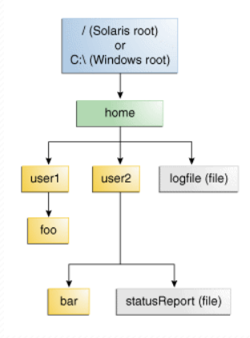

# FILE & FOLDER- Tập Tin Và Thư Mục Trong Java

# Nội dung

1. [Tổng Quan](#1)
2. [PATH - Đường Dẫn](#2)
3. [Đường Dẫn Tuyệt Đối - Đường Dẫn Tương Đối](#3)
4. [java.io.File](#4)

   4.1 [File Fields](#4.1)

   4.2 [File Constructors](#4.2)

   4.3 [File Methods](#4.3)

   4.4 [FileFilter](#4.4)

   4.5 [FilenameFilter](#4.5)

   4.6 [Ví dụ kiểm tra 1 file](#4.6)

   4.7 [Ví dụ về tạo thư mục](#4.7)

   4.8 [Ví dụ lấy mảng danh sách các phân vùng ổ đĩa](#4.8)

   4.9 [Ví dụ lấy danh sách file và folder trong 1 đường dẫn đã cho](#4.9)

   4.10 [Ví dụ sử dụng FileFilter để lọc ra những file có phần mở rộng là .txt từ đường dẫn chỉ định](#4.10)

   4.11 [Ví dụ sử dụng FilenameFilter để lọc ra những file có phần mở rộng là .txt từ đường dẫn chỉ định](#4.11)

   4.12 [Ví dụ liệt kê các pathname của file và directory con trong 1 directory, bằng cách sử dụng Recurse (đệ quy)](#4.12)

   4.13 [Ví dụ liệt kê các name của file và directory con trong 1 directory, bằng cách sử dụng Recurse (đệ quy)](#4.13)

________________________________________________________________________________________________________________________________

## Tổng Quan <a id="1"></a>

* trong thực tế ta rất thường xuyên phải thao tác với tập tin và thư mục trong hệ thống, các thao tác ở đây bao gồm:
  thêm, xóa, đổi tên
* Java cung cấp cho bạn 2 class để làm việc này:
    * java.io.File
    * java.nio.Files

#### java.io.File

* lớp **java.io.File** đại diện cho 1 tập tin (file) hoặc 1 thư mục (directory) của hệ thống, nó được đưa vào Java từ
  phiên bản 1.0

#### java.nio.Files

* phiên bản 7.0, Java bổ sung thêm lớp **java.nio.Files**, việc bổ sung này làm đơn giản hóa việc thao tác với các tập
  tin và thư mục, tất cả các phương thức của class này đều là tĩnh và tự nhiên (static & natural)

________________________________________________________________________________________________________________________________

## PATH - Đường Dẫn <a id="2"></a>

* **đường dẫn (path) là 1 hệ thống tập tin lưu trữ và tổ chức các tập tin trên 1 số loại phương tiện lưu trữ, thường là
  1 hoặc nhiều ổ đĩa cứng, theo cách sao cho chúng có thể dễ dàng lấy ra**
* hầu hết các tập tin được sử dụng ngày nay, lưu trữ các tập tin trong 1 cây (hoặc cấu trúc phân cấp), ở đầu cây là 1 (
  hoặc nhiều hơn) các nút gốc, dưới nút gốc có các tệp (file) và thư mục (folder), mỗi thư mục có thể chứa các tập tin (
  file) và thư mục con (folder)
* hệ điều hành **Microsoft Window** hỗ trợ nhiều nút gốc, mỗi nút gốc ánh xạ tới 1 phân vùng, ví dụ như **C:\** hoặc **
  D:\**...
* hệ điều hành **Solaris (Linux)** hỗ trợ 1 nút gốc, được biểu thị bởi dấu gạch chéo **/**



* 1 tập tin (file) được xác định bởi đường dẫn của nó thông qua hệ thống tập tin bắt đầu từ nút gốc, ví dụ tập tin
  statusReport trong hình trên được mô tả như sau:
    * Trong Hệ điều hành Solaris: /home/user2/statusReport
    * Trong Microsoft Windows: C:\home\user2\statusReport

#### Ký tự phân cách - File.separator

* **separator** là 1 thuộc tính của **File** class, nó đại diện cho ký tự phân cách các tên thư mục trong hệ thống tập
  tin
    * hệ điều hành **Solaris** sử dụng ký tự ``/`` (slash)
    * hệ điều hành **Window** sử dụng ký tự ``\`` (back slash) hoăc vẫn có thể sử dụng ``/`` (slash) <br/><br/>
* chúng ta có thể lấy ký tự này bằng cách sử dụng thuộc tính **separator** của lớp **java.io.File** như
  sau: ``File.separatorChar``

```java
public static final char separatorChar=fs.getSeparator();
```

* thuộc tính **separatorChar** là 1 biến **static**, nó trả về dấu gạch chéo - slash ``/`` nếu hệ điều hành đang sử dụng
  là **Solaris**, hoặc trả về dấu gạch chéo ngược - back slash ``\ `` nếu hệ điều hành đang sử dụng là **Window**

________________________________________________________________________________________________________________________________

## Đường Dẫn Tuyệt Đối - Đường Dẫn Tương Đối <a id="3"></a>

* **đường dẫn tuyệt đối** luôn chứa đầy đủ nút gốc, danh sách thư mục cần thiết để định vị tập tin, ví dụ:

```text
/home/user2/statusReport
hoặc
C:\home\user2\statusReport
```

* Một đường dẫn tương đối cần phải được kết hợp với một đường dẫn khác để truy cập một tập tin, ví dụ:

```text
user2/statusReport
```

* nếu không có thông tin thêm, 1 chương trình không thể xác định chính xác vị trí của tập tin **statusReport** trong hệ
  thống tập tin

________________________________________________________________________________________________________________________________
## java.io.File <a id="4"></a>

* lớp **java.io.File** đại diện cho 1 đường dẫn chỉ đến 1 tập tin hoặc 1 thư mục trong hệ thống tập tin
* đường dẫn (path) này có thể:
    * không thực sự tồn tại trên hệ thống
    * nếu tồn tại, thì nó có thể là:
        * 1 tập tin (file)
        * hoặc 1 thư mục (folder)

```java
public class File implements Serializable, Comparable<File> {
    
}
```
________________________________________________________________________________________________________________________________
### File Fields <a id="4.1"></a>
```java
public class File implements Serializable, Comparable<File> {
  public static final char separatorChar = fs.getSeparator();
  public static final String separator = "" + separatorChar;
  public static final char pathSeparatorChar = fs.getPathSeparator();
  public static final String pathSeparator = "" + pathSeparatorChar;
}
```

Access Modifier     |Data Type  |Variable Name      |Value                    |Description
:-------------------|:----------|:------------------|:------------------------|:-----------------------------------------------------
public static final |char       |separatorChar      |= fs.getSeparator();     |Ký tự phân tách tên mặc định phụ thuộc vào hệ thống.
public static final |String     |separator          |= "" + separatorChar;    |Ký tự phân tách tên mặc định phụ thuộc vào hệ thống, được biểu diễn dưới dạng một chuỗi thuận tiện.
public static final |char       |pathSeparatorChar  |= fs.getPathSeparator(); |Ký tự phân cách đường dẫn phụ thuộc vào hệ thống.
public static final |String     |pathSeparator      |= "" + pathSeparatorChar;|Ký tự phân cách đường dẫn phụ thuộc vào hệ thống, được biểu diễn dưới dạng một chuỗi thuận tiện.

________________________________________________________________________________________________________________________________
### File Constructors <a id="4.2"></a>
```java
public class File implements Serializable, Comparable<File> {
  public File(String pathname) {//...}
  public File(String parent, String child) {//...}
  public File(File parent, String child) {//...}
  public File(URI uri) {//...}
}
```

Access Modifier |Constructor                       |Description
:---------------|:---------------------------------|:--------------------------------------------------------------------------------------
public          |File(String pathname)             |Tạo 1 **instance** mới của **File** bằng cách chuyển đổi chuỗi tên đường dẫn đã cho thành một tên đường dẫn trừu tượng. Nếu chuỗi đã cho là chuỗi trống, thì kết quả là tên đường dẫn trừu tượng rỗng. <br/>``pathname`` : chuỗi tên đường dẫn
public          |File(String parent, String child) |Tạo 1 **instance** mới của **File** từ tên đường dẫn cha và tên đường dẫn con <br/>nếu ``parent = null`` thì **instance** mới của **File** được tạo ra như cách gọi **constructor** của **File** với 1 đối số đơn truyền vào chính là tên đường dẫn con ``child`` <br/>nói cách khác, chuỗi tên đường dẫn cha được lấy để biểu thị 1 floder, và chuỗi tên đường dẫn con được lấy để biểu thị 1 folder hoặc 1 file, nếu chuỗi tên đường dẫn con là tuyệt đối thì nó được chuyển thành 1 đường dẫn tương đối theo cách phụ thuộc vào hệ thống, <br/>nếu chuỗi tên đường dẫn cha là ``null``, thì **instance** của **File** được tạo ra bằng cách chuyển đối tên đường dẫn con thành đường dẫn trừu tượng và giải quyết kết quả dựa trên thư mục mặc định phụ thuộc vào hệ thống <br/>nếu không, chuỗi tên đường dẫn cha và con được chuyển đổi thành tên đường dẫn trừu tượng, và tên đường dẫn trừu tượng con được giải quyết dựa vào tên đường dẫn cha <br/>``parent`` : tên đường dẫn cha <br/>``child`` : tên đường dẫn con
public          |File(File parent, String child)   |Tạo 1 **instance** mới của **File** từ tên đường dẫn trừu tượng cha và tên đường dẫn con <br/> nếu ``parent = null`` thì **instance** mới của **File** được tạo ra như cách gọi **constructor** của **File** với 1 đối số đơn truyền vào chính là tên đường dẫn con ``child`` <br/>nói cách khác, chuỗi tên đường dẫn cha được lấy để biểu thị 1 floder, và chuỗi tên đường dẫn con được lấy để biểu thị 1 folder hoặc 1 file, nếu chuỗi tên đường dẫn con là tuyệt đối thì nó được chuyển thành 1 đường dẫn tương đối theo cách phụ thuộc vào hệ thống, <br/>nếu chuỗi tên đường dẫn cha là ``null``, thì **instance** của **File** được tạo ra bằng cách chuyển đối tên đường dẫn con thành đường dẫn trừu tượng và giải quyết kết quả dựa trên thư mục mặc định phụ thuộc vào hệ thống <br/>nếu không, chuỗi tên đường dẫn cha và con được chuyển đổi thành tên đường dẫn trừu tượng, và tên đường dẫn trừu tượng con được giải quyết dựa vào tên đường dẫn cha <br/>``parent`` : tên đường dẫn trừu tượng cha <br/>``child`` : tên đường dẫn con
public          |File(URI uri)                     |Tạo 1 **instance** mới của **File** bằng cách chuyển đổi 1 đường dẫn **URI** (định dạng tài nguyên thống nhất - Uniform Resource Identifier) thành 1 đường dẫn trừu tượng

________________________________________________________________________________________________________________________________
### File Methods <a id="4.3"></a>
```java
public class File implements Serializable, Comparable<File> {
  public String getName() {//...}
  public String getParent() {//...}
  public File getParentFile() {//...}
  public String getPath() {//...}
  public boolean isAbsolute() {//...}
  public String getAbsolutePath() {//...}
  public File getAbsoluteFile() {//...}
  public String getCanonicalPath() throws IOException {//...}
  public File getCanonicalFile() throws IOException {//...}
  public URL toURL() throws MalformedURLException {//...}
  public URI toURI() {//...}
  public boolean canRead() {//...}
  public boolean canWrite() {//...}
  public boolean exists() {//...}
  public boolean isDirectory() {//...}
  public boolean isFile() {//...}
  public boolean isHidden() {//...}
  public long lastModified() {//...}
  public long length() {//...}
  public boolean createNewFile() throws IOException {//...}
  public boolean delete() {//...}
  public void deleteOnExit() {//...}
  public String[] list() {//...}
  public String[] list(FilenameFilter filter) {//...}
  public File[] listFiles() {//...}
  public File[] listFiles(FilenameFilter filter) {//...}
  public File[] listFiles(FileFilter filter) {//...}
  public boolean mkdir() {//...}
  public boolean mkdirs() {//...}
  public boolean renameTo(File dest) {//...}
  public boolean setLastModified(long time) {//...}
  public boolean setReadOnly() {//...}
  public boolean setWritable(boolean writable, boolean ownerOnly) {//...}
  public boolean setWritable(boolean writable) {//...}
  public boolean setReadable(boolean readable, boolean ownerOnly) {//...}
  public boolean setReadable(boolean readable) {//...}
  public boolean setExecutable(boolean executable, boolean ownerOnly) {//...}
  public boolean setExecutable(boolean executable) {//...}
  public boolean canExecute() {//...}
  public static File[] listRoots() {//...}
  public long getTotalSpace() {//...}
  public long getFreeSpace() {//...}
  public long getUsableSpace() {//...}
  public static File createTempFile(String prefix, String suffix, File directory) throws IOException {//...}
  public static File createTempFile(String prefix, String suffix) throws IOException {//...}
  public int compareTo(File pathname) {//...}
  public boolean equals(Object obj) {//...}
  public int hashCode() {//...}
  public String toString() {//...}
  public Path toPath() {//...}
}
```

AccessModifier  |Return Data  |Method                                                        |Description
:---------------|:------------|:-------------------------------------------------------------|:-----------------------------------------------------------------------------
public          |String       |getName()                                                     |trả về chuỗi đường dẫn con là tên của file hoặc folder (child's pathname) được biểu thị bởi đường dẫn trừu tượng hiện tại, là tên của file hay folder cuối cùng trong chuỗi đường dẫn. <br/>hoặc trả về chuỗi rỗng (empty) nếu chuỗi của đường dẫn hiện tại là rỗng (empty)
public          |String       |getParent()                                                   |trả về chuỗi đường dẫn cha của đường dẫn trừu tượng hiện tại (parent's pathname), hoặc trả về ``null`` nếu đường dẫn này không chứa đường dẫn cha, mà chỉ có duy nhất tên của file, folder, hoặc chỉ là 1 đường dẫn rỗng (empty)
public          |File         |getParentFile()                                               |trả về chuỗi đường dẫn cha của đường dẫn trừu tượng hiện tại (parent's pathname), hoặc trả về ``null`` nếu đường dẫn này không chứa đường dẫn cha, mà chỉ có duy nhất tên của file, folder, hoặc chỉ là 1 đường dẫn rỗng (empty)
public          |String       |getPath()                                                     |trả về chuỗi đường dẫn được chuyển đổi từ tên đường dẫn trừu tượng hiện tại, chuỗi kết quả trả về sử dụng sử dụng ký tự phân cách mặc định để phân cách folder và file
public          |boolean      |isAbsolute()                                                  |kiểm tra và trả về ``true`` nếu đường dẫn hiện tại là đường dẫn tuyệt đối (là đường dẫn có nút gốc), ngược lại là ``false`` (là đường dẫn không chứa nút gốc)
public          |String       |getAbsolutePath()                                             |trả về đường dẫn tuyệt đối của đường dẫn trừu tượng hiện tại, nếu đường dẫn trừu tượng hiện tại đã là đường dẫn tuyệt đối thì tên đường dẫn tuyệt đối được trả về đơn giản bằng phương thức **getPath()**. <br/>nếu tên đường dẫn trừu tượng này là chuỗi rỗng (empty) thì chuỗi đường dẫn chỉ đến thư mục hiện tại của người dùng (được đặt tên bởi thuộc tính của hệ thống **user.dir**) được trả về. nói cách khác, tên đường dẫn này được giải quyết theo cách phụ thuộc vào hệ thống, trên các hệ thống **UNIX**, đường dẫn tương đối được chuyển thành đường dẫn tuyệt đối bằng cách giải quyết nó dựa trên thư mục người dùng hiện tại, trên **WINDOW**, đường dẫn tương đối được chuyển thành đường dẫn tuyệt đối bằng cách giải quyết nó dựa trên thư mục hiện tại của ổ đĩa được đặt tên bằng đường dẫn (nếu có), nếu không nó được giải quyết dựa trên thư mục người dùng hiện tại
public          |File         |getAbsoluteFile()                                             |trả về **instance** của **File** là định dạng tuyệt đối của đường dẫn trừu tượng hiện tại, tương đương với lệnh ``new File(this.getAbsolutePath());``
public          |String       |getCanonicalPath()                                            |trả về chuỗi đường dẫn quy chuẩn của đường dẫn trừu tượng hiện tại, đường dẫn quy chuẩn thì bao gồm tuyệt đối và duy nhất, định nghĩa tỉ mỉ của hình thức quy chuẩn thì phụ thuộc vào hệ thống <br/>phương thức này trước tiên chuyển đường dẫn hiện tại thành tuyệt đối nếu cần thiết, nó giống như gọi đến phương thức **getAbsolutePath()**, và sau đó ánh xạ nó thành hình thức duy nhất của nó theo cách phụ thuộc vào hệ thống, điều này thường liên quan đến việc loại bỏ các tên dư thừa như ``.`` và ``..`` từ tên đường dẫn, giải quyết các **symbolic links** (trên **UNIX**), và chuyển đổi ký tự ổ đĩa thành **standard case** (trên **WINDOW**)
public          |File         |getCanonicalFile()                                            |trả về **instance** của **File** là định dạng quy chuẩn của đường dẫn trừu tượng hiện tại, tương đương với lệnh ``new File(this.getCanonicalPath());``
public          |URL          |toURL()                                                       |trả về **instance** của **URL** đại diện cho đường dẫn **URL** tương đương
public          |URI          |toURI()                                                       |trả về **instance** của **URI** đại diện cho đường dẫn trừu tượng hiện tại, định dạng chính xác của **URI** phụ thuộc vào hệ thống, nếu xác định được đường dẫn trừu tượng này chỉ đến 1 thư mục, thì kết quả trả về sẽ có 1 ký tự gạch chéo - slash ``/`` ở cuối của **URI**
public          |boolean      |canRead()                                                     |trả về ``true`` nếu và chỉ nếu đường dẫn chỉ định bởi đường dẫn trừu tượng hiện tại có tồn tại và có thể đọc được bởi ứng dụng, ngược lại trả về ``false``
public          |boolean      |canWrite()                                                    |trả về ``true`` nếu và chỉ nếu hệ thống đường dẫn thực sự chứa đường dẫn được chỉ rõ bởi đường dẫn trừu tượng hiện tại và ứng dụng có thể ghi vào đường dẫn, ngược lại trả về ``false``
public          |boolean      |exists()                                                      |trả về ``true`` nếu và chỉ nếu file hoặc folder được chỉ rõ bởi đường dẫn trừu tượng hiện tại có tồn tại, ngược lại trả về ``false``
public          |boolean      |isDirectory()                                                 |trả về ``true`` nếu và chỉ nếu đường dẫn được chỉ rõ bởi đường dẫn trừu tượng hiện tại có tồn tại và nó là 1 folder, ngược lại trả về ``false``
public          |boolean      |isFile()                                                      |trả về ``true`` nếu và chỉ nếu đường dẫn được chỉ rõ bởi đường dẫn trừu tượng hiện tại có tồn tại và nó là 1 file, ngược lại trả về ``false``
public          |boolean      |isHidden()                                                    |trả về ``true`` nếu và chỉ nếu đường dẫn được chỉ rõ bởi đường dẫn trừu tượng hiện tại đang bị ẩn theo quy ước của nền tảng, ngược lại trả về ``false``
public          |long         |lastModified()                                                |trả về 1 giá trị **long** có đơn vị là **miliseconds** đại diện cho thời gian đường dẫn được sửa đổi lần cuối, trả về **0L** nếu đường đẫn không tồn tại hoặc xảy ra lỗi **I/O**
public          |long         |length()                                                      |trả về 1 giá trị **long** là độ dài, được tính bằng **byte**, của đường dẫn được chỉ rõ bởi đường dẫn trừu tượng hiện tại, trả về **0L** nếu đường dẫn không tồn tại. <br/>1 số hệ điều hành có thể trả về **0L** cho những đường dẫn biểu thị các thực thể của hệ thống như các **device** hoặc các **pipe**
public          |boolean      |createNewFile()                                               |tạo 1 đường dẫn mới rỗng (empty) từ đường dẫn trừu tượng hiện tại và trả về ``true`` nếu và chỉ nếu đường dẫn trừu tượng hiện tại chưa tồn tại, ngược lại trả về ``false``. <br/>việc kiểm tra sự tồn tại và tạo 1 đường dẫn mới nếu nó chưa tồn tại là 1 hoạt động riêng lẻ đối với các hoạt động khác của hệ thống đường dẫn và có thể ảnh hưởng đến hệ thống đường dẫn. <br/>phương thức này không nên sử dụng cho **file-locking**, vì **protocol** kết quả không thể được hoạt động đáng tin cậy, **FileLock** nên được sử dụng thay thế cho **file-locking** 
public          |boolean      |delete()                                                      |trả về ``true`` nếu và chỉ nếu file hoặc folder được xóa thành công, ngược lại là ``false``
public          |void         |deleteOnExit()                                                |xóa file hoặc folder của đường dẫn trừu tượng này khi máy ảo kết thúc
public          |String[]     |list()                                                        |trả về 1 mảng các **String** danh sách tên của các file hoặc folder trong thư mục được chỉ rõ bởi đường dẫn trừu tượng hiện tại. <br/>trả về 1 mảng các đường dẫn trừu tượng biểu thị các file và folder được chỉ rõ bởi đường dẫn trừu tượng hiện tại. <br/>trả về mảng **empty** nếu đường dẫn trừu tượng hiện tại **emtpy**. <br/>trả về ``null`` nếu đường dẫn trừu tượng hiện tại không chỉ rõ 1 thư mục hoặc xảy ra lỗi **I/O**
public          |String[]     |list(FilenameFilter filter)                                   |trả về 1 mảng các **String** danh sách tên của các file hoặc folder trong thư mục được chỉ rõ bởi đường dẫn trừu tượng hiện tại đáp ứng filter được chỉ định. <br/>``filter`` : **FilenamFilter** chỉ định. <br/>trả về 1 mảng các đường dẫn trừu tượng biểu thị các file và folder được chỉ rõ bởi đường dẫn trừu tượng hiện tại. <br/>trả về mảng **empty** nếu đường dẫn trừu tượng hiện tại **emtpy**. <br/>trả về ``null`` nếu đường dẫn trừu tượng hiện tại không chỉ rõ 1 thư mục hoặc xảy ra lỗi **I/O**
public          |File[]       |listFiles()                                                   |trả về 1 mảng các **File** danh sách các đường dẫn trừu tượng biểu thị các đường dẫn trong thư mục được chỉ rõ bởi đường dẫn trừu tượng hiện tại. <br/>trả về 1 mảng các đường dẫn trừu tượng biểu thị các file và folder được chỉ rõ bởi đường dẫn trừu tượng hiện tại. <br/>trả về mảng **empty** nếu đường dẫn trừu tượng hiện tại **emtpy**. <br/>trả về ``null`` nếu đường dẫn trừu tượng hiện tại không chỉ rõ 1 thư mục hoặc xảy ra lỗi **I/O**
public          |File[]       |listFiles(FilenameFilter filter)                              |trả về 1 mảng các **File** danh sách các đường dẫn trừu tượng biểu thị các đường dẫn trong thư mục được chỉ rõ bởi đường dẫn trừu tượng hiện tại đáp ứng filter được chỉ định. <br/>``filter`` : **FilenameFilter** chỉ định. <br/>trả về 1 mảng các đường dẫn trừu tượng biểu thị các file và folder được chỉ rõ bởi đường dẫn trừu tượng hiện tại. <br/>trả về mảng **empty** nếu đường dẫn trừu tượng hiện tại **emtpy**. <br/>trả về ``null`` nếu đường dẫn trừu tượng hiện tại không chỉ rõ 1 thư mục hoặc xảy ra lỗi **I/O**
public          |File[]       |listFiles(FileFilter filter)                                  |trả về 1 mảng các **File** danh sách các đường dẫn trừu tượng biểu thị các đường dẫn trong thư mục được chỉ rõ bởi đường dẫn trừu tượng hiện tại đáp ứng filter được chỉ định. <br/>``filter`` : **FileFilter** chỉ định. <br/>trả về 1 mảng các đường dẫn trừu tượng biểu thị các file và folder được chỉ rõ bởi đường dẫn trừu tượng hiện tại. <br/>trả về mảng **empty** nếu đường dẫn trừu tượng hiện tại **emtpy**. <br/>trả về ``null`` nếu đường dẫn trừu tượng hiện tại không chỉ rõ 1 thư mục hoặc xảy ra lỗi **I/O**
public          |boolean      |mkdir()                                                       |tạo 1 thư mục được đặt tên bởi đường dẫn trừu tượng hiện tại và trả về ``true``, phương thức này chỉ trả về ``true`` nếu thư mục đã được tạo, ngược lại trả về ``false``. <br/>chú ý: khi dùng phương thức này để tạo thư mục được chỉ rõ trong đường dẫn trừu tượng hiện tại, nó chỉ được tạo khi thư mục cha chứa nó đã được tạo. 
public          |boolean      |mkdirs()                                                      |tạo 1 thư mục được đặt tên bởi đường dẫn trừu tượng hiện tại và trả về ``true``, phương thức này bao gồm cả việc tạo các thư mục cha được chỉ rõ trong đường dẫn trừu tượng hiện tại nhưng các thư mục đó chưa tồn tại trên hệ thống, lưu ý nếu hoạt động này gặp lỗi nó có thể đã thành công trong việc tạo 1 số thư mục cha. <br/>trả về ``true`` nếu và chỉ nếu thư mục chỉ rõ bởi đường dẫn trừu tượng hiện tại được tạo, cùng với tất cả các thư mục cha cần thiết, ngược lại trả về ``false``.   
public          |boolean      |renameTo(File dest)                                           |đổi tên đường dẫn được chỉ rõ bởi đường dẫn trừu tượng hiện tại, trả về ``true`` nếu đổi tên thành công, ngược lại trả về ``false``. <br/>lưu ý: đổi tên file hoặc directory nhưng không thay đổi đường dẫn cha, nó chỉ là hành động đổi tên bình thường, nhưng nếu đổi tên file hoặc directory và thay đổi cả đường dẫn cha, nó giống như 1 hành động **Cut**. <br/>phương thức này sẽ không hoạt động trên **WINDOW** nếu thay đổi đường dẫn cha từ ổ đĩa này sang ổ đĩa kia. <br/>``dest`` : **File** tên đường dẫn chỉ định mới
public          |boolean      |setLastModified(long time)                                    |thiết lập thời gian chỉnh sửa cuối cùng cho file hoặc folder được chỉ rõ bởi đường dẫn trừu tượng hiện tại và trả về ``true``, ngược lại trả về ``false`` khi không đặt được thời gian chỉnh sửa cuối cùng cho file hoặc folder. <br/>``time`` : giá trị **long** là thời gian chỉnh sửa cuối cùng đặt cho file hoặc folder, được đo bằng milliseconds tính từ **epoch (00:00:00 GMT, January 1, 1970)**
public          |boolean      |setReadOnly()                                                 |thiết lập file hoặc folder được chỉ rõ bởi đường dẫn trừu tượng hiện tại chỉ được dùng để đọc, trả về ``true`` nếu thiết lập thành công, ngược lại trả về ``false``
public          |boolean      |setWritable(boolean writable, boolean ownerOnly)              |thiết lập quyền ghi của chủ sở hữu hoặc của mọi người cho file hoặc folder được chỉ rõ bởi đường dẫn trừu tượng hiện tại, trả về ``true`` nếu thiết lập thành công, ngược lại trả về ``false``. <br/>``writable`` : giá trị **boolean**, nếu ``true``, thiết lập quyền truy cập cho phép hoạt động ghi, nếu ``false``, hoạt động ghi không được phép. <br/>``ownerOnly`` : giá trị **boolean**, nếu ``true``, chỉ chủ sở hữu đường dẫn trừu tương hiện tại được phép có hoạt động ghi, ngược lại là ``false`` thì tất cả mọi người đều có quyền ghi đối với đường dẫn trừu tượng hiện tại
public          |boolean      |setWritable(boolean writable)                                 |thiết lập quyền ghi chỉ dành cho chủ sở hữu file hoặc folder được chỉ rõ bởi đường dẫn trừu tượng hiện tại, trả về ``true`` nếu thiết lập thành công, ngược lại trả về ``false``. <br/>phương thức này chỉ áp dụng cho chủ sở hữu file hoặc folder, việc gọi phương thức này tương tự như gọi phương thức **File.setWriteable(boolean, true)** - giá trị ``ownerOnly`` luôn luôn ``true``. <br/>``writeable`` : nếu ``true`` cho phép hoạt động ghi đối với file hoặc folder được chỉ rõ bởi đường dẫn trừu tượng hiện tại, được sở hữu bởi chủ sở hữu xác định, nếu ``false``, hoạt động ghi không được phép 
public          |boolean      |setReadable(boolean readable, boolean ownerOnly)              |thiết lập quyền đọc của chủ sở hữu hoặc của mọi người cho file hoặc folder được chỉ rõ bởi đường dẫn trừu tượng hiện tại, trả về ``true`` nếu thiết lập thành công, ngược lại trả về ``false``. <br/>``readable`` : giá trị **boolean**, nếu ``true``, thiết lập quyền truy cập cho phép hoạt động đọc, nếu ``false``, hoạt động đọc không được phép. <br/>``ownerOnly`` : giá trị **boolean**, nếu ``true``, chỉ chủ sở hữu đường dẫn trừu tương hiện tại được phép có hoạt động đọc, ngược lại là ``false`` thì tất cả mọi người đều có quyền đọc đối với đường dẫn trừu tượng hiện tại
public          |boolean      |setReadable(boolean readable)                                 |thiết lập quyền đọc chỉ dành cho chủ sở hữu file hoặc folder được chỉ rõ bởi đường dẫn trừu tượng hiện tại, trả về ``true`` nếu thiết lập thành công, ngược lại trả về ``false``. <br/>phương thức này chỉ áp dụng cho chủ sở hữu file hoặc folder, việc gọi phương thức này tương tự như gọi phương thức **File.setReadable(boolean, true)** - giá trị ``ownerOnly`` luôn luôn ``true``. <br/>``readable`` : nếu ``true`` cho phép hoạt động đọc đối với file hoặc folder được chỉ rõ bởi đường dẫn trừu tượng hiện tại, được sở hữu bởi chủ sở hữu xác định, nếu ``false``, hoạt động đọc không được phép
public          |boolean      |setExecutable(boolean executable, boolean ownerOnly)          |thiết lập quyền thực thi của chủ sở hữu hoặc của mọi người cho đường dẫn trừu tượng hiện tại, trả về ``true`` nếu thiết lập thành công, ngược lại trả về ``false``. <br/>``executable`` : giá trị **boolean**, nếu ``true`` hoạt động thực thi được cho phép, nếu ``false`` thì ngược lại. <br/>``ownerOnly`` : nếu ``true`` thì chỉ quyền thực thi chỉ dành cho chủ sở hữu đường dẫn trừu tượng hiện tại, ngược lại là ``false`` thì mọi người đều có quyền thực thi đối với đường dẫn này
public          |boolean      |setExecutable(boolean executable)                             |thiết lập quyền thực thi chỉ dành cho chủ sở hữu đường dẫn trừu tượng hiện tại, trả về ``true`` nếu thiết lập thành công, ngược lại trả về ``false``. <br/>phương thức này chỉ áp dụng cho chủ sở hữu đường dẫn trừu tượng hiện tại, việc gọi phương thức này tương tự như gọi phương thức **File.setExecutable(boolean, true)** - giá trị ``ownerOnly`` luôn luôn ``true``. <br/>``executable`` : giá trị **boolean**, nếu ``true`` hoạt động thực thi được cho phép, nếu ``false`` thì ngược lại.
public          |boolean      |canExecute()                                                  |kiểm tra quyền thực thi của ứng dụng đối với đường dẫn được chỉ rõ bởi đường dẫn trừu tượng hiện tại. <br/>trả về ``true`` nếu và chỉ nếu đường dẫn trừu tượng hiện tại tồn tại và ứng dụng được phép thực thi đối với đường dẫn đó, ngược lại trả về ``false``.
public          |static       |File[] listRoots()                                            |trả về mảng các đối tượng **File** biểu thị **availible system root**, hoặc ``null`` nếu **set of root** không thể xác định, mảng sẽ **empty** và không có bất kỳ **filesystem root** nào
public          |long         |getTotalSpace()                                               |trả về giá trị **long** là tổng kích thước của phân vùng ổ đĩa chứa đường dẫn trừu tượng hiện tại, đơn vị tính là **byte**, hoặc trả về **0L** nếu đường dẫn trừu tượng hiện tại không chứa tên của phân vùng ổ đĩa, nên không thể xác định được ổ đĩa phân vùng
public          |long         |getFreeSpace()                                                |trả về giá trị **long** là tổng kích thước chưa được ghi trong phân vùng ổ đĩa chứa đường dẫn trừu tượng hiện tại, đơn vị tính là **byte**, hoặc trả về **0L** nếu được dẫn trừu tượng hiện tại không chứa tên của phân vùng ổ đĩa, nên không thể xác định được ổ đĩa phân vùng
public          |long         |getUsableSpace()                                              |trả về giá trị **long** là tổng kích thước chưa được ghi trong phân vùng ổ đĩa chứa đường dẫn trừu tượng hiện tại, đơn vị tính là **byte**, hoặc trả về **0L** nếu được dẫn trừu tượng hiện tại không chứa tên của phân vùng ổ đĩa, nên không thể xác định được ổ đĩa phân vùng, phương thức này tương tự như phương thức **File.getFreeSpace()**
public static   |File         |createTempFile(String prefix, String suffix, File directory)  |tạo 1 file tạm thời **empty** trong thư mục chỉ định, đồng thời trả về 1 đường dẫn trừu tượng chỉ rõ đến file tạm trống vừa được tạo mới. <br/>``prefix`` : chuỗi tiền tố, dùng để tạo tên file, chứa ít nhất 3 ký tự. <br/>``suffix`` : chuỗi hậu tố, dùng để tạo đuôi mở rộng của tên file, nếu đặt giá trị ``null``, **.tmp** sẽ được sử dụng làm hậu tố. <br/>``directory`` : là đường dẫn **File** chỉ đến folder sẽ chứa file tam empty mới, nếu có giá trị ``null``, thư mục file tạm mặc định sẽ được sử dụng.
public static   |File         |createTempFile(String prefix, String suffix)                  |tạo 1 file tạm thời **empty** trong thư mục chứa file tạm thời mặc định, đồng thời trả về 1 đường dẫn trừu tượng chỉ rõ đến file tạm trống vừa được tạo mới. <br/>``prefix`` : chuỗi tiền tố, dùng để tạo tên file, chứa ít nhất 3 ký tự. <br/>``suffix`` : chuỗi hậu tố, dùng để tạo đuôi mở rộng của tên file, nếu đặt giá trị ``null``, **.tmp** sẽ được sử dụng làm hậu tố.
public          |int          |compareTo(File pathname)                                      |so sánh 2 đường dẫn trừu tượng về mặt từ vựng, thứ tự được xác định bởi phương thức này phụ thuộc vào hệ thống nền tảng. <br/>trên các hệ thống **UNIX**, chữ cái viết hoa có ý nghĩa trong việc so sánh các đường dẫn. <br/>trên hệ thống **WINDOW** chữ cái HOA và thường không có ý nghĩa quan trọng trong việc so sánh đường dẫn. <br/> trả về 1 giá trị **int** : **= 0** nếu đường dẫn trừu tượng hiện tại bằng với đối số chỉ định, **< 0** nếu đường dẫn trừu tượng hiện tại về mặt từ vựng nhỏ hơn đối số chỉ định, **> 0** nếu đường dẫn trừu tượng hiện tại về mặt từ vựng lớn hơn đối số chỉ định. <br/>``pathname`` : đường dẫn trừu tượng chỉ định để so sánh với đường dẫn trừu tượng hiện tại.
public          |boolean      |equals(Object obj)                                            |kiểm tra sự bằng nhau giữa đường dẫn trừu tượng hiện tại với đối tượng là đường dẫn chỉ định. <br/>trả về ``true`` nếu và chỉ nếu đối số đối tượng đường dẫn chỉ định không ``null`` và là 1 đường dẫn trừu tượng biểu thị cùng 1 file hoặc thư mục với đường dẫn trừu tượng hiện tại. <br/>2 tên đường dẫn có bằng nhau hay không còn phụ thuộc vào hệ thống nền tảng, trên các hệ thống **UNIX**, chữ cái HOA và thường là phân biệt rõ ràng, trên **WINDOW** thì không phân biệt chữ cái HOA và thường. <br/>``obj`` : đối tượng đường dẫn chỉ định được lấy ra so sánh.
public          |int          |hashCode()                                                    |trả về **hash code** cho đường dẫn trừu tượng hiện tại
public          |String       |toString()                                                    |trả về định dạng **String** của đường dẫn trừu tượng hiện tại
public          |Path         |toPath()                                                      |trả về 1 đối tượng **Path** từ đường dẫn trừu tượng hiện tại

________________________________________________________________________________________________________________________________
### FileFilter <a id="4.4"></a>
```java
package java.io;

@FunctionalInterface
public interface FileFilter {
    boolean accept(File pathname);
}
```
________________________________________________________________________________________________________________________________
### FilenameFilter <a id="4.5"></a>
```java
package java.io;

@FunctionalInterface
public interface FilenameFilter {
    boolean accept(File dir, String name);
}
```
________________________________________________________________________________________________________________________________

### Ví dụ kiểm tra 1 file <a id="4.6"></a>
```java
import java.io.File;
import java.io.IOException;
import java.util.Date;

public class FileExample_test {
    public static void main(String[] args) throws IOException {
        // D:\Learning\Java\JavaOOP\src\_45_Java_IO\_05_File\test_file.txt
        File file = new File("D:\\Learning\\Java\\JavaOOP\\src\\_45_Java_IO\\_05_File\\test_file.txt");

        System.out.println("exist ? : " + file.exists());

        if (file.exists()) {
            System.out.println("is directory ? : " + file.isDirectory());
            System.out.println("is hidden ? : " + file.isHidden());
            System.out.println("simple name: " + file.getName());
            System.out.println("absolute path: " + file.getAbsolutePath());
            System.out.println("length : " + file.length());

            long lastModifiedMillis = file.lastModified();
            Date lastModifiedDate = new Date(lastModifiedMillis);
            System.out.println("last modified date: " + lastModifiedDate);
        }
    }
}
```
* OUTPUT
```text
exist ? : true
is directory ? : false
is hidden ? : false
simple name: test_file.txt
absolute path: D:\Learning\Java\JavaOOP\src\_45_Java_IO\_05_File\test_file.txt
length : 77
last modified date: Thu Aug 12 00:22:28 ICT 2021
```
________________________________________________________________________________________________________________________________
### Ví dụ về tạo thư mục <a id="4.7"></a>
```java
import java.io.File;

public class FileExample_make_directory {
    public static void main(String[] args) {
        // sử dụng mkdir() method
        // test13 chưa được tạo, nhưng các thư mục cha của nó đã được tạo
        File dir1 = new File("D:\\Learning\\Java\\JavaOOP\\src\\_45_Java_IO\\_05_File\\test11\\test12\\test13");

        // sử dụng mkdirs() method
        // test24 và thư mục cha test25 chưa được tạo trong hệ thống
        File dir2 = new File("D:\\Learning\\Java\\JavaOOP\\src\\_45_Java_IO\\_05_File\\test21\\test22\\test23\\test24\\test25");

        System.out.println("dir1 exist ?: " + dir1.exists() + " -absolute path: " + dir1.getAbsolutePath());
        System.out.println("parentFile of dir1 exist ?: " + dir1.getParentFile().exists());
        boolean createDir1 = dir1.mkdir();
        System.out.println("use mkdir(), dir1 created ?: " + createDir1);
        System.out.println("-------------------------------------------------------------------------------------------");

        System.out.println("dir2 exist ?: " + dir2.exists() + " -absolute path: " + dir2.getAbsolutePath());
        System.out.println("parentFile of dir2 exist ?: " + dir2.getParentFile().exists());
        System.out.println();

        boolean createDir2 = dir2.mkdir();
        System.out.println("use mkdir(), dir2 created ?: " + createDir2);
        System.out.println("parentFile of dir2 exist ?: " + dir2.getParentFile().exists());
        System.out.println();

        createDir2 = dir2.mkdirs();
        System.out.println("use mkdirs(), dir2 created ?: " + createDir2);
        System.out.println("parentFile of dir2 exist ?: " + dir2.getParentFile().exists());

    }
}
```
* OUTPUT
```text
dir1 exist ?: false -absolute path: D:\Learning\Java\JavaOOP\src\_45_Java_IO\_05_File\test11\test12\test13
parentFile of dir1 exist ?: true
use mkdir(), dir1 created ?: true
-------------------------------------------------------------------------------------------
dir2 exist ?: false -absolute path: D:\Learning\Java\JavaOOP\src\_45_Java_IO\_05_File\test21\test22\test23\test24\test25
parentFile of dir2 exist ?: false

use mkdir(), dir2 created ?: false
parentFile of dir2 exist ?: false

use mkdirs(), dir2 created ?: true
parentFile of dir2 exist ?: true
```
________________________________________________________________________________________________________________________________
### Ví dụ lấy mảng danh sách các phân vùng ổ đĩa <a id="4.8"></a>
```java
import java.io.File;

public class FileExample_Files_roots {
    public static void main(String[] args) {
        File[] listroots = File.listRoots();

        for (File f : listroots) {
            System.out.println(f);
        }
    }
}
```
* OUTPUT
```text
C:\
D:\
```
________________________________________________________________________________________________________________________________
### Ví dụ lấy danh sách file và folder trong 1 đường dẫn đã cho <a id="4.9"></a>
```java
import java.io.File;

public class FileExample_listFile {
    public static void main(String[] args) {
        File dir = new File("D:\\\\Learning\\\\Java\\\\JavaOOP\\\\src\\\\_45_Java_IO\\\\_05_File\\\\");

        System.out.println("using File[] listFile(): \n");
        File[] children = dir.listFiles();

        for (File f : children) {
            System.out.println(f.getAbsolutePath());
        }
        System.out.println("--------------------------------");
        System.out.println("using String[] list(): \n");
        String[] listString = dir.list();

        for (String s : listString) {
            System.out.println(s);
        }
    }
}
```
* OUTPUT
```text
using File[] listFile(): 

D:\Learning\Java\JavaOOP\src\_45_Java_IO\_05_File\FileExample_Files_roots.java
D:\Learning\Java\JavaOOP\src\_45_Java_IO\_05_File\FileExample_listFile.java
D:\Learning\Java\JavaOOP\src\_45_Java_IO\_05_File\FileExample_make_directory.java
D:\Learning\Java\JavaOOP\src\_45_Java_IO\_05_File\FileExample_test.java
D:\Learning\Java\JavaOOP\src\_45_Java_IO\_05_File\img.png
D:\Learning\Java\JavaOOP\src\_45_Java_IO\_05_File\README.md
D:\Learning\Java\JavaOOP\src\_45_Java_IO\_05_File\test11
D:\Learning\Java\JavaOOP\src\_45_Java_IO\_05_File\test21
D:\Learning\Java\JavaOOP\src\_45_Java_IO\_05_File\test_file.txt
--------------------------------
using String[] list(): 

FileExample_Files_roots.java
FileExample_listFile.java
FileExample_make_directory.java
FileExample_test.java
img.png
README.md
test11
test21
test_file.txt
```
________________________________________________________________________________________________________________________________
### Ví dụ sử dụng FileFilter để lọc ra những file có phần mở rộng là .txt từ đường dẫn chỉ định <a id="4.10"></a>
* lớp chức năng **implements FileFilter** dùng để lọc những pathname có phần mở rộng .txt được truyền vào
```java
import java.io.File;
import java.io.FileFilter;

public class txtFileFilter implements FileFilter {
  @Override
  public boolean accept(File pathname) {
    // nếu pathname không phải là File, return false
    if (!pathname.isFile()) {
      return false;
    }
    // nếu pathname không kết thúc với .txt, return false
//        if (pathname.getAbsolutePath().endsWith(".txt")) {
//            return true;
//        } else {
//            // nếu pathname là File nhưng pathname không kết thúc với .txt, return false
//            return false;
//        }
    // nếu pathname là File nhưng pathname không kết thúc với .txt, return false

    // viết đơn giản
    return pathname.getAbsolutePath().endsWith(".txt");
  }
}
```
* lớp chương trình chính
```java
import java.io.File;

public class FileFilter_Ex {
    public static void main(String[] args) {
        File file = new File("D:\\Learning\\Java\\JavaOOP\\src\\_45_Java_IO\\_05_File");

        File[] listTxt = file.listFiles(new txtFileFilter());

        for (File f : listTxt) {
            System.out.println(f.getAbsolutePath());
        }
    }
}
```
* OUTPUT
```text
D:\Learning\Java\JavaOOP\src\_45_Java_IO\_05_File\test_file.txt
```
________________________________________________________________________________________________________________________________
### Ví dụ sử dụng FilenameFilter để lọc ra những file có phần mở rộng là .txt từ đường dẫn chỉ định <a id="4.11"></a>
* lớp chức năng **implements FilenameFilter** dùng để lọc những pathname có phần mở rộng .txt được truyền vào
```java
import java.io.File;
import java.io.FilenameFilter;

public class txtFilenameFilter implements FilenameFilter {
    @Override
    public boolean accept(File dir, String name) {
//        if (name.endsWith(".txt")) {
//            return true;
//        } else {
//            return false;
//        }

        // viết đơn giản
        return name.endsWith(".txt");
    }
}
```
* lớp chương trình chính
```java
import java.io.File;

public class FilenameFilter_Ex {
    public static void main(String[] args) {
        File dir = new File("D:\\Learning\\Java\\JavaOOP\\src\\_45_Java_IO\\_05_File");

        File[] listTxt = dir.listFiles(new txtFilenameFilter());

        for (File f : listTxt) {
            System.out.println(f.getAbsolutePath());
        }
    }
}
```
* OUTPUT
```text
D:\Learning\Java\JavaOOP\src\_45_Java_IO\_05_File\test_file.txt
```
________________________________________________________________________________________________________________________________
### Ví dụ liệt kê các pathname của file và directory con trong 1 directory, bằng cách sử dụng Recurse (đệ quy) <a id="4.12"></a>
```java
import java.io.File;

public class RecursiveFile {
    private void fetchFile(File dir) {
        // in ra đường dẫn tuyệt đối của đường dẫn hiện tại
        System.out.println(dir.getAbsolutePath());

        // nếu đường dẫn hiện tại là 1 directory
        if (dir.isDirectory()) {
            // lấy danh sách các đường dẫn con bên trong directory hiên tại
            File[] listChild = dir.listFiles();

            // duyệt từng đường dẫn con
            for (File f : listChild) {
                // gọi đệ quy
                fetchFile(f);
            }
        }
    }

    public static void main(String[] args) {
        File dir = new File("D:\\Learning\\Java\\JavaOOP\\src\\_45_Java_IO\\_05_File");

        RecursiveFile recursiveFile = new RecursiveFile();
        recursiveFile.fetchFile(dir);
    }
}
```
* OUTPUT
```text
D:\Learning\Java\JavaOOP\src\_45_Java_IO\_05_File
D:\Learning\Java\JavaOOP\src\_45_Java_IO\_05_File\FileExample_Files_roots.java
D:\Learning\Java\JavaOOP\src\_45_Java_IO\_05_File\FileExample_listFile.java
D:\Learning\Java\JavaOOP\src\_45_Java_IO\_05_File\FileExample_make_directory.java
D:\Learning\Java\JavaOOP\src\_45_Java_IO\_05_File\FileExample_test.java
D:\Learning\Java\JavaOOP\src\_45_Java_IO\_05_File\FileFilter_Ex.java
D:\Learning\Java\JavaOOP\src\_45_Java_IO\_05_File\FilenameFilter_Ex.java
D:\Learning\Java\JavaOOP\src\_45_Java_IO\_05_File\img.png
D:\Learning\Java\JavaOOP\src\_45_Java_IO\_05_File\README.md
D:\Learning\Java\JavaOOP\src\_45_Java_IO\_05_File\RecursiveFile.java
D:\Learning\Java\JavaOOP\src\_45_Java_IO\_05_File\test11
D:\Learning\Java\JavaOOP\src\_45_Java_IO\_05_File\test11\test12
D:\Learning\Java\JavaOOP\src\_45_Java_IO\_05_File\test11\test12\test13
D:\Learning\Java\JavaOOP\src\_45_Java_IO\_05_File\test21
D:\Learning\Java\JavaOOP\src\_45_Java_IO\_05_File\test21\test22
D:\Learning\Java\JavaOOP\src\_45_Java_IO\_05_File\test21\test22\test23
D:\Learning\Java\JavaOOP\src\_45_Java_IO\_05_File\test21\test22\test23\test24
D:\Learning\Java\JavaOOP\src\_45_Java_IO\_05_File\test21\test22\test23\test24\test25
D:\Learning\Java\JavaOOP\src\_45_Java_IO\_05_File\test_file.txt
D:\Learning\Java\JavaOOP\src\_45_Java_IO\_05_File\txtFileFilter.java
D:\Learning\Java\JavaOOP\src\_45_Java_IO\_05_File\txtFilenameFilter.java
```
________________________________________________________________________________________________________________________________
### Ví dụ liệt kê các name của file và directory con trong 1 directory, bằng cách sử dụng Recurse (đệ quy) <a id="4.13"></a>

```java
import java.io.File;

public class RecursiveFileName {
    public static void main(String[] args) {
        File dir = new File("D:\\Learning\\Java\\JavaOOP\\src\\_45_Java_IO\\_05_File");
        RecursiveFileName treeFileName = new RecursiveFileName();
        treeFileName.recursiveFileName(dir, 0);
    }

    private void recursiveFileName(File dir, int level) {
        if (dir.isDirectory()) {
            System.out.println(getTabSign(level) + "- " + dir.getName());
            File[] listChildren = dir.listFiles();
            assert listChildren != null;
            for (File f : listChildren) {
                recursiveFileName(f, (level + 1));
            }
        } else {
            System.out.println(getTabSign(level) + "+ " + dir.getName());
        }
    }

    private String getTabSign(int level) {
//        StringBuilder stringBuilder = new StringBuilder();
//        for (int i = 0; i < level; i++) {
//            stringBuilder.append("\t");
//        }
//        return stringBuilder.toString();

        // hoặc có thể viết
        return "|\t".repeat(Math.max(0, level));
    }
}
```
* OUTPUT
```text
- _05_File
|	+ FileExample_Files_roots.java
|	+ FileExample_listFile.java
|	+ FileExample_make_directory.java
|	+ FileExample_test.java
|	+ FileFilter_Ex.java
|	+ FilenameFilter_Ex.java
|	+ img.png
|	+ README.md
|	+ RecursiveFile.java
|	+ RecursiveFileName.java
|	- test11
|	|	- test12
|	|	|	- test13
|	- test21
|	|	- test22
|	|	|	- test23
|	|	|	|	- test24
|	|	|	|	|	- test25
|	+ test_file.txt
|	+ txtFileFilter.java
|	+ txtFilenameFilter.java
```
